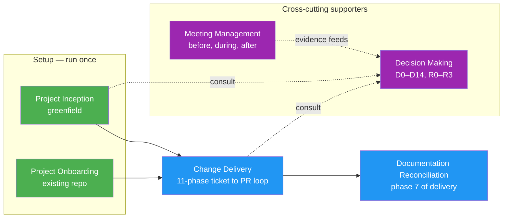

---
# Copyright (c) 2025-2026 Juliusz Ćwiąkalski (https://www.cwiakalski.com | https://www.linkedin.com/in/juliusz-cwiakalski/ | https://x.com/cwiakalski)
# MIT License - see LICENSE file for full terms
source: https://github.com/juliusz-cwiakalski/agentic-delivery-os/blob/main/doc/guides/ados-processes.md
ados_distribution: redistributable
id: GUIDE-ADOS-PROCESSES
status: Draft
created: 2026-06-28
owners: ["engineering"]
summary: "Canonical map of ADOS's six processes — master diagram, per-process cards, and cross-process relationships. Start here for the big picture."
---

# ADOS Processes Map

This page is the canonical map of **Agentic Delivery OS's six processes**. Each process is a reusable, repeatable way of working; together they cover how a team adopts ADOS, ships changes, makes decisions, runs meetings, and keeps documentation honest. Scan the master diagram for the whole picture, then jump to a process's detailed guide from its card.

## The six processes at a glance

The master diagram below shows all six processes and how they relate. Two **setup** entry points (Project Inception and Project Onboarding) feed the steady-state **Change Delivery** loop. Documentation Reconciliation is **embedded** inside delivery (it is phase 7). Decision Making and Meeting Management are **cross-cutting supporters** invoked from anywhere a hard choice arises or people meet.

**Legend**:
- **Green** nodes = entry points (where you start).
- **Blue** nodes = steady-state process and embedded phase.
- **Purple** nodes = cross-cutting supporters (invoked on demand from anywhere).
- Solid arrows = primary flow (setup feeds delivery; delivery embeds reconciliation).
- Dashed arrows = on-demand / evidence-feed relationships (consult decisions; meetings feed decisions).
- Mermaid nodes aren't clickable on GitHub (sandboxed render) — each process's **card below** links to its detailed guide.

## Per-process cards

Each card captures what the process solves, who it is for, its primary output, and where to read more.

### Project Inception

- **Problem it solves:** Build the complete knowledge base (vision, users, architecture, domain, conventions) for a new or serious project so agents can operate with full autonomy.
- **Audience:** Teams starting a **new (greenfield)** project who want maximum agent context.
- **Primary output:** A full `doc/overview/`, `doc/spec/`, `AGENTS.md`, and inception artifacts that agents operate against.
- **Guide:** [project-inception.md](project-inception.md)

### Project Onboarding

- **Problem it solves:** Adopt ADOS into an **existing (brownfield)** repo quickly, with the minimum viable configuration and a clear mandatory/optional split.
- **Audience:** Engineers and tech leads adding ADOS to a repo that already exists.
- **Primary output:** `AGENTS.md`, `pm-instructions.md`, `documentation-handbook.md`, and a working ADOS install.
- **Guide:** [onboarding-existing-project.md](onboarding-existing-project.md)

### Change Delivery

- **Problem it solves:** Turn a ticket into a reviewed, tested PR through a deterministic, traceable, 11-phase workflow — replacing "prompt roulette" with versioned artifacts and gates.
- **Audience:** Every delivery team using ADOS day-to-day.
- **Primary output:** Spec, plan, test plan, code, reconciled docs, and a merged PR — one per change.
- **Guide:** [change-lifecycle.md](change-lifecycle.md)

### Meeting Management

- **Problem it solves:** Prepare, run, document, and follow up on meetings so decisions and action items are durable, discoverable, and not locked in someone's memory.
- **Audience:** Engineers, product managers, founders, and team leads who organize, facilitate, or document meetings.
- **Primary output:** Time-boxed agendas, durable summaries, captured decisions, and assigned action items.
- **Guide:** [meeting-preparation-and-summarization.md](meeting-preparation-and-summarization.md)

### Decision Making

- **Problem it solves:** Calibrate the *amount* of decision process to the *nature and risk* of a decision (R0–R3), and produce durable decision records sized to rigor.
- **Audience:** Engineers, product owners, founders, and operators making record-worthy choices.
- **Primary output:** Decision records (ADR/PDR/TDR/BDR/ODR) produced through the universal D0–D14 kernel.
- **Guide:** [decision-making.md](decision-making.md)

### Documentation Reconciliation (supporting — no standalone guide)

- **Problem it solves:** Keep `doc/spec/**` the **current truth** — reconciled after every accepted change so the next change plans against reality, not stale memory.
- **Audience:** The change workflow itself — run automatically by `@doc-syncer` / `/sync-docs` as part of delivery.
- **Primary output:** An updated, reconciled current system spec under `doc/spec/**`.
- **Guide:** embedded as **phase 7 (`system_spec_update`)** of [change-lifecycle.md](change-lifecycle.md). There is intentionally no standalone guide — it is a supporting phase, not a separate process.

## Cross-process relationships

- **Two entry points, one steady state.** Project Inception (greenfield) and Project Onboarding (brownfield) are **alternative setup paths** — you pick one based on whether the project is new or existing. Both feed into the same **Change Delivery** loop, which is the day-to-day steady state. Inception produces a richer knowledge base; onboarding installs a lighter minimum-viable set.
- **Change Delivery consumes the setup outputs.** The 11-phase loop (ticket → spec → plan → code → review → PR) is the engine that turns the inception/onboarding foundation into shipped changes. Every later process attaches to this loop.
- **Documentation Reconciliation is *inside* delivery, not beside it.** It is phase 7 (`system_spec_update`), run by `@doc-syncer` / `/sync-docs`. After each accepted change, the current system spec is reconciled — so `doc/spec/**` stays the living truth. It is named as a process for visibility, but it has no standalone lifecycle of its own.
- **Decision Making is a cross-cutting supporter.** Hard, hard-to-reverse, or precedent-setting choices arise **during inception and during delivery** (typically at spec/plan time). The decision kernel (D0–D14) and rigor routing (R0–R3) are invoked on demand; durable decisions become records under `doc/decisions/**`.
- **Meeting Management feeds decisions.** Meetings are where evidence, dissent, and action items are captured. A well-run meeting produces the raw material that a decision record (or the next change) consumes — see the back-link from the [meeting guide](meeting-preparation-and-summarization.md) and the cross-link with the [decision guide](decision-making.md).

## How to use this map

- **New project?** Start at **Project Inception** → then enter Change Delivery.
- **Existing repo?** Start at **Project Onboarding** → then enter Change Delivery.
- **Day-to-day work?** You live in the **Change Delivery** loop.
- **A hard choice arises?** Use **Decision Making** (consult `@decision-advisor`; record where warranted).
- **People need to meet?** Use **Meeting Management** to keep decisions and actions durable.

> **See also:** [Change Lifecycle](change-lifecycle.md) · [Project Inception](project-inception.md) · [Onboarding](onboarding-existing-project.md) · [Decision Making](decision-making.md) · [Meeting Management](meeting-preparation-and-summarization.md) · [Documentation Index](../00-index.md)
