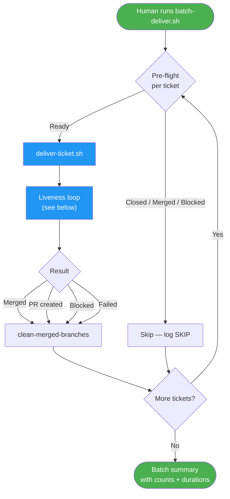
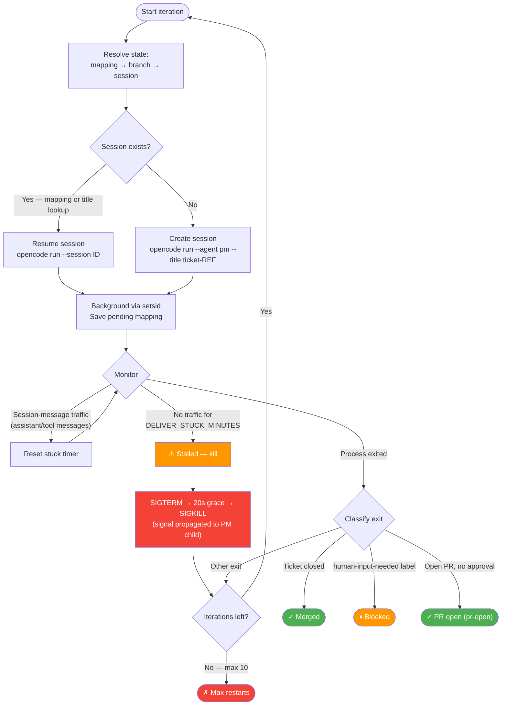
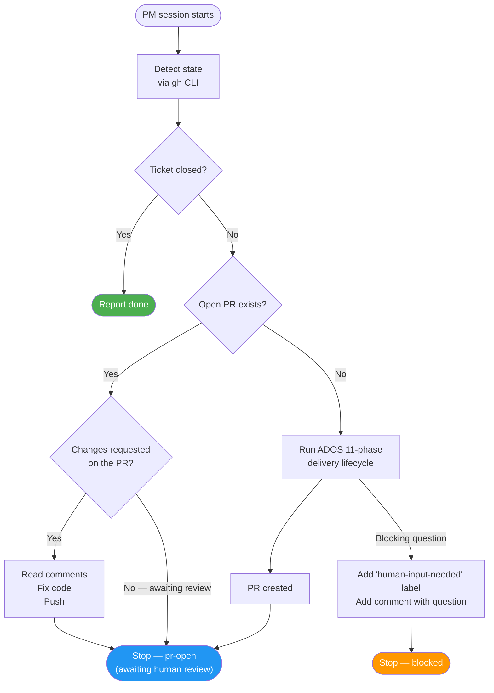
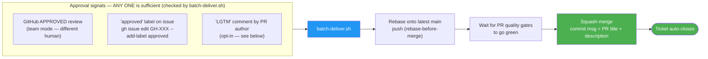
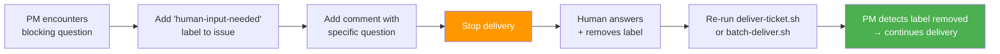

---
# Copyright (c) 2025-2026 Juliusz Ćwiąkalski (https://www.cwiakalski.com | https://www.linkedin.com/in/juliusz-cwiakalski/ | https://x.com/cwiakalski)
# MIT License - see LICENSE file for full terms
source: https://github.com/juliusz-cwiakalski/agentic-delivery-os/blob/main/doc/guides/autonomous-batch-delivery.md
ados_distribution: redistributable
id: GUIDE-AUTONOMOUS-BATCH-DELIVERY
status: Draft
created: 2026-07-03
owners: ["engineering"]
summary: "Deliver multiple tickets unattended with liveness monitoring, session resilience, and push-to-completion PR feedback. Covers deliver-ticket.sh, batch-deliver.sh, and clean-merged-branches."
---

# Autonomous Batch Delivery

> **Canonical modes guide:** [delivery-modes.md](delivery-modes.md) defines the
> two unattended delivery modes (Mode A — autonomous CEO loop; Mode B — manual
> batch) and the behavioral invariants. This guide is the canonical reference for
> the **operational details of Mode B** (`batch-deliver.sh`, `deliver-ticket.sh`,
> `clean-merged-branches`, approval workflow, labels). The two are kept
> consistent: where they describe the same machinery (liveness, rebase-before-
> merge, merge authority), they agree.

Autonomous batch delivery lets you deliver multiple tickets **unattended** — overnight, over the weekend, or while you focus on other work. Three scripts work together to wrap the standard ADOS 11-phase lifecycle with a liveness watchdog, session resilience, and a push-to-completion PM prompt.

## Installation

These scripts ship with ADOS. There are two install paths:

- **`install.sh --local`** (recommended for your projects) — copies the delivery scripts into `./scripts/` and `./tools/` **in the current project**, alongside the other ADOS artifacts:

  ```bash
  # After installing ADOS artifacts into your project
  scripts/install.sh --local

  # The delivery scripts are now available in THIS project:
  #   scripts/opencode-session.sh   — ticket-scoped session manager
  #   scripts/deliver-ticket.sh     — single-ticket liveness-monitored delivery
  #   scripts/batch-deliver.sh      — sequential batch delivery
  #   tools/clean-merged-branches   — squash-merge-safe branch cleanup
  ```

- **`install.sh --global`** — clones the ADOS repo to `~/.ados/repo/`. The delivery scripts are already present there (it's the full repo), so you can run them directly (e.g. `~/.ados/repo/scripts/deliver-ticket.sh GH-112`). The `--global` mode does **not** copy the scripts into any project — use `--local` for that.

If you only want the branch cleanup tool (without the full ADOS delivery scripts), use the standalone installer:

```bash
curl -fsSL https://raw.githubusercontent.com/juliusz-cwiakalski/agentic-delivery-os/main/scripts/install-clean-merged-branches.sh | bash
```

See the [clean-merged-branches docs](../tools/clean-merged-branches.md) for details.

## When to use this

| Scenario | Use |
|---|---|
| You have 3–10 ready tickets and want to wake up to PRs | `batch-deliver.sh GH-108 GH-110 GH-37` |
| A single ticket needs reliable delivery with auto-restart | `deliver-ticket.sh GH-112` |
| You reviewed a PR and want the PM to address comments, or want the batch script to merge an approved PR | Re-run `batch-deliver.sh GH-XXX` — PM addresses feedback; batch script merges approved PRs (rebase + green-gate) |
| Local branches piled up after squash-merges | `tools/clean-merged-branches` |

## Three delivery modes

ADOS supports three ways to run the Change Delivery lifecycle:

| Mode | How | Human involvement | Best for |
|---|---|---|---|
| **Manual** | Run each command (`/write-spec`, `/run-plan`, `/review`, ...) | Every step | Learning, debugging, tight control |
| **Autopilot** | `@pm deliver change GH-456` | Decisions and review only | Interactive single-ticket delivery |
| **Autonomous batch** | `scripts/batch-deliver.sh GH-108 GH-110` | Review PRs, approve, answer questions | Overnight, multi-ticket, unattended |

Autonomous batch delivery is **not a new process** — it is the same 11-phase Change Delivery lifecycle, wrapped in automation that handles the operational concerns (liveness, restarts, branch hygiene, PR feedback) so the human only interacts at review time.

## Architecture



## The liveness loop (`deliver-ticket.sh`)

The liveness loop is the heart of autonomous delivery. It starts a PM agent session, monitors it for progress, and kills-and-restarts if the session goes stale (no opencode session-message traffic for the stuck threshold — default **15 minutes**).

> **Liveness signal changed.** An earlier version measured worktree file-mtimes
> (commits, file changes, `doc/changes/` writes) over a 30-minute window. That
> heuristic is **retired** in favor of **opencode session-message traffic** —
> new assistant/tool messages flowing in the session. A hung LLM stream keeps
> the process alive while making zero progress; the file-mtime heuristic could
> not distinguish that from a healthy long reasoning step. Session-traffic is
> both more precise and allows the tighter 15-minute threshold. See
> [delivery-modes.md § INV-DM-5](delivery-modes.md#inv-dm-5-liveness-means-session-message-progress-not-process-alive)
> for the full rationale. Worktree activity remains a **secondary** signal
> (used by `ceo-loop.sh` to confirm a CEO blocked on a healthy delivery is not
> stuck).



### How activity is detected

Every `DELIVER_POLL_SECONDS` (default 60s), the script probes **opencode session-message traffic** — the stream of assistant/tool messages in the PM's opencode session — via `scripts/pm-liveness.sh`. If new messages have flowed since the last probe, the stuck timer resets. If no new traffic arrives for `DELIVER_STUCK_MINUTES` (default **15**), the session is declared stalled and killed-and-restarted.

This is more precise than the old file-mtime heuristic: a hung LLM stream keeps the process alive (blocked on I/O) while making zero progress, and only session traffic can tell that apart from a healthy long reasoning step. Worktree activity (commits, `doc/changes/` writes) remains a **secondary** signal, primarily consumed by `ceo-loop.sh` to confirm a CEO that is blocked on a healthy delivery is *not* stuck.

> **Graceful degradation:** if the opencode session DB is unavailable (e.g. in CI), `pm-liveness.sh` warns and falls back to a process-alive heuristic — it never blocks delivery on a missing DB.

> **Activity detection assumption**: A healthy PM iteration produces session-message traffic (reasoning, tool calls, file edits) within 15 minutes. If a PM "thinking" phase produces no session traffic for >15 min, the session will be killed and restarted. Tune `DELIVER_STUCK_MINUTES` if your workflow has longer legitimate thinking phases.

### Session resume by title

When the liveness loop kills a stale session and restarts, it does **not** create a new opencode session. Instead:

1. It searches `opencode session list` for a session with title `ticket-GH-XXX`
2. If found, it resumes with `opencode run --session <id>`
3. The PM reads `chg-<ref>-pm-notes.yaml` to determine the current phase and continues from there

This means **no context is lost** on restart — the opencode session retains its conversation history, and all committed artifacts + PM notes are on disk.

## What the PM does inside the session

The PM prompt uses a **push-to-completion** strategy — it detects the ticket's current state and acts accordingly:



> **The PM does not merge.** `deliver-ticket.sh` returns `pr-open` (+ PR URL +
> PM last-message) and stops. The merge is owned by `batch-deliver.sh` (Mode B),
> which acts **only** after the human approves and the rebase + green-gate checks
> pass. The legacy auto-merge-on-`approved`-label path inside the PM is retired.
> Keeping the merge out of the per-ticket engine is what lets `batch-deliver.sh`
> verify the rebase + green CI before committing to the merge. See
> [delivery-modes.md § INV-DM-4](delivery-modes.md#inv-dm-4-ceo-merges-approved-finalized-prs--does-not-yield-mode-a).

The prompt is **identical on every start and resume** — the state detection at the top ensures the PM always does the right thing regardless of how many times the session was restarted.

## Approval workflow (multi-signal, merge owned by the batch script)

GitHub blocks PR authors from approving their own PRs. In solo-developer mode — where the AI creates the PR using your credentials — you need an alternative approval mechanism. The batch script accepts **any one** of these signals as approval, then performs the **rebase-before-merge + green-gate wait** and squash-merges:



| Signal | How to send it | Mode | Default? |
|---|---|---|---|
| GitHub `Approve` review | GitHub UI → Review changes → Approve | Team (different human than PR author) | ✅ Always on |
| `approved` label on issue | `gh issue edit GH-XXX --add-label approved` | Solo (PR author can label the issue) | ✅ Always on |
| LGTM comment by PR author | Comment `lgtm` (exact match) on the PR — **only the PR author's comment counts** | Solo | ⚠️ Opt-in only |

When you re-run `batch-deliver.sh` after approving, the batch script detects the approval, rebases the PR onto the latest `main`, pushes, waits for the PR quality gates to go green, and squash-merges — using the **PR title and description as the commit message**. If a rebase conflict occurs, an AI agent resolves it, pushes, and the gates re-run. If the PR is already on the latest `main` (rebase is a no-op), the green-gate wait still runs but completes immediately.

> **`batch-deliver.sh` never adds the `approved` label itself.** Approval is always a human action. The batch script only *reads* the approval signals and acts on them.

### LGTM comment (opt-in, author-restricted)

By default, LGTM comments are **not** checked — a drive-by `lgtm` from an arbitrary commenter on a public repo must never trigger an unauthorized merge. To enable LGTM as a third approval signal:

```bash
DELIVER_ALLOW_LGTM_COMMENT=true scripts/deliver-ticket.sh GH-112
# or
DELIVER_ALLOW_LGTM_COMMENT=true scripts/batch-deliver.sh GH-108 GH-110
```

When enabled, the script only accepts an **exact** `lgtm` comment (`^lgtm$` — no substring match) written by the **PR author** (the user whose credentials created the PR), not arbitrary commenters.

## Blocked workflow

When the PM hits a question that needs human input:



**To resolve a block**:
1. Read the question (issue comment)
2. Answer it (add a comment to the issue)
3. Remove the label: `gh issue edit GH-XXX --remove-label human-input-needed`
4. Re-run the batch — the PM picks up from where it stopped

## Branch tracking

The delivery scripts track which branch belongs to which ticket via the session mapping file (`.ai/local/opencode-sessions/GH-XXX.json`). The `branch` field is the source of truth:

| Scenario | What happens |
|---|---|
| First run, no branch arg | PM creates a branch; script records it in mapping |
| First run, branch arg provided | Script uses provided branch; records in mapping |
| Re-run, no branch arg | Script reads branch from mapping |
| Re-run, **different** branch arg | Script **warns**: "Mapping records branch A, you passed B — using A" |

This prevents accidentally creating a second branch for the same ticket.

## Usage examples

### Single ticket (liveness-monitored)

```bash
# Deliver one ticket with auto-restart on staleness
scripts/deliver-ticket.sh GH-112

# With explicit branch
scripts/deliver-ticket.sh GH-112:feat/GH-112/bulk-edit-verify-rule

# Dry run (see what would happen)
scripts/deliver-ticket.sh --dry-run GH-112
```

### Batch delivery (multiple tickets)

```bash
# Simple list — branch auto-resolved from mapping or created by PM
scripts/batch-deliver.sh GH-108 GH-110 GH-37

# Explicit branches (colon syntax)
scripts/batch-deliver.sh GH-108:fix/GH-108/doc-syncer GH-110:feat/GH-110/mermaid

# Mixed
scripts/batch-deliver.sh GH-108:fix/GH-108/doc-syncer GH-110 GH-37

# From file (one ticket or ticket:branch per line)
scripts/batch-deliver.sh --tickets-file .ai/local/batch-tickets.txt
```

### Overnight workflow

```bash
# Evening: kick off batch delivery in the background
nohup scripts/batch-deliver.sh GH-108 GH-110 GH-112 GH-37 GH-98 \
  > tmp/overnight.log 2>&1 &

# Morning: check results
cat tmp/batch-deliver-summary.log

# Review PRs on GitHub, then either:
# 1. Approve for merge:
gh issue edit GH-108 --add-label approved

# 2. Leave comments (PM will address on next run):
# Comment directly on the PR in GitHub UI

# 3. Re-run to let PM address comments + merge approved PRs:
scripts/batch-deliver.sh GH-108 GH-110 GH-112 GH-37 GH-98
# Already-merged tickets are skipped automatically; approved PRs are
# rebased, green-gate-checked, and squash-merged by the batch script.
```

### Branch cleanup (standalone)

```bash
# Clean up after merges
tools/clean-merged-branches

# Preview without deleting
tools/clean-merged-branches --dry-run

# With different base branch
tools/clean-merged-branches --base develop
```

`clean-merged-branches` only deletes branches that are **already squash-merged into the base branch** (verified via ancestry, not just name). It **never deletes unmerged branches**, and it **never touches protected branches** (`main`, `master`, `develop`, plus any you add via `--protected`). This guarantee is what makes the batch script safe to invoke it automatically after each merge.

## Configuration

All settings are environment variables (with CLI flag overrides where noted):

### deliver-ticket.sh

| Variable | Default | Description |
|---|---|---|
| `DELIVER_STUCK_MINUTES` | `15` | Minutes with no PM session-message traffic before the PM is declared stalled and restarted (was 30/file-mtime, now 15/session-traffic) |
| `DELIVER_POLL_SECONDS` | `60` | Seconds between activity checks |
| `DELIVER_KILL_GRACE_SECONDS` | `20` | Seconds between SIGTERM and SIGKILL |
| `DELIVER_MAX_RESTARTS` | `10` | Maximum restart iterations before giving up |
| `DELIVER_LOOP_SLEEP_SECONDS` | `5` | Seconds between restart iterations |
| `DELIVER_ALLOW_LGTM_COMMENT` | `false` | Opt-in: accept an exact `lgtm` comment by the PR author as a merge signal (C-1) |

### batch-deliver.sh

| Variable | Default | Description |
|---|---|---|
| `DRY_RUN` | `false` | Skip actual delivery, just log what would happen |

### clean-merged-branches

| Flag | Default | Description |
|---|---|---|
| `--base` | `main` | Base branch to compare against |
| `--dry-run` | off | List branches that would be deleted |
| `--protected` | `main,master,develop` | Comma-separated protected branches |
| `--allow-dirty` | off | Allow running with uncommitted changes |
| `--color` | off | Enable colored output |

## Integration with ADOS processes

Autonomous batch delivery is an **operational mode** of the Change Delivery process — not a separate process. The PM agent runs the same 11-phase lifecycle (clarify scope → specification → test planning → delivery planning → DoR → delivery → doc sync → review → quality gates → DoD → PR). The scripts add:

- **Liveness monitoring** — so a stuck subagent doesn't waste hours
- **Session resilience** — so a killed process can resume without losing context
- **Branch hygiene** — so merged branches don't pile up
- **PR feedback** — so the PM can address review comments, and the batch script can merge approved PRs (rebase + green-gate + squash-merge) without a new interactive session

See the [Delivery Modes guide](delivery-modes.md) for the canonical modes definition and behavioral invariants, the [Change Delivery guide](change-lifecycle.md) for the 11-phase lifecycle details, and the [ADOS Processes Map](ados-processes.md) for how this fits into the bigger picture.

## Labels reference

| Label | Who adds it | Meaning | Color |
|---|---|---|---|
| `human-input-needed` | PM (when blocked) | Ticket has a blocking question for the human. Remove after answering to resume. | `FBCA04` (yellow) |
| `approved` | Human (after review) | PR is approved for squash-merge. Solo-developer-friendly — works even when GitHub self-approval is blocked. This is the **default** solo-mode approval signal. | `0E8A16` (green) |

> **LGTM is not a label** — it is an opt-in comment-based signal (`DELIVER_ALLOW_LGTM_COMMENT=true`), restricted to the PR author with an exact `^lgtm$` match. See [Approval workflow](#approval-workflow-multi-signal-merge-owned-by-the-batch-script).

> **See also:** [Delivery Modes](delivery-modes.md) (canonical modes guide) · [Change Lifecycle](change-lifecycle.md) · [ADOS Processes Map](ados-processes.md) · [clean-merged-branches tool docs](../tools/clean-merged-branches.md) · [OpenCode Agents Guide](opencode-agents-and-commands-guide.md)
