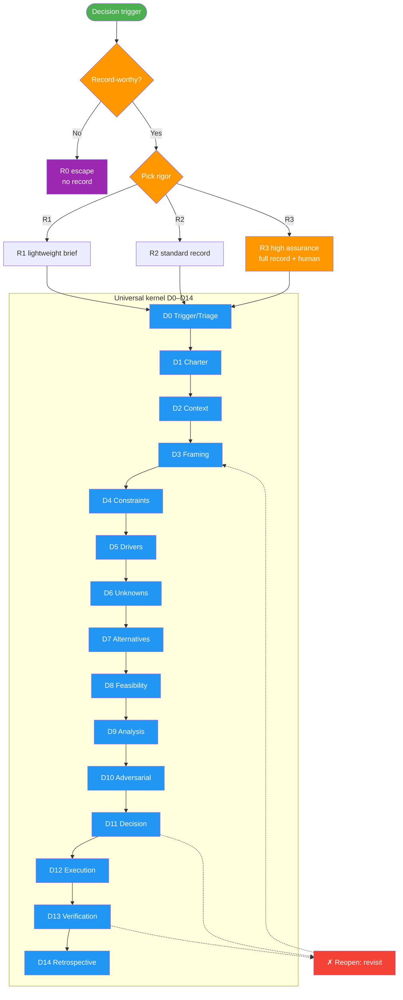

---
# Copyright (c) 2025-2026 Juliusz Ćwiąkalski (https://www.cwiakalski.com | https://www.linkedin.com/in/juliusz-cwiakalski/ | https://x.com/cwiakalski)
# MIT License - see LICENSE file for full terms
source: https://github.com/juliusz-cwiakalski/agentic-delivery-os/blob/main/doc/guides/decision-making.md
ados_distribution: redistributable
---
# Decision-Making Guide

> **Audience:** Engineers, product owners, founders, operators, and AI agents.
>
> **Purpose:** A condensed, process-first guide that calibrates the *amount* of process to the *nature and risk* of a decision — not its record prefix. This guide supersedes the artifact-centric narrative previously found in `decision-records-management.md` (now a thin record-artifact reference).

> Part of the [ADOS process map](ados-processes.md) — see how Decision Making supports Change Delivery and the rest.

Decisions at a glance — first triage **record-worthiness** (the R0 escape hatch), then route to a **rigor profile** (R1–R3), then run the **universal kernel** (D0–D14) at the depth that profile demands:

**Legend**: green = start ("Decision trigger"); purple = optional/escape (R0 — no record); orange = gates/attention (record-worthiness triage, rigor routing, R3 high-assurance); blue = ordinary kernel stages; red = reopen/remediation ("✗ Reopen"). Dashed arrows = feedback/revisit loops. See §2 for the full D0–D14 table and §3 for the R0–R3 detail.

---

## 1. When to decide — record-worthiness and the R0 escape hatch

Not every choice deserves a record. Apply record-worthiness first, then triage rigor:

**Record a decision when** it is hard to reverse, sets a precedent, has cross-team or cross-component impact, changes the security/privacy posture, introduces a new dependency/vendor, establishes business/product/operating direction, or is likely to be questioned later.

**Do NOT record** implementation details, bug fixes, or routine doc-only changes (use the change workflow).

**The R0 escape hatch (routine/delegated):** a local, easily reversible choice already covered by policy/precedent needs **no record** — an optional note, commit message, or ticket comment is enough. AI may act within explicitly delegated bounds here (see §6). Reaching for a full record on a reversible routine choice is a process smell: skip the ceremony and keep moving.

---

## 2. The universal decision kernel (D0–D14)

Every R1–R3 decision runs this lifecycle. **Depth varies by rigor profile** (§3); the stages are shared.

| Stage | Name | Core output |
|-------|------|-------------|
| **D0** | Trigger & Triage | What/why-now, deadline, proposed type, domains, archetype, conditions, rigor, emergency? already-resolved-by-policy? |
| **D1** | Decision Charter & Rights | DACI roles (§5), deadline, escalation authority |
| **D2** | Context & Evidence | Repo docs, config, prior decisions, metrics, research, contracts, regulations. Maintain **FACT / ASSUMPTION / TO-CONFIRM** labels + source references |
| **D3** | Problem Framing & Outcomes | Current state, trigger, root cause vs symptom, decision question, desired outcomes, scope, non-goals, horizon, stakeholders |
| **D4** | Constraints & Guardrails | Each constraint as a pass/fail test with source, verification, negotiability (`negotiable: yes|no`) — **kept distinct from drivers** |
| **D5** | Drivers & Value Model | Candidate drivers; priority/direction/proxy; optional justified weights |
| **D6** | Assumptions, Unknowns & Information Value | Impact-if-false, confidence, validation; can a pilot/spike/staging run cheaply reduce uncertainty? |
| **D7** | Alternative Generation | Include ALT-0 baseline; ≥2 substantive alternatives for R2/R3; meaningfully distinct; include build/buy/partner/postpone/experiment/stop where relevant |
| **D8** | Feasibility & Constraint Filter | Screen on constraints first; no weighted score rescues an ineligible option |
| **D9** | Analysis Method & Evaluation | Choose method by routing (qualitative trade-off, MCDA, cost-benefit, EV, decision tree, scenario, sensitivity, real-options, experiment, threat model, privacy impact, premortem, reference-class forecasting) |
| **D10** | Adversarial Challenge | Valuable for R2, **mandatory** for R3; performed independently before the reviewer sees the preferred conclusion where practical |
| **D11** | Recommendation & Decision (separated) | Analyst/AI recommendation vs authorized decision; rationale; constraint attestation; accepted-risk exceptions; dissent; confidence justified by evidence (AI-generated confidence is **not** evidence) |
| **D12** | Execution & Communication | Implications, accountable performer, rollout stages, guardrails, rollback, dependent changes, communications |
| **D13** | Verification & Revisit | Leading/lagging/guardrail metrics, targets, window, review date, invalidation triggers |
| **D14** | Retrospective & Calibration | Separate process quality, evidence quality, execution quality, realized outcome, and luck/variance; avoid outcome bias |

---

## 3. Rigor profiles (R0–R3) + emergency overlay

Scale ceremony to stakes. Each profile defines **required output** and a **target cycle time**.

| Profile | When | Required output | Cycle |
|---------|------|-----------------|-------|
| **R0 — Routine/Delegated** | Local, easily reversible, covered by policy/precedent | **No record.** Optional note/commit/ticket comment. AI may act within delegated bounds (§6). | Minutes |
| **R1 — Lightweight** | Low–medium impact, reversible, limited stakeholders, manageable uncertainty, no major legal/security/privacy/financial exposure | Concise brief: problem, constraints, top drivers, baseline + ≥1 option, choice + rationale, owner, revisit trigger | Minutes to **1 business day** |
| **R2 — Standard** | Meaningful trade-off, may be questioned, multi-team, material cost, useful to gather evidence | Full canonical record + evidence + ≥2 alternatives + baseline + roles + method + assumptions/uncertainty + verification + review date | Days |
| **R3 — High Assurance** | Hard-to-reverse, critical/financial/security/privacy/legal/safety/ethical, org-wide, or deep-uncertainty + large downside | Full record + independent reviewer/critic + domain sign-off + source verification + premortem + scenario/sensitivity + explicit dissent + guardrails + rollback + **human final decision** + deadline + escalation + formal review date | Days–weeks |

**R1 is a strict proper subset of R3.** The R1 brief contains only a subset of the R3 sections; it never invents R3-only sections. R0 produces **zero** mandatory records.

### Emergency overlay

Immediate action to contain an incident, prevent harm, restore service, or meet a hard deadline. It changes **sequencing, not accountability**:

1. Declare owner + authority
2. Act to stabilize
3. Record facts / assumptions / actions / timestamps
4. State constraints + stop-conditions
5. Reassess
6. Complete the normal record retrospectively
7. Post-review

---

## 4. Four-axis classification → routing

A decision is classified on four axes. These axes drive rigor, method, and authority — they are **not** collapsed to a single "record type."

| Axis | Values |
|------|--------|
| **Type** | ADR · PDR · TDR · BDR · ODR |
| **Domain tags** | strategy · product · UX · pricing · architecture · security · privacy · finance · operations · … |
| **Archetype** | selection · design · prioritization · allocation · policy · standard · threshold · forecast_commitment · experiment · go_no_go · exception_waiver · incident_response · negotiated_choice · sunset_reversal |
| **Conditions** | Cynefin environment (clear/complicated/complex/chaotic) · reversibility · stakes · urgency · uncertainty · blast radius · recurrence · evidence maturity · stakeholder diversity · external obligations |

Routing: classify → pick a rigor profile (§3) → pick a method (D9) → assign authority (§5, §6). The classification is captured in the record's optional `classification:` front-matter block.

---

## 5. Decision rights (DACI-style)

Make accountability explicit at D1 and surface it in the record:

| Role | Responsibility |
|------|----------------|
| **Driver** | Coordinates the decision process; keeps it moving |
| **Decider / Approver** | One accountable authority who makes the final call |
| **Contributors** | Provide expertise and evidence |
| **Required reviewers/agreers** | Verify mandatory requirements (constraints, policy) |
| **Performers** | Execute the decision |
| **Informed** | Notified of the outcome |

**Who typically decides, per type and risk** (defaults, overridable by governance):

| Type | Typical approver (low risk) | Typical approver (high risk / R3) |
|------|------------------------------|-----------------------------------|
| ADR | Tech lead / architecture lead | Cross-domain review + human decider |
| PDR | Product owner | Product leadership + stakeholders |
| TDR | Tech lead | Tech lead + affected owners |
| BDR | Product owner / business lead | Business leadership + finance |
| ODR | SRE/platform lead | SRE lead + affected owners |

High-stakes decisions may require cross-domain approval based on **risk, not prefix**. R3 **always** requires a human final decision (§6).

---

## 6. Bounded AI-authority model

ADOS uses AI as a decision **aid**, not an unaccountable decider.

**Allowed AI roles:** facilitator · researcher · repository analyst · evidence organizer · option generator · analyst · simulator · critic · record writer · verification monitor.

**AI may make a final decision autonomously ONLY when ALL are true:**

- Authority explicitly delegated
- Decision is R0 or a defined R1
- Boundaries are machine-checkable
- Reversal is easy
- Blast radius is limited
- An audit trail exists
- An escalation path exists

**AI must NOT be sole final authority for:** R3 decisions, legal/regulatory interpretation, material financial commitments, employment/individuals, safety-critical choices, privacy rights, irreversible architecture/strategy, active security-risk acceptance, or ethical trade-offs affecting people.

**Recommendation ≠ decision.** The analyst/AI recommendation is always rendered separately from the authorized (often human) decision. R2/R3 records stay at `status: Proposed` with `decision_date: null` until an authorized human decides; AI never auto-Accepts them. Provenance is recorded in the optional `ai_assistance:` block (roles used, whether external data was shared, whether citations were verified, the human decider, reviewers).

> **Honesty about independence.** Multiple AI agents using the **same model + prompt lineage do not constitute independent evidence.** For a single-model setup, `@decision-critic` is a **first-pass check, NOT independent assurance**. **R3 ALWAYS requires a human reviewer** regardless of the critic's verdict. Where a different model family is configured, assigning it to the critic is **recommended, not mandated**, to provide genuine independence.

---

## 7. Per-type nuance matrix (condensed)

Context anchors, typical approver, and fitting framework per type. This is a single condensed matrix — **not** separate catalog files per type.

| Type | Context anchors | Typical approver | Fitting frameworks |
|------|-----------------|------------------|--------------------|
| **ADR** | System specs, contracts, source, config | Architecture lead / service owners | Trade-off analysis, ATAM, real-options, threat model |
| **PDR** | Roadmap, UX research, north star, personas | Product owner | Jobs-to-be-done, opportunity scoring, RICE |
| **TDR** | Codebase, libraries, build/CI config, benchmarks | Tech lead | Trade-off matrix, build/buy/partner, spike/experiment |
| **BDR** | Strategy docs, ICP, pricing model, market data | Business lead / product owner | Cost-benefit, EV, scenario planning, reference-class forecasting |
| **ODR** | Runbooks, infra config, on-call, SLOs/SLAs | SRE/platform lead | Threat model, chaos/postmortem, sensitivity analysis |

---

## 8. Constraints vs drivers discipline

This discipline (hardened by GH-60) is mandatory at D4–D5:

- **Constraints (hard requirements)** are binary, pass/fail gates that **eliminate** alternatives. Each is recorded with: ID (`C-1`…), Statement (phrased as a test), Source, Verification, and **Negotiable** (`yes|no`). Use the `negotiable: yes|no` field consistently — do **not** use the informal English phrase meaning "not negotiable" alongside it (the GH-60 defect). `negotiable: no` means a violation is disqualifying; `negotiable: yes` means a documented accepted-risk exception may be recorded in the Decision section.
- **Decision drivers** are continuous preferences used to **rank** survivors (tradeable). They are never binary gates.
- Keep the two **separate**. When the same factor appears in both buckets, categorize it into exactly one before proceeding.
- **Context is situational facts, not constraints.** The Context section describes the situation and triggers only — it must not duplicate the Constraints section (GH-60 context-conflation defect, now fixed).
- Every alternative includes an explicit **constraint-compliance evaluation** (prose or matrix; default to matrix when unsure), not just pros/cons against drivers.
- The Decision section explicitly **attests** the chosen alternative satisfies every constraint, or documents an accepted-risk exception (only for `negotiable: yes`).

---

## 9. The decision record artifact (demoted reference)

The process lives in this guide; the **record artifact** (naming, front matter, lifecycle) is a thin reference kept in [`decision-records-management.md`](decision-records-management.md). Summary:

- **Location/naming:** `doc/decisions/<TYPE>-<zeroPad4>-<slug>.md` (flat directory; each type has its own sequence).
- **Template:** [`doc/templates/decision-record-template.md`](../templates/decision-record-template.md) — the **single source of truth** for the record body structure and the optional `classification`/`governance`/`ai_assistance`/`review_date` front matter.
- **Lifecycle:** `Proposed → Under Review → Accepted → (Deprecated | Superseded)`. `decision_date` is set only when status becomes Accepted.
- **R0 produces no record.** R1 renders a compact subset; R2 a standard record; R3 a full record (see the template's proportional-rendering guidance).

---

## 10. Agent & command integration

| Tool | Role |
|------|------|
| `@decision-advisor` | The domain-neutral orchestrator for **all five types**. Runs triage → classify → rigor → rights → plan (D0–D14). Requests human approval for R2/R3. References the template for body structure (no baked-in structure). |
| `@decision-critic` | Read-only independent challenger (D10). Returns **PASS / PASS_WITH_RISKS / REWORK**. Honest about same-model non-independence (§6); R3 still needs a human reviewer. |
| `/plan-decision` | Interactive planning session: triage → classify → rigor → rights → D2–D9; emits a `<decision_planning_summary>` (accepts the legacy tag + fields via alias). |
| `/write-decision` | Renders the record **proportionally** (R1/R2/R3), records `ai_assistance`, keeps recommendation ≠ decision, refuses to auto-Accept R2/R3 without a human decider. |
| `/review-decision <ID>` | Delegates an independent challenge to `@decision-critic`; read-only; produces a verdict artifact. |

### Three decision modes

| Mode | When | How |
|------|------|-----|
| **(a) Interactive AI session** | Human driver/decider wants structured help | `/plan-decision` → `@decision-advisor` plans → `/write-decision` renders → human decides |
| **(b) Meeting-driven** | A meeting reaches a durable decision | Meeting discussion becomes **evidence input** to `/plan-decision`; durable decisions route to `/write-decision` (see the Meeting guide) |
| **(c) Delegated AI autonomous** | R0–R1, delegated, reversible, bounded | AI acts within §6 bounds with audit + escalation; no record for R0, R1 brief for R1 |

---

## 11. Project-local decision instructions

Each project can create `.ai/agent/decision-instructions.md` to supplement this generic guide with project-specific details:

- **Strategic context**: mission, ranked priorities, values, decision principles — a decision-relevant extract so the `@decision-advisor` calibrates recommendations to what THIS project cares about (not a duplication of full strategy docs).
- **Operational conventions**: tracker integration (GitHub Issues / Jira / Linear), decision identifier scheme (sequential per type / project-prefixed / tracker-assigned), labels, status workflow, file location.

`@decision-advisor` and `@decision-critic` read this file when present to ground their work. See [`doc/templates/blueprints/decision-instructions--example.md`](../templates/blueprints/decision-instructions--example.md) for a starting template. The `/bootstrap` command scaffolds this file for new projects.

---

## References

- [Decision Records Management (artifact reference)](decision-records-management.md) — naming, front matter, lifecycle
- [Decision Record Template](../templates/decision-record-template.md) — single source of truth for record body structure
- [Project-local Decision Instructions (blueprint)](../templates/blueprints/decision-instructions--example.md) — starting template for your project's `.ai/agent/decision-instructions.md`
- [Meeting Preparation and Summarization Guide](meeting-preparation-and-summarization.md) — meeting-driven decisions
- `@decision-advisor` · `@decision-critic` · `/plan-decision` · `/write-decision` · `/review-decision`
