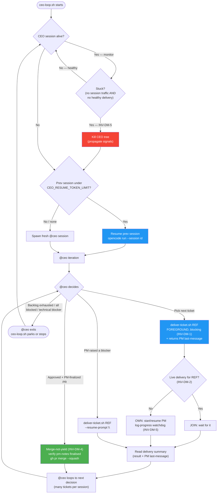
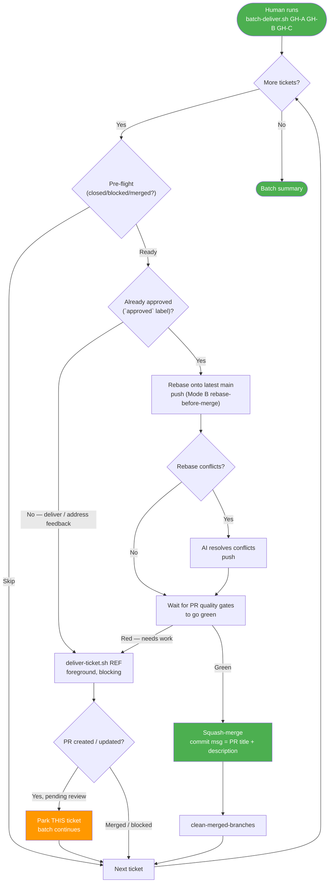

---
# Copyright (c) 2025-2026 Juliusz Ćwiąkalski (https://www.cwiakalski.com | https://www.linkedin.com/in-juliusz-cwiakalski/ | https://www.x.com/cwiakalski)
# MIT License - see LICENSE file for full terms
source: https://github.com/juliusz-cwiakalski/agentic-delivery-os/blob/main/doc/guides/delivery-modes.md
ados_distribution: redistributable
id: GUIDE-DELIVERY-MODES
status: Active
created: 2026-07-07
owners: ["engineering"]
summary: "How to run ADOS autonomous ticket delivery in the two unattended modes — the autonomous CEO loop (Mode A) and the manual batch (Mode B) — the component responsibilities, the AI-vs-script split, and the behavioral invariants that keep unattended delivery converging instead of burning tokens."
references:
  - "ADOS epic #95 — Autonomous-loop reliability"
  - "ADOS epic #117 — Loop tooling productization & safe CEO upstream"
  - "Absorbs #97 (loop concurrency), #99 (CEO merge-not-yield), #96 (log-progress liveness)"
  - "Downstream consumer: #118 (upstream the @ceo agent + opt-in gating + threat model)"
  - "Delivery vehicle: #142"
---

# Delivery Modes

ADOS can deliver tickets unattended in two modes. Both wrap the same per-ticket
engine (`deliver-ticket.sh`) and the same 11-phase ADOS lifecycle
([change-lifecycle.md](change-lifecycle.md)). They differ in **who picks the
next ticket** and **who authorizes the merge**.

| | Mode A — Autonomous CEO loop | Mode B — Manual batch |
|---|---|---|
| **Trigger** | `scripts/ceo-loop.sh` (long-running outer process) | Human: `scripts/batch-deliver.sh GH-A GH-B …` |
| **Who picks tickets** | The `@ceo` agent (respects deps, priority, blockers) | The human (an explicit list) |
| **Tickets per run** | One at a time, many per CEO session | The provided list, sequentially |
| **Merge authority** | **The `@ceo` agent** — it is the approver and the merger (authority granted once for autonomous mode, not per-PR) | **The human** — the human approves (via the `approved` label); the batch script then rebases, waits for green quality gates, and squash-merges |
| **Concurrency** | Exactly one ticket in flight **per repo working tree** | Exactly one ticket in flight at a time (sequential) |
| **Best for** | Unattended delivery (overnight, weekend) | Curated batch with human review; addressing review feedback |
| **Backstop if a delivery outlives a session** | `ceo-loop.sh` detects the stuck CEO and kill+restarts it; the in-flight delivery (if healthy) is joined, not raced | Human re-runs the same command (idempotent skip) |

> **Batch autonomy is intentionally bounded.** In Mode B, `batch-deliver.sh`
> never merges on its own — it only acts on a PR the human has explicitly
> approved. If you want unattended merges, you are in Mode A, not Mode B.

## Background

This guide exists because sustained autonomous dogfooding of an earlier
experimental loop spawned **~20 CEO agent sessions to deliver a single ticket**
— pure token burn. The architecture was *inverted*: a short-lived, expensive AI
reasoning step (the CEO opencode session) was put in charge of *babysitting* a
long-running, cheap, deterministic script (`deliver-ticket.sh`) that had been
launched **detached** (`setsid … & disown`). Every CEO exit triggered a loop
respawn; every respawn re-discovered the detached delivery, wrote a large
reconciliation note, and exited.

The fix is structural: the expensive AI never babysits the cheap script. The
behavioral invariants below state the contract that makes the loop **converge**
instead of churn, and align with the upstream ADOS reliability plan (epic #95 —
#97, #99, #96).

## Component responsibilities

```
                ┌─────────────────────────────────────────────────────────┐
                │  MODE A                                  MODE B          │
                │                                                           │
   human ─────► ceo-loop.sh                human ─────► batch-deliver.sh   │
                │   │ (bash, outer;                         │ (bash,        │
                │   │  stuck-session watchdog)              │  sequential)  │
                │   ▼ per CEO session                       ▼ per ticket   │
                │ @ceo (opencode, AI)                      deliver-ticket.sh
                │   │  pick ticket / merge approved PR        │ (foreground) │
                │   │  handle blocker / learn                ▼              │
                │   ▼ per ticket                           PM opencode      │
                │ deliver-ticket.sh                        (AI, 11 phases)  │
                │   │ (bash, FOREGROUND, blocking)                           │
                │   ▼                                                      │
                │ PM opencode (AI, 11-phase lifecycle)                      │
                │   │  → spec → plan → coder → review → … → PR              │
                │   ▼                                                      │
                │ squash-merge (gh pr merge --squash)                       │
                └─────────────────────────────────────────────────────────┘
```

| Component | Kind | Owns | Must NOT do |
|---|---|---|---|
| `ceo-loop.sh` | Script (outer) | Spawn one `@ceo` session at a time; **detect a stuck CEO** (no session traffic, no healthy delivery in progress) and kill+restart it; resume the previous CEO session when its context is under the resume threshold; honor a durable stop signal | Spawn a second `@ceo` while one is alive; kill a CEO that is blocked on a healthy in-flight delivery; wipe the stop signal at startup |
| `@ceo` | AI agent (decision points) | Pick next ticket; **wait for `deliver-ticket.sh` to return** and consume its last-message + result; verify the PM finalized all phases before merging; merge ready (approved) PRs; handle blockers (optionally resume the PM with a `--resume-prompt`); retrospectives | Babysit a healthy delivery; detach `deliver-ticket.sh`; merge a PR the PM has not finalized; yield forever on a ready PR; halt merely because a peer exists |
| `batch-deliver.sh` | Script | Sequential per-ticket delivery; pre-flight skip; **rebase-before-merge with green-gate wait** for human-approved PRs; squash-merge using the PR title/description as the commit message; summary | Pick tickets; approve a PR (Mode B); merge a PR the human has not approved |
| `deliver-ticket.sh` | Script (per-ticket) | Single-ticket lifecycle: **single-flight + join** per repo, spawn/resume PM, in-progress tracking (repo-local PID file), **writes the delivering marker on its OWN path** (race-free "CEO blocked on delivery" signal for ceo-loop.sh), **log-progress liveness watchdog**, kill-and-restart on stall, **signal propagation to the PM child**, state classification; expose subcommands (`--is-delivering`, `--last-message`, `--resume-prompt`); return a delivery summary (result + PR URL + PM last-message) on stdout | Run detached; spawn a duplicate PM for the same ticket/repo; **merge** (merge authority is the CEO in Mode A or `batch-deliver.sh` in Mode B); leave an orphaned opencode child when killed |
| PM opencode | AI agent (per-ticket) | The ADOS 11-phase lifecycle; delegate to subagents; address review comments; return a delivery summary (last message) to `deliver-ticket.sh` | Pick the next ticket; merge without an approval signal |
| `tools/clean-merged-branches` | Script | Branch hygiene: delete branches already squash-merged into the base | **Remove unmerged branches**; touch protected branches (`main`, `master`, `develop`) |

## The AI-vs-script split

The guiding principle: **the expensive, stateless, judgment-heavy work is AI;
the cheap, long-running, deterministic work is script.** The loop must never
put the expensive thing in charge of babysitting the cheap thing. Equally,
anything that *can* be scripted should be — don't make the AI rediscover
scriptable facts by burning tokens.

| Step | AI? | Owner |
|---|---|---|
| Pick next ticket (deps, priority, blockers) | **Yes** | `@ceo` — once per decision point |
| "Is a delivery in progress in this repo?" | No | `deliver-ticket.sh --is-delivering` (consumed by `ceo-loop.sh` and `@ceo`) |
| Detect closed / blocked / merged → skip | No | `deliver-ticket.sh` / `batch-deliver.sh` |
| Spawn & monitor PM opencode (liveness, restart) | No | `deliver-ticket.sh` |
| Run the ADOS 11-phase lifecycle | **Yes** | PM opencode + subagents |
| Review PR vs spec/plan | **Yes** | `@reviewer` (inside the PM lifecycle) |
| Approve + merge PR (Mode A) | **Yes** (authority + judgement) | `@ceo` verifies PM finalization (pm-notes), then executes `gh pr merge --squash` **directly** (`deliver-ticket.sh` returns `pr-open`; it does **not** merge in Mode A) |
| Rebase before merge (Mode B batch) | No (happy path); **Yes** only on conflict | `deliver-ticket.sh` / `batch-deliver.sh`; AI resolves rebase conflicts, then gates re-run |
| Wait for PR quality gates to go green after rebase | No | `deliver-ticket.sh` / `batch-deliver.sh` |
| Branch hygiene (fetch / prune / delete merged) | No | `tools/clean-merged-branches` |
| Handle a technical blocker | **Yes** | `@ceo` judgement (may resume the PM with a `--resume-prompt`) |
| Retrospective / process learning | **Yes** | `@ceo` |

## Behavioral invariants

These are the non-negotiable rules. The tooling exists to enforce them.

### INV-DM-1: `deliver-ticket.sh` runs FOREGROUND, never detached

A caller invoking `deliver-ticket.sh` **blocks until the ticket is merged,
blocked, PR-open, or failed.** The CEO must never `setsid … & disown` it. This
single rule removes the "CEO exits, delivery orphans, loop respawns" failure
mode at its source.

The opencode bash-tool timeout does not violate this: if a CEO's blocking call
is cut short, the PM child keeps running and the *next* `deliver-ticket.sh REF`
call **joins** it (INV-DM-2). The system converges; no work is lost.

### INV-DM-2: `deliver-ticket.sh` is single-flight + join, per repo

`deliver-ticket.sh` is **safe to call concurrently or repeatedly** — it
converges to "exactly one PM session per ticket in this repo."

- It tracks its own PID (and the PM child's PID) in a **repo-local, git-ignored
  file** under `.ai/local/delivery/<REF>.pid`.
- On startup, it probes that file. **Live `deliver-ticket.sh` for the same
  ticket ⇒ JOIN:** wait for it (poll the PID), then classify the result from
  GitHub state and exit through the same code path as if it had run. Never
  spawn a duplicate PM; never kill a healthy one.
- **No live instance ⇒ OWN:** start/resume the PM session, monitor liveness,
  kill-and-restart on stall.
- **Signal propagation:** `deliver-ticket.sh` traps `SIGTERM`/`SIGINT` and
  forwards the signal to its PM opencode child (grace period, then `SIGKILL`),
  so killing the wrapper never leaves an orphaned opencode instance. The same
  propagation rule applies to `ceo-loop.sh` and every other delivery script.

### INV-DM-3: `ceo-loop.sh` detects a *stuck* CEO, not a healthy wait

The loop runner's **primary job is to detect a CEO session that is genuinely
stuck** — and recover it via kill+restart. It is *not* primarily about "parking
while a delivery is in progress"; that is handled by the CEO blocking on
`deliver-ticket.sh` (INV-DM-1/2).

A CEO session is **stuck** (kill+restart) when, for longer than the stall
threshold, **all** of these hold:

- no new **opencode session message traffic** (the stream of assistant/tool
  messages has gone idle), **and**
- **no healthy delivery in progress** in this repo. This is checked via two
  complementary signals: the race-free **delivering marker file**
  (`.ai/local/delivery/delivering`, written by `deliver-ticket.sh` on its OWN
  path *before* the delivery starts, carrying a live pid), and — as
  defense-in-depth — `deliver-ticket.sh --is-delivering` (the PID probe), plus
  the in-flight delivery's own watchdog.

A CEO that is **blocked on a healthy, progressing delivery** is *not* stuck and
must not be killed — the delivery will return and the CEO will continue. The
delivering marker makes this race-free: it exists before the child PID is
observable by the probe, closing the brief window where a just-started
delivery could look "not in progress."

The stop/park signal is **durable across loop restarts** (#97): `ceo-loop.sh`
does not wipe its stop file at startup, and a non-expired park condition is
honored until it clears.

### INV-DM-4: CEO merges approved, finalized PRs — does not yield (Mode A)

In Mode A the `@ceo` agent is the merge authority. Before merging it must:

1. confirm the PR is **approved** (the CEO's own authorization, recorded as
   such), **and**
2. confirm the **PM has finalized** the change — all 11 phases complete, per
   `chg-<ref>-pm-notes.yaml`. (This check is AI-driven today, because pm-notes
   are authored by the PM and not yet schema-strict enough to script reliably.)

When both hold, the CEO runs the final-check gate and squash-merges. "Yield"
applies **only** when a PM is demonstrably alive and mid-delivery (process
exists, no finalized PR). A sleeping process is not "actively delivering."
This is the #99 "merge-not-yield" + "proceed-not-halt" backstop.

> **`deliver-ticket.sh` does not merge.** It returns `pr-open` (+ PR URL + PM
> last-message). The legacy auto-merge-on-`approved`-label path is retired: in
> Mode A the CEO merges directly after the INV-DM-4 verification; in Mode B
> `batch-deliver.sh` merges after the human approves and the rebase + green-gate
> checks pass. Keeping the merge out of the per-ticket engine is what lets the
> CEO verify PM finalization *before* the merge (comment #9).

### INV-DM-5: Liveness means multi-signal progress, not process-alive

"Liveness" is measured by **two complementary signals**; if EITHER shows recent
activity, the session is healthy:

1. **Session-tree message traffic** — new assistant/tool messages flowing in the
   session. The probe queries the current `session_message` table across the
   **recursive session tree** (it traverses `session.parent_id`), so traffic
   from child sessions counts too: when the PM delegates to `@coder` /
   `@spec-writer` (and the parent goes quiet itself), that is NOT a false stall.
2. **Git/worktree activity** — the most recent of git-commit epoch and worktree
   file mtimes. This runs ALONGSIDE the DB signal (not only as a degraded
   fallback), so a healthy delivery that the DB can't see is still recognized.

A hung LLM stream keeps the process alive (blocked on I/O) while making zero
progress on *both* signals; the ps-only heuristic must not call that "healthy."

A session with **no activity from either signal for ≥ `CEO_LOOP_STALL_MINUTES`**
(default **10**; at-threshold == stalled, matching the `>=` comparison in
`pm-liveness.sh`/`ceo-loop.sh`) is **stalled**, not slow, and is killed-and-resumed.

Observed stuck root cases this guards against:

- opencode hangs **indefinitely on an LLM provider response** (an opencode
  internal bug) — the process is alive but both signals are silent.
- the agent **tries to access a folder it should not** (e.g. the user's home
  directory), which triggers a permission-acceptance prompt that **never gets
  answered** in autonomous mode — the session waits forever.

The earlier 30-minute, file-mtime-based detector is retired in favor of this
multi-signal approach, which is both more precise (it catches child-session
traffic the single-table query missed) and allows the tighter threshold.

### INV-DM-6: One ticket in flight per repo working tree

Each repo working tree runs **exactly one ticket delivery at a time.** This
preserves ADOS discipline ([change-lifecycle.md](change-lifecycle.md)) and
makes branch hygiene safe.

This invariant is **repo-local**: running parallel deliveries in **different
repos**, or in **independent clones** of the same repo, is explicitly allowed
and must not interfere. The PID/in-progress tracking is keyed on the working
tree (under `.ai/local/delivery/`), so two clones never see each other's
deliveries.

## How the pieces fit

### Script subcommands (script what can be scripted)

To keep the AI from burning tokens rediscovering scriptable facts,
`deliver-ticket.sh` exposes encapsulated subcommands/flags:

| Invocation | Returns | Used by |
|---|---|---|
| `deliver-ticket.sh REF` | Runs the full per-ticket lifecycle (foreground, blocking). On completion, prints a **delivery summary** on stdout: the result classification (`merged` / `blocked` / `pr-open` / `failed`) **plus the PM agent's last message** (so the caller sees open questions, blockers, and the PR link directly). | `@ceo` (Mode A), `batch-deliver.sh` (Mode B) |
| `deliver-ticket.sh REF --resume-prompt "<text>"` | Same as above, but resumes the PM session with the given prompt **instead of the default** — lets the CEO resolve a PM-raised blocker by injecting a custom instruction. | `@ceo` (Mode A) |
| `deliver-ticket.sh --is-delivering [REF]` | Exit `0` if a delivery is in progress in this repo (for `REF`, or any ticket if no `REF` given); non-zero otherwise. Prints nothing on stdout. | `ceo-loop.sh` (stuck-vs-healthy decision), `@ceo` |
| `deliver-ticket.sh --last-message REF` | Prints the last PM message for `REF` from the most recent delivery (without running a new one). | `@ceo` |

The in-progress tracking that backs `--is-delivering` lives entirely inside
`deliver-ticket.sh` (the repo-local PID file from INV-DM-2). Callers never
inspect the PID file directly.

### Session resume optimization (`ceo-loop.sh`)

Starting every CEO iteration from a blank slate wastes tokens re-deriving
"where is this project, what's in flight." `ceo-loop.sh` **remembers the last
CEO session id** and, before spawning a new one:

1. reads the previous session's context size, and
2. **resumes** it (`opencode run "<continue prompt>" --session <id>`) if the
   context is **under** `CEO_RESUME_TOKEN_LIMIT` (default **100000** tokens),
   otherwise starts a **fresh** session.

This is feasible today via documented, stable opencode CLI:

- list sessions + ids: `opencode session list --format json`
- read a session's token totals: `opencode db "SELECT (tokens_input + tokens_output + tokens_reasoning) AS total FROM session WHERE id = '<id>'" --format json`
- resume non-interactively: `opencode run "continue your interrupted work" --session <id>`

The threshold is configurable via the `CEO_RESUME_TOKEN_LIMIT` env var (see
[Configuration](#configuration)).

## Mode A — Autonomous CEO loop



> **The JOIN/OWN decision is internal to `deliver-ticket.sh`.** The CEO simply
> calls `deliver-ticket.sh REF` in the foreground (blocking); the script itself
> probes for a live owner and decides JOIN (wait + classify) vs OWN
> (start/resume the PM). Either way it returns the same delivery summary, so the
> CEO never spawns or races a second PM (INV-DM-2).

**Key properties of the corrected loop:**

1. **No second CEO is spawned while one is alive.** The loop monitors the live
   session and only kills it when it is genuinely stuck (INV-DM-3/5).
2. **One CEO session delivers many tickets.** The CEO loops *inside* its
   session: pick → deliver (block) → read summary → pick → deliver → …
3. **The CEO waits for delivery** and reads the PM's last message, so it sees
   blockers, open questions, and PR links directly — and can resume the PM with
   a `--resume-prompt` to resolve a blocker.
4. **`deliver-ticket.sh` is always foreground** (INV-DM-1) and **join-safe**
   (INV-DM-2), so a crashed agent's orphaned delivery is adopted, not raced.
5. **A finalized, approved PR gets merged, not deferred** (INV-DM-4).
6. **Sessions are resumed** when their context is small enough, saving tokens.

### Running Mode A

```bash
# Start the autonomous CEO loop (foreground; run in tmux/nohup for unattended use)
scripts/ceo-loop.sh

# Stop it durably (the stop signal survives a restart until cleared)
scripts/ceo-loop.sh --stop

# Clear a stale stop signal and resume
scripts/ceo-loop.sh --reset
```

`ceo-loop.sh` is the outer process. It is **not** the merge authority itself —
it spawns the `@ceo` agent, which decides and merges. The loop's own job is
session lifecycle (spawn / resume / detect-stuck / kill+restart) and honoring
the stop signal.

## Mode B — Manual batch (human review gate)



**Mode B rules:**

- `batch-deliver.sh` **never approves a PR itself.** The human approves by
  adding the `approved` label (`gh issue edit GH-XXX --add-label approved`).
- A ticket **pending human review** parks *that ticket only* — the batch
  continues to the next ticket. Re-running the command is idempotent.
- **Rebase before merge:** because multiple PRs are open against `main`, an
  approved PR is rebased onto the latest `main`, pushed, and the script **waits
  for the PR quality gates to go green** before merging. If the PR is already on
  the latest `main`, the rebase is a no-op; the green-gate still runs but
  **returns immediately if the checks are already green** (the common case for
  an approved PR) — no redundant waiting. **Rebase conflicts** are resolved by
  an AI agent, after which the gates re-run.
- **Always squash-merge**, using the **PR title and description as the squash
  commit message** — so `@pr-manager` must always produce descriptions that are
  fit to become the final commit message.

See [autonomous-batch-delivery.md](autonomous-batch-delivery.md) for the
operational details of Mode B (it remains canonical for `batch-deliver.sh`
usage, the approval workflow, and labels). This guide and that one are kept
consistent: where the two describe the same machinery (`deliver-ticket.sh`,
rebase-before-merge, liveness), they agree.

### Running Mode B

```bash
# Deliver a batch (PRs stop for human review)
scripts/batch-deliver.sh GH-A GH-B GH-C

# Explicit branches (colon syntax)
scripts/batch-deliver.sh GH-A:feat/GH-A/slug GH-B

# After reviewing each PR on GitHub, approve the ones you're happy with:
gh issue edit GH-A --add-label approved

# Re-run to address review feedback on the others AND merge the approved ones:
scripts/batch-deliver.sh GH-A GH-B GH-C
```

## Recovery semantics (why this converges)

The design is robust to the messy realities of long-running AI sessions:

| Failure | What happens | Why it converges |
|---|---|---|
| CEO session crashes mid-delivery | PM child keeps running (reparented to init). `ceo-loop.sh` sees the delivery is still in progress (`--is-delivering`) and does **not** spawn a racing CEO; it waits, then spawns a fresh/resumed CEO once the delivery finishes. | No duplicate agent; delivery finishes; loop resumes. |
| CEO bash-tool timeout cuts a blocking `deliver-ticket.sh` call | PM child keeps running. Next CEO decision point calls `deliver-ticket.sh REF`, which **joins** (INV-DM-2). | No duplicate PM; same result returned. |
| PM LLM stream hangs (opencode bug) | Liveness watchdog (INV-DM-5) sees no session traffic for ≥threshold → kill-and-resume the PM via the session manager. | No infinite wait; session resumes from committed artifacts + pm-notes. |
| Agent hits a forbidden-folder permission prompt | Same as above — no session traffic → detected as stuck → kill+restart. | Autonomous mode is not blocked on an unseen prompt. |
| `deliver-ticket.sh` killed (SIGTERM/SIGKILL) | Trap forwards the signal to the PM child; PID file is cleared. | No orphaned opencode instance. |
| opencode internally detaches its own grandchildren | The trap kills the opencode child's process group; grandchildren that opencode itself `setsid`-detached (LLM transport, bash-tool subprocesses) can escape the group kill. | Known limitation (see Troubleshooting). A defense-in-depth sweep by session id (`pgrep -f "opencode.*<session>"`) can be added if orphans are observed; for now the limitation is accepted and documented. |
| Two `deliver-ticket.sh REF` invoked concurrently (same repo) | Second invocation joins the first (INV-DM-2); both return the same classified result. | No race on the working tree. |
| Parallel deliveries in two clones of the same repo | Each clone's PID file is repo-local; neither sees the other. | INV-DM-6 is per-working-tree, not per-remote. |
| GitHub API rate-limit during classification | `classify_result` returns `unknown`; the iteration does not burn a restart slot. | Transient outage retried without losing progress. |

## Configuration

All settings are environment variables (CLI flag overrides where noted).

### `ceo-loop.sh`

| Variable | Default | Description |
|---|---|---|
| `CEO_LOOP_POLL_SECONDS` | `30` | Seconds between liveness/stuck checks of the live CEO session |
| `CEO_LOOP_STALL_MINUTES` | `10` | Minutes with no session-message traffic AND no healthy delivery (delivering marker + `--is-delivering`) before a CEO is declared stuck and killed (INV-DM-5) |
| `CEO_RESUME_TOKEN_LIMIT` | `100000` | Resume the previous CEO session if its context (input+output+reasoning tokens) is under this limit; otherwise start fresh |
| `CEO_LOOP_MAX_RESTARTS` | `10` | Max CEO kill+restart iterations before giving up |

### `deliver-ticket.sh`

| Variable | Default | Description |
|---|---|---|
| `DELIVER_STUCK_MINUTES` | `10` | Minutes with no PM session traffic AND no git/worktree activity before the PM is declared stalled and restarted (INV-DM-5; was 30/file-based, then 15/session-traffic, now 10/multi-signal) |
| `DELIVER_POLL_SECONDS` | `60` | Seconds between liveness checks |
| `DELIVER_KILL_GRACE_SECONDS` | `20` | Seconds between SIGTERM and SIGKILL when propagating to the PM child |
| `DELIVER_MAX_RESTARTS` | `10` | Maximum PM restart iterations before giving up |
| `DELIVER_ALLOW_LGTM_COMMENT` | `false` | Opt-in: accept an exact `lgtm` comment by the PR author as a merge signal |

### `batch-deliver.sh`

| Variable | Default | Description |
|---|---|---|
| `DRY_RUN` | `false` | Skip actual delivery, just log what would happen |

### `tools/clean-merged-branches`

| Flag | Default | Description |
|---|---|---|
| `--base` | `main` | Base branch to compare against |
| `--dry-run` | off | List branches that would be deleted |
| `--protected` | `main,master,develop` | Comma-separated protected branches (never deleted) |

## Troubleshooting

| Symptom | Likely cause | Fix |
|---|---|---|
| CEO keeps getting killed and restarted | Genuine stall (LLM hang) *or* `CEO_LOOP_STALL_MINUTES` too low for a legitimately long reasoning step | Check the session traffic in the log; raise the threshold if the step is legitimately long |
| `ceo-loop.sh` kills a CEO that was waiting on a healthy delivery | `--is-delivering` not reflecting the in-flight delivery (PID file stale/cleared) | Ensure `deliver-ticket.sh` writes/clears the PID file correctly; do not delete `.ai/local/delivery/` manually |
| Orphaned `opencode` process after killing a delivery | Signal trap missing or not forwarded | All delivery scripts must propagate SIGTERM/SIGINT → SIGKILL to children (INV-DM-2) |
| Two PMs spawned for the same ticket | JOIN probe failed (PID file race or stale PID reused by the OS) | `deliver-ticket.sh` must validate the PID is still `deliver-ticket.sh` for this repo before treating it as live |
| Merge used a poor commit message | PR description not merge-ready | `@pr-manager` must always emit descriptions fit to be the squash commit message |
| `clean-merged-branches` deleted a branch I needed | Misconfigured `--base` / `--protected`, or a branch that looked merged | It must never delete unmerged or protected branches; if it did, that is a bug |
| On macOS, an owner/CEO is rejected as stale right after it starts | macOS `ps` lacks the Linux `-o etimes=` (elapsed **seconds**) column. The scripts fall back to parsing `-o etime=` (elapsed `[[dd-]hh:]mm:ss`) when `etimes=` is absent; this needs `ps` from a modern macOS build. If the fallback also fails the start-epoch guard degrades gracefully (treats the owner as live rather than wrongly killing it). | Ensure `ceo-loop.sh`/`deliver-ticket.sh` are current (they carry the `etime=` fallback); no action needed otherwise. |

## Process management via script API

**Agents MUST use the script CLI subcommands to inspect and manage process
state. They MUST NOT directly use `ps`, `kill`, `pkill`, or read PID/state
files.** The scripts are the single source of truth for process lifecycle —
they encapsulate PID validation, staleness detection, and signal propagation.

> **The delivering marker is internal.** `.ai/local/delivery/delivering` is
> written and read by the scripts themselves (`deliver-ticket.sh` writes it;
> `ceo-loop.sh` consumes it). Agents never inspect or manipulate it directly —
> it surfaces through `deliver-ticket.sh --status [REF]` as
> `delivering_marker=yes|no`.

### `deliver-ticket.sh`

| Subcommand | What it does |
|---|---|
| `--status [REF]` | Print delivery state (delivering, pid, session_id, stale, delivering_marker) |
| `--is-delivering [REF]` | Exit 0 if a delivery is in progress (boolean check) |
| `--last-message REF` | Print the PM's last message for REF |
| `--log [REF]` | Print the last 50 lines of the delivery log for REF |
| `--help` | Full usage + options |

### `ceo-loop.sh`

| Subcommand | What it does |
|---|---|
| `--status` | Print loop + CEO state (loop_running, ceo_alive, stop_signal) |
| `--log [N]` | Print the last N lines of the CEO loop log (default 50) |
| `--stop` | Write durable stop signal |
| `--reset` | Clear stop signal |
| `--help` | Full usage + options |

### Principle

Reading script bodies to understand internals is unnecessary — the `--help`
output and subcommands are the API. Agents use these subcommands to check
state, detect staleness, and decide actions without burning tokens on manual
process inspection or risk misinterpreting PID files.

## Log locations

When debugging delivery-loop or per-ticket issues, these are the deterministic
locations to inspect. Log files are appended across iterations and each entry
carries a full date+timestamp so multi-day runs (overnight, weekend) are
unambiguous.

### `deliver-ticket.sh` — per-ticket

| Path | Content |
|---|---|
| `tmp/deliver-ticket/<ref>.log` | opencode stderr (verbose PM output) — appended across all iterations for this ticket |
| `tmp/deliver-ticket/<ref>.pm.out` | opencode stdout (PM final messages) — appended; `tail -n 1` is the latest PM last-message |
| `.ai/local/delivery/<ref>.pid` | single-flight PID file (live while a delivery runs; cleared on exit) |
| `.ai/local/delivery/<ref>.last-message` | persisted PM last-message (consumed by `--last-message`) |
| `.ai/local/delivery/<ref>.lock` | flock lock file for the atomic JOIN-or-OWN decision |
| `.ai/local/delivery/delivering` | delivering marker (INV-DM-3) — written on the OWN path, read by ceo-loop.sh as a race-free "CEO blocked on a delivery" signal; cleared on exit |

The `<ref>` is lowercased (e.g., `gh-15.log` for `GH-15`). The `delivering`
marker is repo-wide (one per working tree), not per-`<ref>`.

### `ceo-loop.sh` — CEO outer loop

| Path | Content |
|---|---|
| `tmp/ceo-loop/ceo.log` | opencode stderr (verbose CEO output) — appended across all iterations |
| `.ai/local/ceo/ceo.pid` | CEO child PID (live while CEO runs; cleared on exit) |
| `.ai/local/ceo/stop` | durable stop signal (written by `--stop`, cleared by `--reset`) |
| `.ai/local/ceo/last-session` | last CEO session ID (for the resume decision) |

### Quick debugging workflow

1. **CEO stuck / looping?** → `scripts/ceo-loop.sh --status` then `scripts/ceo-loop.sh --log`
2. **Delivery looping / misclassified?** → `scripts/deliver-ticket.sh --status <ref>` then `scripts/deliver-ticket.sh --log <ref>`
3. **What did the PM say last?** → `scripts/deliver-ticket.sh --last-message <ref>`
4. **Need to force-restart the CEO loop?** → `scripts/ceo-loop.sh --stop && scripts/ceo-loop.sh --reset && scripts/ceo-loop.sh`

## See also

- [autonomous-batch-delivery.md](autonomous-batch-delivery.md) — canonical guide
  for `batch-deliver.sh` / `deliver-ticket.sh` / `clean-merged-branches`
  (Mode B operations, approval workflow, labels). Kept consistent with this
  guide.
- [change-lifecycle.md](change-lifecycle.md) — the 11-phase ADOS lifecycle both
  modes wrap.
- [ados-processes.md](ados-processes.md) — the ADOS process map.
