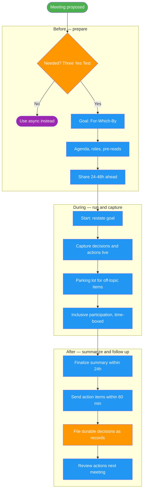

---
# Copyright (c) 2025-2026 Juliusz Ćwiąkalski (https://www.cwiakalski.com | https://www.linkedin.com/in/juliusz-cwiakalski/ | https://x.com/cwiakalski)
# MIT License - see LICENSE file for full terms
source: https://github.com/juliusz-cwiakalski/agentic-delivery-os/blob/main/doc/guides/meeting-preparation-and-summarization.md
ados_distribution: redistributable
---
# Meeting Preparation and Summarization Guide

> **Audience:** Engineers, product managers, founders, team leads, and AI agents who organize, facilitate, or document meetings.
>
> **Purpose:** A practical, end-to-end guide for preparing, running, and summarizing meetings — covering what to store where, how to write a great agenda, how to capture decisions and action items, and how to choose between copy/paste and git-native workflows.

> Part of the [ADOS process map](ados-processes.md) — see how Meeting Management relates to Decision Making and the rest.

The meeting lifecycle at a glance — **before** (prepare), **during** (run and capture), **after** (summarize and follow up):



**Legend**: green = start; purple = optional/escape (use async instead of a meeting); orange = decision/gate (the "is a meeting needed?" triage and the "file durable decisions" gate); blue = ordinary steps. Solid arrows = forward flow.

---

## 1. Why meeting documentation matters

A meeting without documentation is a meeting that never happened for everyone who wasn't in the room. Good documentation:

- Makes decisions durable and discoverable (not locked in someone's memory)
- Assigns clear ownership for follow-up actions
- Provides raw evidence for strategy synthesis (interviews, customer calls, retrospectives)
- Reduces the need for repeat meetings ("what did we decide last time?")
- Enables asynchronous participation for distributed and remote-first teams

This guide covers the full lifecycle: **before** (preparation), **during** (facilitation and capture), and **after** (summarization and follow-up).

---

## 2. Before the meeting: Preparation

### 2.1 Decide if a meeting is needed

Before booking, apply the **"Three Yes Test"**:

1. Do you have a clear, shareable goal?
2. Do you have an agenda with time-boxed topics?
3. Have you been selective about attendees (each person has a clear contribution purpose)?

If any answer is "no," do not book the meeting. Consider these async-friendly alternatives:

| If the meeting is primarily... | Use instead |
|-------------------------------|------------|
| Information sharing / announcements | Async doc, Loom video, email |
| Status updates | Shared tracker, Slack thread, dashboard |
| Simple approval | Async workflow, PR review, comment thread |
| Reading a document together | Send the doc async; meet only to discuss disagreements |

**Only book a meeting when:** the topic requires real-time discussion, decision-making under uncertainty, relationship-building, or urgent incident resolution.

### 2.2 Define the goal

Write a one-sentence goal using the **"For Which By" formula**:

> *[Decision/Outcome] for [Stakeholder/Benefit] by [Deadline/Trigger]*

Examples:
- "Decide on Q3 budget allocation for Finance team approval by Friday EOD"
- "Agree on the API contract for the orders service before sprint planning on Monday"
- "Generate 20+ growth experiment ideas for the growth team to evaluate next week"

Share the goal in the calendar invite and at the top of the meeting notes file.

### 2.3 Create the agenda

A great agenda has three parts:

**A. Time-boxed topics**

| Time | Topic | Owner | Expected outcome |
|------|-------|-------|------------------|
| 5 min | Review last meeting's action items | Facilitator | Confirm completion |
| 15 min | API contract proposal | Alice | Decision: accept/reject/revise |
| 10 min | Open questions from PR #45 | Bob | Discussion → resolution or owner |
| 5 min | Action items & wrap-up | Facilitator | Owners + due dates assigned |

Rules:
- Assign a time estimate to every topic (prevents overrun).
- Name an owner for each topic (the person responsible for driving it).
- State the expected outcome (decision, discussion, update, feedback).
- Always end with an action-items review (5 min).

**B. Preparation requirements**

- **Pre-reads:** documents to review before the meeting (attach links).
- **Pre-work:** tasks to complete before the meeting (data to gather, questions to prepare).
- Share the agenda and prep materials **24-48 hours** in advance.

**C. Attendees and roles**

- **Required:** Decision-makers and subject-matter experts needed to resolve issues. Mark explicitly.
- **Optional:** Stakeholders for visibility. Be ruthless — if they don't need to attend for the meeting to succeed, remove them and send an async recap instead.
- **Roles:** Assign before the meeting:
  - **Facilitator** — keeps focus, enforces time-boxes, ensures participation
  - **Note-taker** — captures decisions, actions, parked items, open questions
  - **Timekeeper** — signals when a topic is approaching its time limit

### 2.4 Choose a decision framework (for decision meetings)

Specify how decisions will be made so attendees know the rules:

| Framework | When to use | How it works |
|-----------|-------------|--------------|
| **DACI** | Clear decision owner | Driver (proposes), Approver (decides), Contributors (input), Informed (notified) |
| **RAPID** | Complex stakeholder decisions | Recommend, Agree, Perform, Input, Decide — each role assigned to a person |
| **Consent** | Fast, no-objection decisions | A decision passes if no one objects ("safe to try?") |
| **Consensus** | High-buy-in needed | Everyone must agree; slower but more durable |

State the framework in the agenda. For non-decision meetings (brainstorming, status, retro), mark "N/A."

**Three decision modes** (see the [Decision-Making Guide](decision-making.md)) — know which one a meeting uses:

| Mode | When | How |
|------|------|-----|
| **(a) Interactive AI session** | A human driver/decider wants structured help | `/plan-decision` → `@decision-advisor` plans → `/write-decision` renders → human decides |
| **(b) Meeting-driven** | A meeting reaches a durable decision | Meeting discussion is **evidence input** to `/plan-decision`; durable decisions route to `/write-decision` |
| **(c) Delegated AI autonomous** | Routine/reversible R0–R1 choices within delegated bounds | AI acts within bounded authority with audit + escalation; minimal/no record |

For mode (b), capture the discussion, options, and rationale during the meeting so `/plan-decision` has high-quality evidence to work from.

### 2.5 Two ways to share the agenda

**Option A: Copy/paste workflow**

1. Fill in the "Agenda & Preparation" block in the meeting notes file.
2. Select the block and copy it.
3. Paste it into the calendar invite description.
4. Attendees see the agenda when they open the invite.

**Option B: Git-native workflow**

1. Create the meeting notes file (or open a PR) before the meeting.
2. Share the file or PR URL as the calendar invite link.
3. Attendees open the file/PR to review the agenda.
4. Collaborators can **comment on the agenda**, ask questions, and propose additions before the meeting starts (using PR comments or inline review).
5. During the meeting, the note-taker updates the same file in real-time (or after).
6. After the meeting, the PR is merged — the notes become the canonical record.

The git-native workflow is ideal for:
- Teams already living in git (engineering teams using ADOS)
- Meetings with complex pre-reads that benefit from inline discussion
- Async-first teams where the "meeting" is partly a review of comments accumulated before the sync call
- Auditability — the PR history shows how the agenda evolved

---

## 3. During the meeting: Facilitation and capture

### 3.1 Start strong

- Start on time even if some attendees are late (don't punish punctuality).
- Restate the goal at the top.
- Review action items from the last meeting (did owners complete them?).
- Confirm roles: who is facilitating, taking notes, keeping time.

### 3.2 Use the parking lot

When someone raises an off-topic item:
1. Add it to the **Parked Items** section of the notes.
2. Acknowledge it briefly ("good point — parking that for now").
3. Move back to the current topic.

Review parked items at the end of the meeting or at the start of the next one. Assign each a proposed next step (follow-up meeting, async thread, add to backlog).

### 3.3 Capture in real-time

The note-taker should capture these as they happen (not from memory afterward):

| Section | What to capture | What NOT to capture |
|---------|----------------|---------------------|
| **Decisions** | Accepted outcomes + brief rationale | Verbatim discussion leading to the decision |
| **Action items** | Verb-first task + single owner + due date + context | Vague commitments ("someone should look into this") |
| **Ideas** | All ideas during brainstorming (no judgment) | Evaluations during generation (save for post-meeting) |
| **Open questions** | Unresolved items + owner to investigate + revisit date | Items that were resolved during the meeting |
| **Parked items** | Off-topic items + proposed next step | Detailed discussion of the parked item |
| **Notes worth keeping** | Patterns, risks, constraints, agreements discovered | Ephemeral clarifications already resolved |
| **Discussion** | Key points by topic (bullets) | Word-for-word transcript (use transcript recording for that) |

### 3.4 Ensure inclusive participation

- Use structured turn-taking (round-robin for standups, silent brainstorming before discussion).
- Pause for reflection before moving on ("anyone haven't spoken yet?").
- For hybrid/remote meetings: address remote participants by name, use chat for questions.
- For brainstorming: enforce "no evaluation during generation" to encourage wild ideas.

---

## 4. After the meeting: Summarization and follow-up

### 4.1 Finalize the summary (within 24 hours)

Meeting information has a half-life. Finalize the summary while memories are fresh:

1. Clean up the discussion section (remove ephemeral notes, keep durable insights).
2. Confirm every action item has: a verb-first task, a single owner, a specific due date.
3. Confirm every decision has a brief rationale.
4. Move accepted ideas from the Ideas section to Decisions or Action Items.
5. Update the document status:
   - `status: Draft` → `status: Accepted`
   - `document_classification: raw-evidence` → `document_classification: current-truth`
   - `synthesis_status: raw` → `synthesis_status: synthesized`
6. Review parked items — assign owners or schedule follow-ups.

### 4.2 Send action items (within 60 minutes)

Action items buried in a long summary are rarely acted on. Send action items separately and quickly:

- Extract action items into a short message (Slack, email, or PR comment).
- Send within 60 minutes of meeting end while context is fresh.
- Include: task, owner, due date, and link to the full meeting notes.

### 4.3 File significant decisions

If the meeting produced a durable decision (architecture choice, pricing decision, process change), file it as a decision record. The decision process — when to record, how much ceremony, who decides — is defined in the **[Decision-Making Guide](decision-making.md)**; meeting discussion is legitimate **evidence input** to `/plan-decision`, and durable decisions route to `/write-decision` (delegate via `@decision-advisor`).

| Decision type | Record type | Location |
|---------------|-------------|----------|
| Architecture / technical | ADR | `doc/decisions/ADR-XXXX-<slug>.md` |
| Product scope / priority | PDR | `doc/decisions/PDR-XXXX-<slug>.md` |
| Business strategy / pricing / GTM | BDR | `doc/decisions/BDR-XXXX-<slug>.md` |
| Technical direction / tech choice | TDR | `doc/decisions/TDR-XXXX-<slug>.md` |
| Operating model / process / cadence | ODR | `doc/decisions/ODR-XXXX-<slug>.md` |

Cross-link the decision record back to the meeting notes via `related_decisions` in the meeting front matter, and from the decision record to the meeting via `related_changes` or body reference.

### 4.4 Review at the next meeting

At the start of the next meeting (or next standup), review the previous meeting's action items:
- Did the owner complete the task?
- If not, what's blocking it?
- Move incomplete items forward or reassign.

This closes the loop and prevents action items from silently dying.

---

## 5. What to store where

### 5.1 Meeting notes file

| Meeting scope | Location | Profile requirement |
|---------------|----------|---------------------|
| Repo-scoped (service planning, team retro, design review) | `doc/meetings/YYYY-MM-DD-<topic-slug>.md` | Always allowed (engineering-safe) |
| Cross-repo / product / business (product strategy, all-hands, leadership) | `doc/business/meetings/YYYY-MM-DD-<topic-slug>.md` | Requires `business_docs_enabled: true` |

### 5.2 Transcripts

| Type | Location | How to link |
|------|----------|-------------|
| Full transcript (text) | `doc/meetings/transcripts/YYYY-MM-DD-<topic-slug>.txt` | `transcript_url` front-matter field |
| Video/audio recording | External (Zoom, Meet, Loom) or `doc/meetings/transcripts/` | `recording_url` front-matter field |

Store transcripts in the repo (not just external links) so they are one click away and survive link rot. For business meetings: `doc/business/meetings/transcripts/`.

### 5.3 Decisions

| Decision significance | Where it goes | Example |
|-----------------------|---------------|---------|
| Minor (resolved in meeting, no durable record needed) | Meeting notes only | "We'll use library X for this task" |
| Significant (durable, affects future work) | `doc/decisions/` as ADR/PDR/BDR/TDR/ODR + cross-link from meeting notes | "We adopt event-driven architecture for all new services → ADR-0042" |

### 5.4 Action items

Action items live in the meeting notes file. For traceability, also:
- Link action items to relevant GitHub issues or Jira tickets via `related_changes`.
- For ADOS changes: reference the `workItemRef` in the meeting notes front matter.

### 5.5 Front matter fields (quick reference)

```yaml
id: MEETING-<YYYY-MM-DD>-<slug>
status: Draft | Accepted
meeting_date: <YYYY-MM-DD>
meeting_type: standup | planning | review | retro | 1-1 | all-hands | interview | working-session | brainstorming | war-room | incident | design-review | technical-spike | other
attendees: [<names>]
recording_url: <url or null>
transcript_url: <relative path or url or null>
facilitator: <name>
note_taker: <name>
timekeeper: <name>
document_classification: raw-evidence | current-truth
source_type: meeting
synthesis_status: raw | in-review | synthesized
owners: [<owner-or-team>]
area: meetings
links:
  related_decisions: [ADR-0042]
  related_changes: [GH-456]
  related_documents: [doc/spec/features/feature-orders.md]
summary: "<one-line summary>"
```

---

## 6. Meeting type-specific guidance

Different meeting types need different documentation focus. Use the `meeting_type` field to signal the type, then apply the relevant guidance:

| Meeting type | Typical length | Cadence | Documentation focus | Key sections |
|-------------|---------------|---------|---------------------|--------------|
| **Standup** (`standup`) | 15 min | Daily | Blockers, commitments | Updates, Blockers, Action Items, Parked Items |
| **Planning** (`planning`) | 30-60 min | Weekly / per sprint | Scope, commitments, dependencies | Goal, Decisions, Action Items, Open Questions |
| **Review** (`review`) | 30-60 min | Per milestone | Feedback, decisions, revisions | Discussion (by area), Decisions, Action Items |
| **Retrospective** (`retro`) | 45-60 min | Per sprint / milestone | Improvements, patterns | Discussion (what went well / what didn't), Action Items |
| **Decision** (`decision`) | 30-60 min | As needed | Framework, decision, rationale | Goal, Decision Framework, Decisions, Action Items |
| **1:1** (`1-1`) | 25-30 min | Weekly / biweekly | Career, blockers, concerns | Discussion (career / blockers / concerns), Action Items |
| **All-hands** (`all-hands`) | 30-60 min | Monthly | Announcements, Q&A | Discussion (announcements / Q&A), Action Items |
| **Interview** (`interview`) | 30-60 min | As needed | Customer/(candidate insights | Discussion (by question), Notes Worth Keeping |
| **Working session** (`working-session`) | 60-120 min | As needed | Collaboration, pairing, problem-solving | Discussion, Notes Worth Keeping, Action Items |
| **Brainstorming** (`brainstorming`) | 60-90 min | As needed | Raw idea generation | Ideas (all), Evaluation (post-meeting) |
| **War room / Incident** (`war-room` \| `incident`) | As long as needed | During incident | Timeline, root cause, resolution | Discussion (timeline / root cause), Decisions, Action Items |
| **Design review** (`design-review`) | 60-90 min | As needed | Feedback by area, revisions | Discussion (feedback by area), Decisions, Action Items |
| **Technical spike** (`technical-spike`) | Variable | As needed | Findings, recommendations | Discussion (findings), Decisions, Notes Worth Keeping |

For `other` meeting types, use the default agenda and summary structure from the template.

### Special notes:

- **Brainstorming:** enforce "no evaluation during generation." Capture every idea. Evaluate post-meeting using a feasibility x impact matrix. Move accepted ideas to Decisions or Action Items.
- **War room / Incident:** capture the timeline as it unfolds (timestamps for each event). Keep it blameless — focus on process, not people. After resolution, file a postmortem in `doc/ops/incident-reviews/` and link from the meeting notes.
- **1:1:** notes are typically private (manager-direct report only). Focus on career development and blockers, not task status (use async for that). Default to NOT committing 1-1 notes to a shared repo; confirm with the user or use a private/local location, since 1-1 content may include sensitive career or feedback discussions.
- **Retrospective:** use structured sections (What Went Well, What Didn't Work, Action Items). Ensure every action item is traceable to an identified issue.

---

## 7. Best practices (research-informed)

### 7.1 The action item formula

Every action item must have:

1. **Verb-first task** — what to do ("Prepare budget variance analysis...")
2. **Single owner** — one named person (multiple owners halve completion likelihood)
3. **Specific due date** — not "soon" or "next week" but "2026-06-28"
4. **Context** — why it matters ("needed for Q3 planning")
5. **Definition of done** — what "complete" looks like (optional but powerful)

### 7.2 Conciseness: highlight reel, not transcript

- Focus on outcomes, not verbatim documentation.
- Capture main ideas, decisions, and responsibilities — not every word spoken.
- Use bullet points, not paragraphs.
- If you need the full record, use a transcript (`transcript_url`) and keep the summary clean.

### 7.3 Distinguish decisions from discussion from open questions

- **Decisions:** accepted outcomes with rationale and implications. These are durable.
- **Discussion points:** topics explored without consensus. Preserve context, not transcript.
- **Open questions:** unresolved items needing follow-up. Assign an owner and a revisit date.

### 7.4 Meeting cost awareness

Every meeting has a cost: (sum of attendees' hourly rates) x duration. Before booking a 10-person, 60-minute meeting, ask: is the expected outcome worth that investment? Consider:
- Could this be a smaller meeting + async update to the rest?
- Could this be a PR review instead of a sync call?
- Could this be two shorter meetings with prep in between?

### 7.5 Common failure modes and prevention

| Failure mode | Prevention |
|-------------|------------|
| No clear agenda | Never book without an agenda; share 24-48h in advance |
| No clear owner/outcome | Assign a meeting leader responsible for producing an outcome |
| Wrong people in the room | Use "what do I expect this person to contribute?" test for each attendee |
| Too long / unfocused | Time-box every topic; facilitator enforces limits |
| No follow-up | Review last meeting's action items at start of next meeting; track actions visibly |

---

## 8. Templates and references

| Resource | Location |
|----------|----------|
| Meeting notes template | `doc/templates/meeting-notes-template.md` |
| Documentation handbook (meeting conventions) | `doc/documentation-handbook.md` §2b |
| Decision records | `doc/decisions/` (ADR/PDR/TDR/BDR/ODR) |
| Decision record template | `doc/templates/decision-record-template.md` |
| Documentation profiles | `doc/documentation-profile.md` (if present) |
| Feature spec: documentation profiles | `doc/spec/features/feature-documentation-profiles.md` |
| Feature spec: document templates | `doc/spec/features/feature-document-templates.md` |

---

## 9. Quick checklist

### Before the meeting

- [ ] Goal defined (one sentence, "for which by" formula)
- [ ] Agenda with time-boxed topics, owners, expected outcomes
- [ ] Required vs optional attendees identified
- [ ] Roles assigned (facilitator, note-taker, timekeeper)
- [ ] Pre-reads and pre-work shared 24-48h in advance
- [ ] Meeting notes file created (or PR opened) with agenda block filled
- [ ] Agenda shared: copy/pasted into invite OR file/PR URL shared as invite link

### During the meeting

- [ ] Started on time
- [ ] Goal restated
- [ ] Last meeting's action items reviewed
- [ ] Topics time-boxed; parking lot used for off-topic items
- [ ] Decisions, action items, ideas, open questions, parked items captured in real-time

### After the meeting

- [ ] Summary finalized within 24 hours
- [ ] Action items sent within 60 minutes
- [ ] Document status updated to `Accepted`, classification to `current-truth`
- [ ] Significant decisions filed as ADR/PDR/BDR and cross-linked
- [ ] Transcript (if any) stored in `transcripts/` and linked via `transcript_url`
- [ ] Action items reviewed at the start of the next meeting
