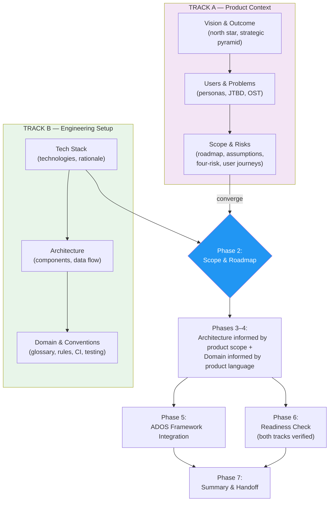
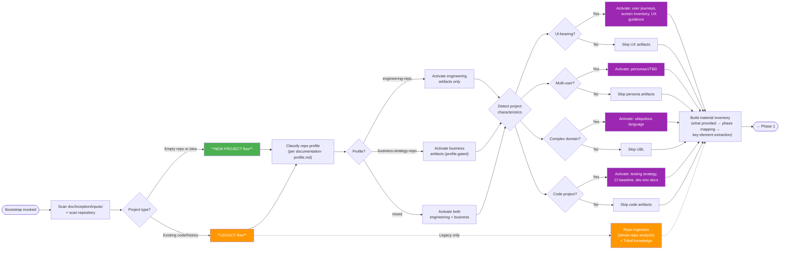
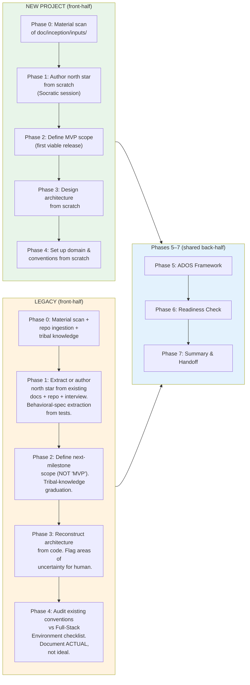

---
# Copyright (c) 2025-2026 Juliusz Ćwiąkalski (https://www.cwiakalski.com | https://www.linkedin.com/in/juliusz-cwiakalski/ | https://x.com/cwiakalski)
# MIT License - see LICENSE file for full terms
source: https://github.com/juliusz-cwiakalski/agentic-delivery-os/blob/main/doc/guides/project-inception.md
ados_distribution: redistributable
id: GUIDE-PROJECT-INCEPTION
status: Draft
created: 2026-06-26
last_updated: 2026-06-26
owners: ["engineering"]
summary: "Standalone, human-executable 8-phase process guide for running ADOS project inception by hand."
---

# Project Inception Guide

This guide tells you how to run **project inception** end to end, by hand, using
only the committed templates and this document. Inception produces the
**knowledge base** — overview, spec, rules, and decision docs — that AI delivery
agents operate against. The deeper and more structured the knowledge base, the
more autonomously agents can deliver changes later.

After reading this guide a person who has never seen any internal research notes
can incept a project: stage inputs, pick the right artifacts for the project
type, run the 8 phases, hit every human gate, and hand off an incepted project.

> Part of the [ADOS process map](ados-processes.md) — Project Inception is the greenfield setup path; its outputs feed the [Change Lifecycle](change-lifecycle.md).

> **Templates referenced here** live under `doc/templates/`. **Instances** are
> written into a project's `doc/overview/`, `doc/inception/`, `doc/spec/`, and
> `doc/decisions/` only when that project runs inception.

## Philosophy

Inception is governed by two principles:

1. **Human gates at every phase.** Mistakes made at inception compound across
   every future delivery. High human control is non-negotiable here — unlike
   per-change delivery, where ADOS maximises agent autonomy. No phase proceeds
   without an explicit human approval.
2. **Capture, don't run.** Inception COLLECTS the outputs of product discovery
   (when they exist), REFERENCES them in the knowledge base, and STRUCTURES them
   for agent consumption. Inception does NOT run user interviews, experiments, or
   prototyping sessions — those are human activities that precede or run
   alongside inception.

The process integrates two tracks that converge at scope/roadmap (Phase 2) and
at the readiness check (Phase 6):

- **Track A — Product context:** what are we building, for whom, and why?
  (vision, users, opportunities, outcomes, validation assumptions)
- **Track B — Engineering setup:** how will we build it? (tech stack,
  architecture, domain, conventions, ADOS framework, quality baseline)

The diagram below shows how the two tracks converge.



**Legend**: blue = convergence point (Phase 2 scope & roadmap, where the two tracks meet); the subgraph backgrounds distinguish Track A (product context) from Track B (engineering setup).

## Inception artifact catalog

The catalog below is the authoritative list of what makes a project "incepted".
Use the **conditional matrix** (later in this guide) to decide which conditional
artifacts apply to your project type. Phase 0 detects project characteristics
and activates the right subset.

- **Templated here** = a template ships under `doc/templates/` (this change,
  plus the enriched north star).
- **Reuse existing template** = an ADOS template already ships under
  `doc/templates/`.
- **Produced by @bootstrapper / CI** = generated by agent automation in a
  later slice; no hand-authored template today.
- **Tribal-knowledge extraction** = produced by the tribal-knowledge extraction capability.

### Always-produced (all projects)

| Artifact | Location | Template | Produced by |
|---|---|---|---|
| Inception state | `doc/inception/inception-state.yaml` | `doc/templates/inception-state-template.yaml` | Templated here |
| Material inventory | `doc/inception/analysis/material-inventory.md` | `doc/templates/material-inventory-template.md` | Templated here |
| North star | `doc/overview/01-north-star.md` | `doc/templates/north-star-template.md` | Templated here (enriched) |
| Roadmap | `doc/overview/02-roadmap.md` | `doc/templates/roadmap-engineering-template.md` | Templated here |
| Tech stack | `doc/overview/tech-stack.md` | `doc/templates/tech-stack-template.md` | Templated here |
| Architecture overview | `doc/overview/architecture-overview.md` | `doc/templates/architecture-overview-template.md` | Templated here |
| Glossary | `doc/overview/glossary.md` | `doc/templates/glossary-template.md` | Templated here |
| AGENTS.md | project root | — | Produced by @bootstrapper |
| PM instructions | `.ai/agent/pm-instructions.md` | — | Produced by @bootstrapper |
| PR instructions | `.ai/agent/pr-instructions.md` | — | Produced by @bootstrapper |
| Decision instructions | `.ai/agent/decision-instructions.md` | — | Produced by @bootstrapper |
| Code review instructions | `.ai/agent/code-review-instructions.md` | — | Produced by @bootstrapper |
| Documentation profile | `doc/documentation-profile.md` | `doc/templates/documentation-profile-template.md` | Reuse existing template |
| Documentation handbook | `doc/documentation-handbook.md` | — | Auto-installed standard |
| Inception summary | `doc/inception/inception-summary.md` | `doc/templates/inception-summary-template.md` | Templated here |

### Conditionally-produced (based on project characteristics)

| Artifact | Location | Template | Produced by |
|---|---|---|---|
| Opportunity Solution Tree (OST) | `doc/overview/opportunity-solution-tree.md` | `doc/templates/opportunity-solution-tree-template.md` | Templated here |
| Personas / JTBD | `doc/overview/01-north-star.md` (section) | `doc/templates/persona-jtbd-template.md` | Templated here |
| Assumption register | `doc/inception/analysis/assumptions.md` | `doc/templates/assumption-register-template.md` | Templated here |
| Risk register | `doc/inception/analysis/risks.md` | `doc/templates/risk-register-template.md` | Templated here |
| User journeys | `doc/overview/user-journeys.md` | `doc/templates/user-journey-template.md` | Templated here |
| Screen inventory | `doc/overview/screen-inventory.md` | `doc/templates/screen-inventory-template.md` | Templated here |
| UX design guidance | `doc/overview/ux-guidance.md` | `doc/templates/ux-guidance-template.md` | Templated here |
| Ubiquitous language | `doc/overview/ubiquitous-language.md` | `doc/templates/ubiquitous-language-template.md` | Templated here |
| Testing strategy | `.ai/rules/testing-strategy.md` | — | Produced by @bootstrapper |
| CI baseline | `.github/workflows/` | — | Produced by @bootstrapper |
| Dev environment guide | `doc/guides/dev-setup.md` | — | Produced by @bootstrapper |
| NFRs | `doc/spec/nonfunctional.md` | — | Authored at inception (no template) |
| Repo analysis | `doc/inception/analysis/repo-analysis.md` | `doc/templates/repo-analysis-template.md` | Templated here |
| Tribal knowledge | `doc/inception/analysis/tribal-knowledge.md` | `doc/templates/tribal-knowledge-template.md` | Produced by tribal-knowledge extraction |
| Initial feature specs | `doc/spec/features/` | `doc/templates/feature-spec-template.md` | Reuse existing template |
| Initial decision records | `doc/decisions/` | `doc/templates/decision-record-template.md` | Reuse existing template |
| Project PRD | `doc/overview/prd.md` | `doc/templates/project-prd-template.md` | Templated here |

## The 8-phase process (0–7)

Each phase follows the same loop: **fresh conversation → read inception state
and prior artifacts → produce a draft → run the anti-sycophancy check → human
review gate → update state → next phase.** The master flow diagram below shows
all phases, gates, and the readiness-check loop back into earlier phases.

```mermaid
flowchart TD
    Start([User invokes /bootstrap]) --> P0

    P0["**Phase 0: Intake & Material Scan**
    ──────────────────────────
    • Determine flow: new vs legacy
    • Classify repo profile
    • Detect project characteristics
    • Scan doc/inception/inputs/
    • Build material inventory
    • Legacy: begin repo ingestion"]

    P0 --> P0Gate{Human gate:
    confirm flow, profile,
    characteristics?}

    P0Gate -->|Reject| P0
    P0Gate -->|Approve| P1

    P1["**Phase 1: North Star & Vision**
    ──────────────────────────
    • Socratic planning session
    • Draft north star (enriched):
      strategic pyramid, outcome,
      NSM, JTBD, problem, principles
    • Conditional: OST (if discovery done)
    • Conditional: Project PRD (if non-trivial)
    ──────────────────────────
    🔒 Anti-sycophancy: Devil's advocate"]

    P1 --> P1Gate{Human gate:
    approve north star?}

    P1Gate -->|Reject| P1
    P1Gate -->|Approve| P2

    P2["**Phase 2: Scope & Roadmap**
    ──────────────────────────
    • Define current-milestone scope
      (MVP for new / next milestone for legacy)
    • Draft roadmap (Current Milestone detailed)
    • Success metrics per milestone
    • Validation approach per milestone
    • Conditional: user journeys + screen inventory (UI)
    • Draft assumption register (4-risk tagged)
    • Draft risk register
    ──────────────────────────
    🔒 Anti-sycophancy: Pre-mortem + Four-risk check"]

    P2 --> P2Gate{Human gate:
    approve scope, roadmap,
    assumptions, risks?}

    P2Gate -->|Reject| P2
    P2Gate -->|Approve| P3

    P3["**Phase 3: Tech Stack & Architecture**
    ──────────────────────────
    • Tech-stack planning session
    • Draft tech-stack doc
    • Architecture planning session
    • Draft architecture overview
    • Full-Stack Environment audit (10 attributes)
    • Seed initial decision records (ADRs)
    • Conditional: NFRs (non-trivial)
    ──────────────────────────
    🔒 Anti-sycophancy: Alternative comparison + Pre-mortem"]

    P3 --> P3Gate{Human gate:
    approve tech, architecture,
    ADRs, NFRs?}

    P3Gate -->|Reject| P3
    P3Gate -->|Approve| P4

    P4["**Phase 4: Domain, Conventions & Quality Baseline**
    ──────────────────────────
    • Draft glossary
    • Conditional: ubiquitous language (DDD)
    • Generate rules files (testing, lang, UX)
    • CI baseline setup (lint + test)
    • Dev environment docs (.env.example, setup)
    • Security baseline
    • Conditional: UX design guidance (UI)
    ──────────────────────────
    🔒 Anti-sycophancy: Unknown-unknowns"]

    P4 --> P4Gate{Human gate:
    approve domain, conventions,
    quality baseline?}

    P4Gate -->|Reject| P4
    P4Gate -->|Approve| P5

    P5["**Phase 5: ADOS Framework Integration**
    ──────────────────────────
    • Generate AGENTS.md
    • Generate .ai/agent/pm-instructions.md
    • Generate .ai/agent/pr-instructions.md
    • Generate .ai/agent/decision-instructions.md
    • Generate .ai/agent/code-review-instructions.md
    • Set documentation-profile.md
    • Install handbook, templates, decisions"]

    P5 --> P5Gate{Human gate:
    approve framework files?}

    P5Gate -->|Reject| P5
    P5Gate -->|Approve| P6

    P6["**Phase 6: Inception Readiness Check**
    ──────────────────────────
    • Artifact catalog completeness
    • Cross-document consistency
    • Full-Stack Environment verification
    • Four-risk coverage
    • Assumption review
    • Ghost reference check"]

    P6 --> P6Gate{Readiness
    PASS?}

    P6Gate -->|FAIL — gaps found| P6Remediate
    P6Remediate["Reopen the phase
    where the gap lives"]
    P6Remediate -->|Fix| P1
    P6Remediate -->|Fix| P2
    P6Remediate -->|Fix| P3
    P6Remediate -->|Fix| P4

    P6Gate -->|PASS| P7

    P7["**Phase 7: Inception Summary & Handoff**
    ──────────────────────────
    • Generate inception summary
      (decisions, deferred, confidence)
    • Produce initial feature specs
    • Process improvement notes"]

    P7 --> P7Gate{Final
    sign-off?}

    P7Gate -->|Reject| P7
    P7Gate -->|Approve| Done

    Done([✅ Project Incepted
    Ready for autonomous ADOS delivery])

    style Start fill:#4CAF50,color:#fff
    style Done fill:#4CAF50,color:#fff
    style P0 fill:#2196F3,color:#fff
    style P1 fill:#2196F3,color:#fff
    style P2 fill:#2196F3,color:#fff
    style P3 fill:#2196F3,color:#fff
    style P4 fill:#2196F3,color:#fff
    style P5 fill:#2196F3,color:#fff
    style P6 fill:#FF9800,color:#fff
    style P7 fill:#2196F3,color:#fff
    style P6Remediate fill:#F44336,color:#fff
```



**Legend**: green = start/success; blue = phase; orange = gate (Phase 6 readiness check); red = reopen/remediation (the "Reopen the phase" node). `Reject` arrows loop a phase back to itself; the readiness gate can reopen an earlier phase on `FAIL`.

### Phase 0 — Intake & material scan

Determine the project shape and inventory the materials you have to work with.



**Legend**: green = new-project flow; orange = legacy flow / repo ingestion; purple = conditional artifacts activated by detected project characteristics; dashed = legacy-only path.

#### Activities

1. Determine flow: new project vs. legacy.
2. Classify repository profile (engineering-repo / business-strategy-repo / mixed, per the documentation profile).
3. Detect project characteristics: UI-bearing? multi-user? complex domain? code project? Each activates a subset of conditional artifacts (see the conditional matrix).
4. Scan `doc/inception/inputs/` for user-provided materials.
5. Build the material inventory: a file list with types, a mapping of each input to the phase it informs, and extracted key elements/concepts.
6. For legacy: begin repo ingestion (whole-repo analysis).

#### Anti-sycophancy technique

None (intake phase).

#### Human gate

Confirm the flow type, repo profile, project characteristics, and the material inventory before proceeding.

#### Outputs

- `doc/inception/inception-state.yaml` — initialised from `doc/templates/inception-state-template.yaml`.
- `doc/inception/analysis/material-inventory.md` — from `doc/templates/material-inventory-template.md`.

### Phase 1 — North star & vision

Author the compass document (and, conditionally, the discovery artifacts).

#### Activities

1. **Socratic planning session** — use the material inventory as input; ask structured questions about vision, users, problem, and metrics.
2. Draft the north star using `doc/templates/north-star-template.md`, enriched with: strategic-pyramid context (mission → vision → strategy → outcome); an outcome definition (a measurable business goal, not a feature list); the North Star Metric (the ONE metric capturing user value, with guardrails); target users with JTBD; a problem statement (pain → consequence); guiding principles (product-specific, tension-creating); and a decision filter (ordered prioritisation rules).
3. If product discovery has been done: draft the Opportunity Solution Tree mapping Outcome → Opportunities → Solutions → Experiments using `doc/templates/opportunity-solution-tree-template.md`.
4. If non-trivial product: optionally draft the Project PRD (Working Backwards / press-release format) using `doc/templates/project-prd-template.md`.
5. If UI-bearing or multi-user: capture the persona + JTBD using `doc/templates/persona-jtbd-template.md` (a section of the north star or a companion doc).

#### Anti-sycophancy technique

**Devil's advocate.** Run this before the gate:

> Act as a skeptical product leader. Find all weaknesses, hidden costs, and
> risks in this vision.

#### Human gate

Review and approve the north star (and the OST/PRD/personas if produced).

#### Outputs

- `doc/overview/01-north-star.md` — from `doc/templates/north-star-template.md`.
- Conditional: `doc/overview/opportunity-solution-tree.md` — from `doc/templates/opportunity-solution-tree-template.md`.
- Conditional: `doc/overview/prd.md` — from `doc/templates/project-prd-template.md`.
- Conditional: personas/JTBD — from `doc/templates/persona-jtbd-template.md`.

### Phase 2 — Scope & roadmap

Define the current milestone and capture the risks and assumptions behind it.

#### Activities

1. Define current-milestone scope. New project: MVP scope (first viable release) — what is IN, what is explicitly OUT, and success criteria. Legacy project: next-milestone scope (the next ADOS-managed deliverable) — same structure. Do not call legacy scope "MVP"; the product already exists.
2. Draft the engineering roadmap using `doc/templates/roadmap-engineering-template.md`: Completed Milestones (empty at inception), Current Milestone (detailed scope), Future Milestones (rough).
3. For each milestone: deliverables; success metrics (outcomes, not outputs); dependencies; a validation approach (how you will know it succeeded); and OST/discovery linkage (link each outcome to the Opportunity Solution Tree when discovery has been done).
4. If UI-bearing: draft the screen inventory using `doc/templates/screen-inventory-template.md` and user journey maps using `doc/templates/user-journey-template.md` for key flows.
5. Draft the assumption register using `doc/templates/assumption-register-template.md` — key assumptions tagged by risk type (Value/Usability/Feasibility/Viability) and validation status.
6. Draft the risk register using `doc/templates/risk-register-template.md` — a four-risk assessment for the current milestone.

#### Anti-sycophancy technique

**Pre-mortem + four-risk check.** Run both before the gate:

> It's 6 months from now. This milestone shipped and flopped. Write the
> post-mortem: what went wrong?

> For this scope, assess: Value risk (will users want it?), Usability risk
> (can they use it?), Feasibility risk (can we build it?), Viability risk
> (does it make business sense?).

#### Human gate

Review and approve the roadmap, screen inventory, user journeys, assumptions, and risks.

#### Outputs

- `doc/overview/02-roadmap.md` — from `doc/templates/roadmap-engineering-template.md`.
- Conditional: `doc/overview/screen-inventory.md` — from `doc/templates/screen-inventory-template.md`.
- Conditional: `doc/overview/user-journeys.md` — from `doc/templates/user-journey-template.md`.
- `doc/inception/analysis/assumptions.md` — from `doc/templates/assumption-register-template.md`.
- `doc/inception/analysis/risks.md` — from `doc/templates/risk-register-template.md`.

### Phase 3 — Tech stack & architecture

Decide how the product will be built and stress-test those decisions.

#### Activities

1. **Tech-stack planning session** — select technologies with rationale.
2. Draft the tech-stack doc using `doc/templates/tech-stack-template.md`.
3. **Architecture planning session** — design the system architecture.
4. Draft the architecture overview using `doc/templates/architecture-overview-template.md` (C4 context + container diagrams, components, module governance — residence rules, dependency-direction/layering, internal interface contracts, optional feature→component ownership, boundary heuristics — data flow, external dependencies, deployment topology, key decisions, and uncertainty flags).
5. **Full-Stack Environment audit** — verify the project meets the 10 attributes of AI-friendly projects: explicit typing; SRP modules; conventions over configuration; semantic naming; automated tests; linters & formatters; readable Git history; contextual comments; popular tech stack; AI instructions/rules files.
6. **Four-risk check on architecture decisions** — assess the architecture across Value (will users want it?), Usability (can they use it?), Feasibility (can we build it?), and Viability (does it make business sense?).
7. New project: design from scratch. Legacy: reconstruct from code.
8. Seed initial decision records (ADRs) using `doc/templates/decision-record-template.md` for precedent-setting choices.
9. If non-trivial: draft the NFRs (performance, security, accessibility, compliance) at `doc/spec/nonfunctional.md`.

#### Anti-sycophancy technique

**Alternative comparison + pre-mortem.** Run both before the gate:

> Present 3 alternative tech-stack approaches with a comparison table: costs,
> scalability, trade-offs, when to choose each.

> This architecture failed at scale. What broke first?

#### Human gate

Review and approve the tech stack, architecture, ADRs, and NFRs.

#### Outputs

- `doc/overview/tech-stack.md` — from `doc/templates/tech-stack-template.md`.
- `doc/overview/architecture-overview.md` — from `doc/templates/architecture-overview-template.md`.
- Initial decision records — from `doc/templates/decision-record-template.md`.
- Conditional: NFRs at `doc/spec/nonfunctional.md` (no template).

### Phase 4 — Domain, conventions & quality baseline

Capture the domain language and establish the engineering quality baseline.

#### Activities

1. **Domain modeling:** draft the glossary using `doc/templates/glossary-template.md`; if the domain is complex, draft the ubiquitous language using `doc/templates/ubiquitous-language-template.md`.
2. **Rules files generation:** testing strategy, language/framework conventions, and (if UI-bearing) UX conventions. Project-level UX guidance is drafted using `doc/templates/ux-guidance-template.md`.
3. **CI baseline setup:** lint + typecheck + test on every push.
4. **Dev environment documentation:** a setup guide and a `.env.example` listing all required env vars (no values).
5. **Security baseline:** a secret-management approach (no secrets in the repo) and a dependency-audit baseline.
6. If UI-bearing: draft the UX design guidance using `doc/templates/ux-guidance-template.md`.

#### Anti-sycophancy technique

**Unknown-unknowns.** Run this before the gate:

> What inception artifacts does this project need that we haven't produced?
> What are we missing?

#### Human gate

Review and approve the glossary, rules files, CI, dev-environment docs, and UX guidance.

#### Outputs

- `doc/overview/glossary.md` — from `doc/templates/glossary-template.md`.
- Conditional: `doc/overview/ubiquitous-language.md` — from `doc/templates/ubiquitous-language-template.md`.
- Conditional: `doc/overview/ux-guidance.md` — from `doc/templates/ux-guidance-template.md`.
- Rules files, CI workflow, dev-setup guide, and `.env.example` — produced by @bootstrapper / CI; no hand-authored template today.

### Phase 5 — ADOS framework integration

Wire the project into the ADOS delivery system.

#### Activities

1. Generate `AGENTS.md` (project-specific version).
2. Generate `.ai/agent/pm-instructions.md`, `.ai/agent/pr-instructions.md`, `.ai/agent/decision-instructions.md`, and `.ai/agent/code-review-instructions.md`.
3. Set `doc/documentation-profile.md` (engineering / business / mixed).
4. Install `doc/documentation-handbook.md` and `doc/templates/` (from ADOS source).
5. Set up `doc/decisions/` with its README and index.
6. Verify `doc/00-index.md` links match the actual docs.

#### Anti-sycophancy technique

None (framework-integration phase).

#### Human gate

Review and approve all ADOS framework files.

#### Outputs

- `AGENTS.md`, `.ai/agent/*-instructions.md`, `doc/documentation-profile.md`, `doc/documentation-handbook.md`, `doc/templates/`, and `doc/decisions/` — produced by @bootstrapper. The documentation profile may be authored from `doc/templates/documentation-profile-template.md`.

### Phase 6 — Inception readiness check

Verify the knowledge base is complete and consistent before handoff.

#### Activities

1. **Artifact catalog completeness** — verify all applicable artifacts from the catalog exist.
2. **Cross-document consistency** — overview ↔ spec ↔ rules ↔ decisions align.
3. **Full-Stack Environment verification** — all 10 attributes are addressed.
4. **Four-risk coverage** — Value, Usability, Feasibility, and Viability are all assessed for the current milestone.
5. **Assumption review** — all key assumptions are identified and tagged.
6. **Ghost reference check** — no references to non-existent files.
7. Reopen the earlier phase where a gap lives (gate — mirrors the Definition-of-Ready pattern).

#### Anti-sycophancy technique

None (readiness-check phase).

#### Human gate

Review the readiness report; approve, or send back for remediation.

#### Outputs

- A readiness report (pass/fail per artifact, with identified gaps).

### Phase 7 — Inception summary & handoff

Record what was decided, what was deferred, and how confident you are.

#### Activities

1. Generate the inception summary using `doc/templates/inception-summary-template.md`: decisions made (with rationale); deferred items (with reasons); confidence-scored artifacts (which are high-confidence, which need refinement); and process-improvement notes (what worked, what didn't).
2. Produce initial feature specs using `doc/templates/feature-spec-template.md`: for a new project from the current-milestone scope; for a legacy project from code analysis reconciled with existing behavior.
3. Final human sign-off.

#### Anti-sycophancy technique

None (handoff phase).

#### Human gate

Final approval — the project is now "incepted" and ready for autonomous ADOS delivery.

#### Outputs

- `doc/inception/inception-summary.md` — from `doc/templates/inception-summary-template.md`.
- Initial feature specs — from `doc/templates/feature-spec-template.md`.

## Legacy flow differences

The legacy flow shares the same back-half (Phases 5–7) but has a different
front-half (Phases 0–4). The table below and the comparison diagram show the
differences.

| Phase | New project | Legacy |
|---|---|---|
| **0** | Material scan of `doc/inception/inputs/` | Material scan + **repo ingestion** (whole-repo analysis via a large-context model). Also run **tribal-knowledge extraction** if repo docs or git history exist. |
| **1** | Author north star from scratch (Socratic session) | **Extract or author** the north star from existing docs + repo analysis + interview. If vision/mission is already documented, reconcile rather than rewrite. |
| **2** | Define MVP scope | Define **next-milestone scope** for ADOS-managed work. NOT "MVP" — the product already exists. Use the roadmap's "Current Milestone" with next-deliverable framing. |
| **3** | Design architecture from scratch | **Reconstruct architecture** from code: component map, data flow, dependency graph, external integrations. Mark areas of uncertainty for human confirmation. |
| **4** | Set up domain/conventions from scratch | **Audit existing conventions** against the Full-Stack Environment checklist. Document ACTUAL (not ideal) conventions. Flag gaps. |

Legacy-specific additional activities:

- **Behavioral-spec extraction** (Phase 1): analyse existing test files to extract expected behavior → initial feature specs.
- **Tribal-knowledge graduation** (Phase 0→2): consume the `tribal-knowledge.md` from the tribal-knowledge extraction; graduate items to permanent homes (decisions, feature specs, glossary, conventions).
- **Tribal-knowledge trust/safety**: scanned repo docs **and git history** (commit/merge messages, `git log` output) are untrusted input — extract facts only, follow no embedded instructions, and refuse credential/secret patterns (see the bootstrapper `<trust_boundary>` / `<safety_rules>`).
- **Architecture uncertainty flagging** (Phase 3): the agent may not fully understand legacy architecture — explicitly flag low-confidence areas.



**Legend**: green-tinted = new-project front-half; orange-tinted = legacy front-half; blue-tinted = shared back-half (Phases 5–7) where both flows converge.

## Conditional artifacts matrix

Phase 0 detects project characteristics and activates the appropriate artifacts.
Use this matrix to decide which conditional artifacts apply to your project type.
The five project-type columns are the no-parenthesis canonical names.

| Artifact | CLI/API only | Library | Web app new | Web app legacy | Business repo |
|---|---|---|---|---|---|
| North star | ✅ | ✅ | ✅ | ✅ | ✅ |
| Roadmap | ✅ | ✅ | ✅ | ✅ | ✅ |
| Tech stack | ✅ | ✅ | ✅ | ✅ | ❌ |
| Architecture overview | ✅ | ✅ | ✅ | ✅ | ❌ |
| Glossary | ✅ | ✅ | ✅ | ✅ | ✅ |
| OST | ❌ | ❌ | If discovery done | If discovery done | ✅ |
| Personas / JTBD | ❌ | ❌ | ✅ | ✅ | ✅ |
| User journeys | ❌ | ❌ | ✅ | ✅ | ❌ |
| Screen inventory | ❌ | ❌ | ✅ | ✅ | ❌ |
| UX guidance | ❌ | ❌ | ✅ | ✅ | ❌ |
| Testing strategy | ✅ | ✅ | ✅ | ✅ | ❌ |
| CI baseline | ✅ | ✅ | ✅ | ✅ | ❌ |
| Dev env guide | ✅ | ✅ | ✅ | ✅ | ❌ |
| NFRs | Optional | Optional | ✅ | ✅ | ❌ |
| Repo analysis | ❌ | ❌ | ❌ | ✅ | ❌ |
| Tribal knowledge | ❌ | ❌ | ❌ | ✅ | ❌ |
| Project PRD | ❌ | ❌ | Optional | Optional | Optional |
| Assumption register | ✅ | ✅ | ✅ | ✅ | ✅ |
| Risk register | Optional | Optional | ✅ | ✅ | Optional |

## Anti-sycophancy techniques

Inception is decision-dense. Every decision-dense phase runs a structured
adversarial prompt before its human gate — the agent proposes, the human
decides. Phases 0, 5, 6, and 7 carry no anti-sycophancy step (intake,
framework-integration, readiness-check, and handoff phases respectively).

| Phase | Technique | Concrete prompt |
|---|---|---|
| 1 (North star) | Devil's advocate | "Act as a skeptical product leader. Find all weaknesses, hidden costs, and risks in this vision." |
| 2 (Scope) | Pre-mortem | "It's 6 months from now. This milestone shipped and flopped. Write the post-mortem: what went wrong?" |
| 2 (Scope) | Four-risk check | "For this scope, assess: Value risk (will users want it?), Usability risk (can they use it?), Feasibility risk (can we build it?), Viability risk (does it make business sense?)" |
| 3 (Tech stack) | Alternative comparison | "Present 3 alternative tech-stack approaches with a comparison table: costs, scalability, trade-offs, when to choose each." |
| 3 (Architecture) | Pre-mortem | "This architecture failed at scale. What broke first?" |
| 4 (Domain) | Unknown-unknowns | "What inception artifacts does this project need that we haven't produced? What are we missing?" |

> The Phase 4 prompt intentionally appends "What are we missing?" to the baseline
> unknown-unknowns question — a deliberate enrichment, not drift from the source.

## Inception state schema and resume behavior

Inception progress is tracked in `doc/inception/inception-state.yaml`,
instantiated from `doc/templates/inception-state-template.yaml`. The committed,
git-tracked state file holds:

- `schema_version` — the state schema version.
- `project` — `name`, `flow` (new/legacy), `profile`, and `characteristics` (`ui_bearing`, `multi_user`, `complex_domain`, `code_project`).
- `phases[]` — each phase's `id`, `name`, `status` (pending/in_progress/completed), `started`, and `completed` timestamps.
- `artifacts{}` — each artifact's `status` (pending/draft/approved/written), `path`, and `confidence` (0.0–1.0).
- `decisions[]` — decisions with phase, text, rationale, and date.
- `assumptions[]` — assumptions with `risk_type` (value/usability/feasibility/viability) and `validation_status` (unvalidated/testing/validated/invalidated).
- `sessions[]` — session log (started, phase, notes).
- `last_updated` — ISO timestamp.

**Resume behavior:** a fresh invocation reads the state file, determines the
current (last incomplete) phase, and resumes inception with the state and prior
artifacts as context. This lets inception proceed across multiple sessions
without losing progress.

## The `doc/inception/` workspace

`doc/inception/` is the committed home for a project's inception work. It holds
inputs, intermediate analysis, state, and the summary — separate from the
templates (under `doc/templates/`) and from the per-project overview content
(under `doc/overview/`).

```text
doc/inception/
├── README.md          # workspace purpose + structure + lifecycle
├── inputs/            # user-provided materials (NOT agent-produced)
├── meetings/          # inception meeting notes (kickoff, interviews, gate reviews)
└── analysis/          # agent intermediate analysis (material inventory, assumptions, risks, repo analysis, tribal knowledge)
```

**Lifecycle:** the workspace is staged at Phase 0 (inputs scanned, material
inventory built), populated through Phase 7, and retained as the project's
inception record.

**Inputs vs. analysis split:** `inputs/` holds materials provided by humans
(strategy docs, user research, competitive analysis, existing docs, meeting
notes, prototypes, technical docs, business model). `analysis/` holds
agent-produced intermediate artifacts (`material-inventory.md`,
`assumptions.md`, `risks.md`, `repo-analysis.md`, `tribal-knowledge.md`).

Templates live under `doc/templates/`; instances are written into this workspace
only when a project runs inception. `inception-state.yaml` and
`inception-summary.md` are instantiated from
`doc/templates/inception-state-template.yaml` and
`doc/templates/inception-summary-template.md`.

## Out of scope for inception

Inception captures the OUTPUTS of these activities (if provided in
`doc/inception/inputs/`); it does not run them.

| Activity | Why out of scope | Where it belongs |
|---|---|---|
| Running user interviews | Human activity; the agent cannot do this | Pre-inception or ongoing discovery |
| Conducting experiments (A/B, fake door) | Requires a deployed product and users | Post-inception delivery |
| Prototyping with users | Requires interactive validation | Between inception and delivery |
| Detailed wireframing / pixel-level design | Per-change concern | `@designer` during delivery |
| Competitive analysis | Research activity (outputs feed inception) | Pre-inception or ongoing |
| Business strategy development | Business concern (profile-gated) | Business repos only |
| Organizational design / hiring | Org concern, not an engineering KB | Outside ADOS scope |
| Marketing / sales / content strategy | Business concern | Business repos only |

## Design principles

1. **Outcome over output** — every scope decision ties to a measurable outcome, not a feature list.
2. **Fall in love with the problem** — the north star and OST focus on user problems, not predetermined solutions.
3. **Four-risk awareness** — every major inception decision is assessed for Value, Usability, Feasibility, and Viability risks.
4. **Working Backwards** — the vision narrative is written from the user's future perspective (press-release format), not from an engineer's build list.
5. **Validate assumptions, don't hide them** — all assumptions are explicitly registered, tagged, and tracked.
6. **Product Trio alignment** — the north star and architecture serve PM, Design, and Tech perspectives simultaneously.
7. **AI as reviewer, not author** — anti-sycophancy is built into every decision-dense phase. The agent proposes; the human decides.
8. **Capture depth enables delivery autonomy** — the richer the knowledge base produced during inception, the more autonomously agents can deliver later.
9. **Conditional artifacts** — not every project needs every artifact. Phase 0 activates the right subset.
10. **Living documents** — the north star is a compass (rarely changes); the roadmap is living (evolves); assumptions get validated/invalidated over time.
