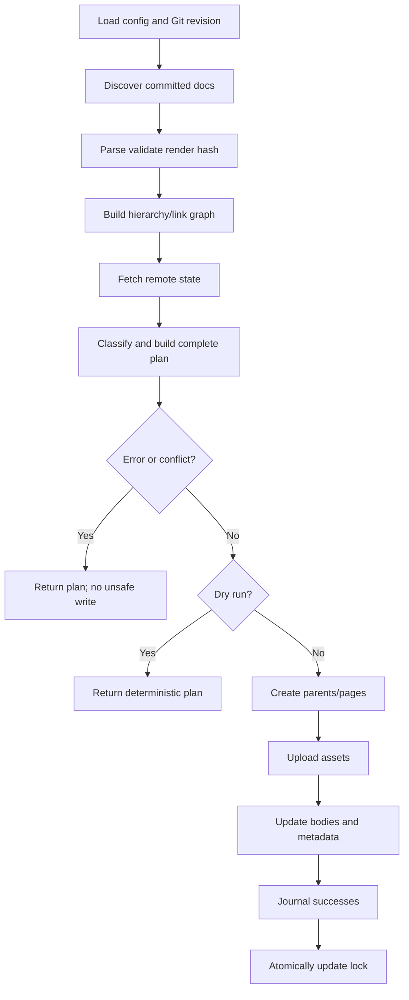
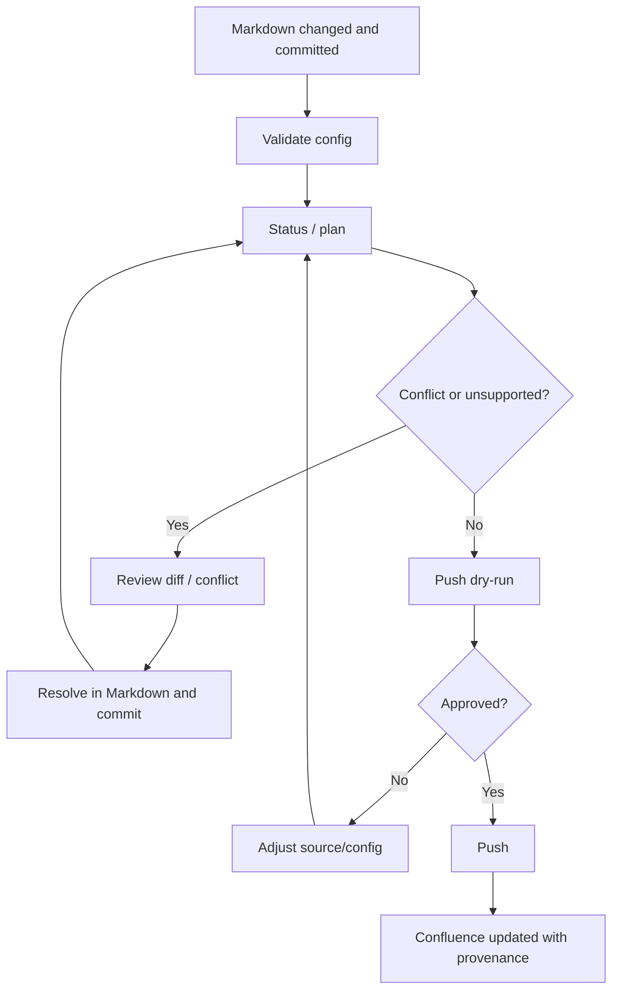
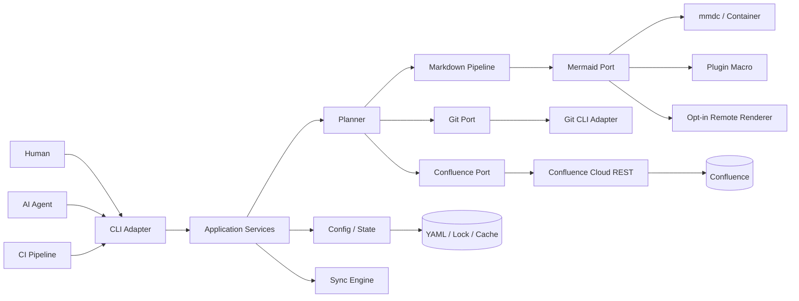
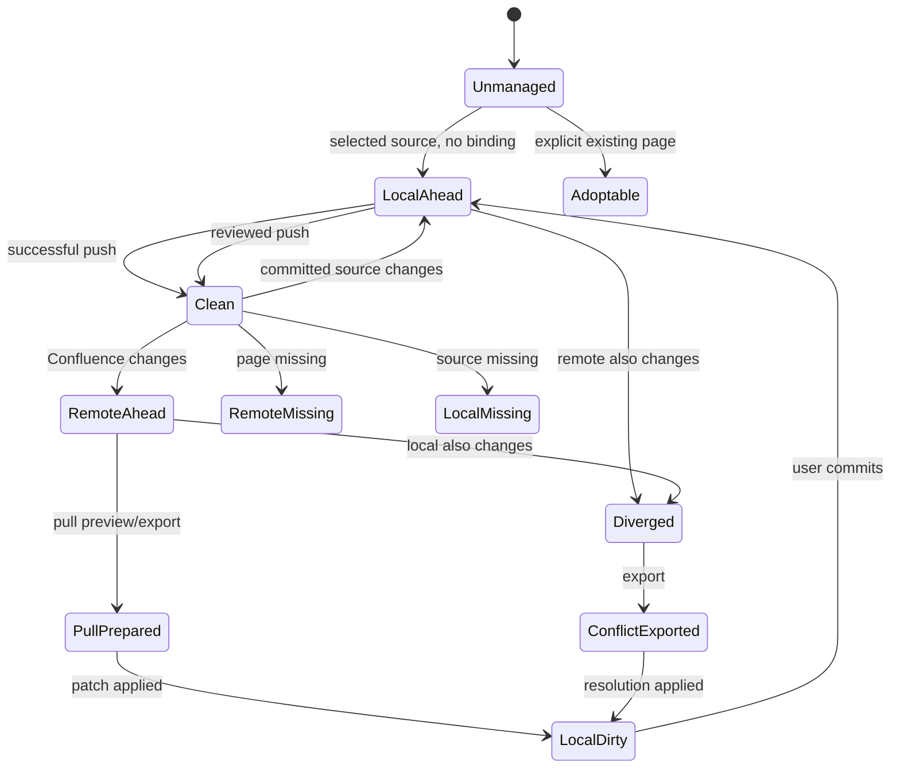

# MarkSync for Confluence — Complete System Specification

Status: Draft  
Source: Full brainstorming conversation and project North Star  
Owner: Juliusz Ćwiąkalski  
Last updated: 2026-06-16

---

## 1. Executive Summary

MarkSync for Confluence is an open-source, Git-native documentation synchronization tool for teams that want to author, review, version, validate, and maintain technical documentation as Markdown in Git while still publishing that documentation to Confluence for organization-wide consumption.

The product exists because engineering teams and AI agents work most effectively with plain-text documentation stored beside source code. Git provides branches, pull requests, diffs, traceability, automated validation, and repeatable delivery workflows. Confluence remains the mandated or preferred knowledge-sharing platform in many organizations, especially for product managers, analysts, operations, auditors, customers, and other stakeholders who do not work directly in repositories.

Without a reliable bridge, teams copy documentation manually, maintain duplicate versions, lose formatting and diagrams, and allow the Git and Confluence versions to drift. Existing tools generally solve only a subset of the problem: basic one-way publishing, limited syntax conversion, or provider-specific automation. They often lack deterministic hierarchy mapping, source provenance, dry-run and diff workflows, conflict safeguards, AI-agent-friendly outputs, and a controlled path for reconciling edits made in Confluence.

MarkSync makes Git the authoritative engineering workspace and Confluence a first-class publication surface. The initial release focuses on a trustworthy one-way publishing loop:

1. select Markdown files and folders through version-controlled YAML;
2. map repository structure to a Confluence page hierarchy;
3. allow per-document front-matter overrides;
4. render Markdown into Confluence Storage Format;
5. upload referenced images, attachments, and rendered Mermaid diagrams;
6. show a deterministic plan and diff before applying changes;
7. create or update pages with source-commit provenance;
8. detect remote drift and refuse unsafe overwrites;
9. produce human-readable and machine-readable output;
10. run identically from a developer workstation, an AI-agent session, a container, or a CI pipeline.

The complete direction also includes controlled Confluence-to-Git reconciliation. Confluence edits are treated as proposed changes, not as a competing authoritative source. MarkSync may convert them to Markdown and prepare an uncommitted patch for human or AI review. It never commits automatically, silently merges divergence, or overwrites uncommitted local work.

The implementation is a portable Go CLI named `marksync`, distributed as native binaries and a container image. The repository is currently greenfield, so this specification defines the target architecture, repository structure, commands, configuration, state model, synchronization semantics, testing, CI/CD, release process, and phased delivery.

Success means a team can keep its documentation lifecycle in Git while satisfying the organizational requirement that current, readable, and traceable documentation remains available in Confluence.

---

## 2. Source Synthesis

### 2.1 Final Direction

- Build a standalone Go CLI named `marksync`.
- Keep Markdown and Git as the authoritative documentation workflow.
- Publish selected documentation to Confluence through deterministic, configuration-as-code synchronization.
- Mirror repository folders to Confluence page hierarchy by default.
- Allow YAML configuration and front-matter overrides for exceptional mappings.
- Optimize the CLI equally for humans, CI pipelines, and AI agents.
- Provide dry-run, status, plan, diff, structured JSON, stable exit codes, and comprehensive help.
- Annotate every managed page with repository, source path, Git revision, and synchronization metadata.
- Detect remote edits and conflicts before writes.
- Introduce reverse synchronization only as a controlled review workflow that creates local changes but never commits.
- Keep the core deployment local-first and CI-ready, without a required hosted service.
- Use `juliusz-cwiakalski/marksync-for-confluence` under the MIT license.
- Use the project as a useful open-source product and a demonstration of high-quality architecture and AI-native delivery.

### 2.2 Confirmed Decisions

| Decision | Rationale | Status |
|---|---|---|
| Git-hosted Markdown is authoritative. | It provides diffs, review, branches, versioning, automation, and superior AI-agent access. | Decided |
| Confluence is the publication/consumption surface. | Organizations may mandate Confluence even when engineers prefer Git. | Decided |
| The product is a CLI. | It works locally, in CI, in containers, and under agent orchestration. | Decided |
| The implementation language is Go. | Portable native binaries, fast startup, no language runtime. | Decided |
| The executable is `marksync`. | Concise and aligned with the project name. | Decided |
| The repository is `git@github.com:juliusz-cwiakalski/marksync-for-confluence.git`. | Created for this project. | Decided |
| The project uses the MIT license. | Already present and appropriate for open source. | Decided |
| Selection/defaults are stored in version-controlled YAML. | Publication behavior must be reviewable and reproducible. | Decided |
| Folder structure mirrors page hierarchy by default. | Minimizes configuration and keeps navigation aligned. | Decided |
| Front matter can override mapping. | Exceptional documents need explicit page/parent/title behavior. | Decided |
| A guided `marksync init` flow is required. | Setup must be easy for individuals and teams. | Decided |
| Developers may use personal credentials locally. | Local runs should respect their Confluence permissions. | Decided |
| CI uses a dedicated least-privilege Atlassian account and protected secrets. | Non-interactive, auditable automation. | Decided |
| Dry-run and diff are first-class. | Users and agents must see intended changes before mutation. | Decided |
| Machine-readable output is mandatory. | Agents and CI must parse stable contracts. | Decided |
| Uncommitted local changes are never silently published or overwritten. | Published content must be traceable and local work protected. | Decided |
| Every sync records source-commit metadata. | Pages must be traceable to an exact source version. | Decided |
| Manual Confluence changes are detected. | Push must not silently overwrite remote work. | Decided |
| Reverse sync never creates an automatic Git commit. | Review remains mandatory. | Decided |
| Divergence requires explicit resolution. | Markdown and Confluence are not perfectly symmetric. | Decided |
| Mermaid uses content hashing. | Avoid unnecessary rendering/upload and preserve idempotency. | Decided |
| Unit, integration, E2E, and Gherkin tests are required. | Strong confidence is needed for AI-assisted Go implementation. | Decided |
| The CLI should be consumable as an AI skill/tool. | OpenCode, Claude Code, and similar agents should operate it safely. | Decided |
| No hosted backend is required for core value. | Lower complexity, cost, and privacy risk. | Decided |

### 2.3 Rejected or Deferred Ideas

| Idea | Outcome | Reason |
|---|---|---|
| Confluence as equal or primary source of truth | Rejected | Undermines Git-native review and traceability. |
| Silent last-writer-wins | Rejected | Risks data loss. |
| Automatic commits after pull | Rejected | Users must inspect and approve changes. |
| Fully automatic bidirectional sync in MVP | Deferred | Conversion and conflict handling are substantially more complex. |
| Replacing Confluence | Out of scope | The product bridges an existing organizational requirement. |
| WYSIWYG editor | Out of scope | Authoring remains in Markdown-capable tools. |
| Mandatory SaaS control plane | Out of scope | Not needed for the core workflow. |
| Atlassian Rovo MCP as the core integration | Rejected | Direct REST is simpler, deterministic, and CI-friendly. |
| Pandoc as mandatory runtime dependency | Deferred/optional | Conflicts with a portable native CLI. |
| Every Confluence deployment/Markdown extension in v1 | Deferred | Reliability first. |
| Automatic deletion when a file disappears | Deferred/opt-in | Destructive and needs explicit policy. |
| Synchronizing comments/discussions | Out of scope initially | Pull-request review is preferred. |
| Built-in MCP server in first release | Deferred | CLI plus skill document is sufficient initially. |

### 2.4 Assumptions and Recommended Defaults

| Assumption / Default | Why reasonable | Validation Needed |
|---|---|---|
| MVP supports Confluence Cloud first. | The discussion and auth model refer to Cloud URLs/tokens. | Confirm before Data Center work. |
| Confluence Storage Format is the write representation. | Current page APIs support it and it maps naturally from Markdown. | Validate required constructs in sandbox. |
| Page API v2 is used; attachment/property operations are adapter-isolated. | Matches current Atlassian capabilities. | Confirm in technical spike. |
| `marksync.lock.yaml` stores durable local-to-remote mappings. | Stable identity and deterministic rename handling. | Confirm teams accept committed page IDs. |
| Content properties duplicate essential metadata remotely. | Enables recovery and drift/ownership checks. | Validate property API behavior. |
| Delete policy defaults to `ignore`. | Safest behavior. | Confirm before archive/trash modes. |
| Push reads committed `HEAD` content. | Guarantees provenance. | Confirm whether an unsafe dev mode is ever needed. |
| Dirty selected files are skipped locally and fail strict/CI mode. | Matches "skip uncommitted changes" while preserving CI determinism. | Confirm local exit behavior. |
| First H1 becomes title and is omitted from body. | Avoids duplicate titles. | Validate with examples. |
| Missing folder index produces a generated folder page. | Preserves hierarchy without boilerplate. | Confirm default. |
| Local assets must stay inside repository root. | Security and reproducibility. | None. |
| Mermaid is adapter-based. | No assumption of a production-grade pure-Go renderer. | Select MVP adapter. |
| No telemetry is sent by default. | Local-first privacy. | Optional future telemetry spec. |
| English is the initial CLI/documentation language. | Conventional developer-tool scope. | Confirm before localization. |

### 2.5 Open Questions

| Question | Why It Matters | Blocks |
|---|---|---|
| Shared public OAuth app or organization-supplied client credentials? | Determines browser-login UX. | OAuth phase |
| Which Mermaid renderer is mandatory in v1? | Affects dependencies, privacy, and image fidelity. | Mermaid implementation |
| Commit lock file by default or rely primarily on remote metadata? | Affects determinism and merge conflicts. | State ADR |
| Generated folder pages or mandatory `_index.md`? | Affects hierarchy UX. | Planner default |
| Exact canonical subset for reverse conversion? | Perfect arbitrary round-trip is impossible. | Pull phase |
| Local push: skip dirty docs or abort whole run? | Partial publication may surprise users. | Final CLI semantics |
| Does project naming need adjustment under Atlassian trademark policy? | Public branding risk. | Public launch |
| Which package managers follow GitHub Releases? | Installation convenience. | Post-MVP |
| Is Data Center strategically important? | Different APIs/auth. | Future roadmap |

### 2.6 Source Traceability Notes

- Git authoring plus required Confluence publication is the core user problem.
- YAML selection, hierarchy mirroring, and front-matter overrides were explicitly agreed.
- Manual conflict resolution, no auto-commit, and protection of uncommitted files were explicit.
- Go, native binaries, Docker, and Gherkin testing were explicit preferences.
- Structured CLI output, dry-run, diff, help, and AI-agent operability were explicit requirements.
- Lock/state classification and adapter boundaries are recommended defaults added for implementation safety.
- The public repository was verified as greenfield at the time of writing.
- Atlassian API assumptions were checked against official Confluence Cloud documentation on 2026-06-16.

---

## 3. Context, Problem, and Goals

### 3.1 Context

Architecture descriptions, ADRs, requirements, runbooks, API contracts, test scenarios, and implementation plans benefit from living beside code, changing in the same branch, receiving pull-request review, being linted automatically, retaining complete history, and being directly accessible to coding agents.

Confluence remains useful for broad discoverability, permissions, familiar navigation, and non-engineering readers. Many organizations require approved documentation there.

This creates two poor choices:

1. author in Confluence and lose Git-native engineering/AI workflows; or
2. author in Git and fail organizational publication expectations.

MarkSync removes that false choice.

### 3.2 Problem / Opportunity

The problem is not merely Markdown conversion. It is maintaining one trustworthy documentation lifecycle across two environments with incompatible editing models.

The product contract is:

- Git owns authoring and approval.
- Confluence owns broad consumption.
- MarkSync owns deterministic conversion, mapping, synchronization, provenance, drift detection, and controlled reconciliation.
- Humans or supervised AI agents own conflict decisions.

### 3.3 Goals

- Eliminate manual copying.
- Preserve Git as the authoritative reviewed source.
- Publish readable, navigable pages with high fidelity.
- Keep page identity stable across edits and renames.
- Make pages traceable to path and commit.
- Detect remote changes before update.
- Provide deterministic, idempotent synchronization.
- Support local, CI, container, and AI-agent operation.
- Minimize setup effort.
- Keep credentials out of repositories/logs.
- Provide a phased path to controlled reverse sync.
- Demonstrate a high-quality open-source engineering project.

### 3.4 Non-Goals

- Replacing Confluence or Git hosting.
- Becoming a document editor.
- Real-time collaboration.
- Perfect round-trip of arbitrary Confluence layouts.
- Automatic semantic merge decisions.
- Automatic Git commit, push, or PR creation.
- Automatic page deletion in MVP.
- Syncing comments, whiteboards, databases, blog posts, or all custom content.
- Mandatory hosted accounts/backend.
- Data Center support in MVP.
- Other knowledge platforms in MVP.

### 3.5 Success Metrics

| Metric | Target / Signal | Measurement |
|---|---|---|
| Time to first publish | Under 10 minutes excluding credential creation | Usability test |
| Manual-copy elimination | >=90% of configured updates require no copy/paste | Beta feedback |
| Supported conversion correctness | 100% fixture pass | Golden/live tests |
| Silent overwrite incidents | Zero | Tests/issues |
| Idempotency | Second unchanged push performs zero writes | E2E |
| Traceability | 100% managed pages have valid source metadata | Integration/doctor |
| Machine operability | All automation commands support JSON and stable exits | Contract tests |
| Cross-platform delivery | Linux/macOS/Windows amd64; arm64 where supported | Release pipeline |
| Generality | Two independent repositories/sites use same binary without code changes | Beta milestone |

---

## 4. Users, Stakeholders, and Jobs

### 4.1 Primary Users

- **Software architect** — maintains architecture-as-code, ADRs, diagrams, and technical decisions.
- **Technical lead/developer** — changes documentation with code and reviews it in PRs.
- **Platform/developer-experience engineer** — standardizes publishing across repositories and CI systems.
- **Documentation owner** — needs hierarchy, links, assets, and drift reporting.
- **AI coding/documentation agent** — needs explicit schemas, safe defaults, and non-interactive commands.

### 4.2 Stakeholders / Consumers

- Product owners and analysts;
- QA engineers;
- operations and support;
- security/compliance/auditors;
- engineering managers;
- open-source contributors;
- project owner Juliusz Ćwiąkalski.

### 4.3 Jobs To Be Done

- When software changes, update docs in the same branch so they are reviewed and released together.
- When Confluence publication is required, publish automatically instead of copying.
- Before mutation, inspect exact plan/diff.
- Detect manual Confluence edits so they are not lost.
- Bring valuable Confluence edits back as an uncommitted reviewable patch.
- Run CI with a dedicated least-privilege account.
- Let AI agents validate and publish through structured commands.
- Preserve page identity across file moves.
- Reuse unchanged Mermaid renders and attachments.

### 4.4 Core Journeys

#### Initialize

Run `marksync init`, detect Git root/remote, choose Confluence site/space/root page, choose patterns/auth profile, generate config, validate access, and show first dry-run. No secret is written to the repository.

#### Local publish

Run `plan` or `push --dry-run`; select committed files; validate/render; fetch remote state; classify operations; review; run `push`; create parents/pages; upload assets; update bodies/metadata; atomically update lock.

#### CI publish

Checkout full history, provide protected credentials, run `config validate`, `doctor`, and `push --non-interactive --format json`; retain summary as artifact.

#### Preview

Use `status`, `plan`, and `diff` without remote mutation.

#### Add/adopt

Use `add` for a new document identity or `adopt --page-id` to bind an existing page. Refuse pages owned by another project by default.

#### Rename/move

Preserve document/page identity via stable ID/lock; plan title/parent change rather than duplicate create.

#### Detect remote edit

Compare remote version/body hash with last base; classify `REMOTE_AHEAD` or `DIVERGED`; block push.

#### Reconcile remote edit

Use `pull --dry-run`; reverse-convert managed content; produce diff/patch; explicitly apply to clean worktree; never commit automatically.

#### Resolve divergence

Export base/local/remote bundle; human or AI creates final Markdown; validate; commit normally; push establishes a new base.

#### Agent operation

Read `skills/marksync/SKILL.md`; use JSON and non-interactive mode; always validate and dry-run; escalate conflicts.

---

## 5. Scope

### 5.1 MVP

- Go CLI and container;
- cross-platform binaries;
- `init`, token auth commands, config validate, doctor, status, plan, diff, push, add, adopt, render;
- YAML config plus JSON Schema;
- include/exclude patterns and multiple targets;
- hierarchy mirroring and front-matter overrides;
- stable document IDs and lock mapping;
- Markdown -> Storage Format;
- page create/update/no-op;
- provenance panel and content property;
- managed relative links;
- local images/attachments;
- Mermaid adapter and hash naming;
- committed-HEAD snapshots and dirty-file protection;
- remote drift/version checks;
- retries/rate-limit handling;
- human/JSON/NDJSON output;
- stable exit codes;
- Gherkin, unit, integration, E2E, and live sandbox tests;
- GitHub Actions, GoReleaser, docs, examples, AI skill.

### 5.2 Later Phases

1. Controlled reverse conversion, patches, apply, conflict bundles.
2. OAuth 2.0 3LO, enhanced enterprise auth/proxy/CA support.
3. Opt-in archive/trash, bulk adoption, stale reporting.
4. Data Center adapter, MCP server, package managers, reusable CI components.
5. Additional knowledge-platform adapters only after Confluence maturity.

### 5.3 Explicitly Out of Scope

Real-time sync, WYSIWYG, automatic semantic conflict resolution, automatic commits, default deletion, comments, non-page Confluence content, arbitrary raw HTML, hosted billing/account service, mobile/desktop GUI.


---

## 6. Required Final State

### 6.1 Target Repository Structure

```text
marksync-for-confluence/
├── .github/
│   ├── ISSUE_TEMPLATE/
│   ├── dependabot.yml
│   └── workflows/
│       ├── ci.yml
│       ├── codeql.yml
│       ├── release.yml
│       └── live-confluence-tests.yml
├── cmd/marksync/main.go
├── internal/
│   ├── app/
│   ├── auth/
│   ├── cli/
│   ├── config/
│   ├── confluence/
│   ├── git/
│   ├── markdown/
│   ├── mermaid/
│   ├── metadata/
│   ├── output/
│   ├── planner/
│   ├── state/
│   └── sync/
├── api/json/
│   ├── event.schema.json
│   ├── plan.schema.json
│   └── result.schema.json
├── schema/
│   ├── marksync.schema.json
│   └── marksync-lock.schema.json
├── features/
│   ├── initialization.feature
│   ├── configuration.feature
│   ├── hierarchy.feature
│   ├── publishing.feature
│   ├── assets.feature
│   ├── mermaid.feature
│   ├── drift-detection.feature
│   ├── dirty-worktree.feature
│   ├── structured-output.feature
│   └── reverse-sync.feature
├── tests/
│   ├── acceptance/
│   ├── integration/
│   ├── e2e/
│   └── live/
├── testdata/
│   ├── markdown/
│   ├── storage-format/
│   ├── remote-pages/
│   └── conflicts/
├── examples/
│   ├── minimal/
│   ├── multi-target/
│   ├── architecture-docs/
│   ├── github-actions/
│   ├── gitlab-ci/
│   ├── jenkins/
│   └── azure-devops/
├── skills/marksync/SKILL.md
├── doc/
│   ├── overview/
│   │   ├── 01-north-star.md
│   │   └── 02-roadmap.md
│   ├── specs/01-system-specification.md
│   ├── architecture/
│   ├── adr/
│   ├── user-guide/
│   └── contributor-guide/
├── scripts/
├── .editorconfig
├── .gitignore
├── .golangci.yml
├── .goreleaser.yml
├── CHANGELOG.md
├── CODE_OF_CONDUCT.md
├── CONTRIBUTING.md
├── Dockerfile
├── LICENSE
├── Makefile
├── README.md
├── SECURITY.md
├── go.mod
├── go.sum
└── tools.go
```

Detailed package expectations:

```text
internal/cli/
  root.go init.go auth.go add.go adopt.go config.go doctor.go
  status.go plan.go diff.go render.go push.go pull.go conflict.go
  completion.go

internal/confluence/
  client.go cloud_client.go models.go pages.go attachments.go
  properties.go spaces.go retry.go errors.go

internal/git/
  repository.go command.go snapshot.go status.go history.go rename.go

internal/markdown/
  parser.go frontmatter.go canonical.go renderer.go
  storage_renderer.go reverse_converter.go links.go assets.go diagnostics.go

internal/planner/
  planner.go hierarchy.go graph.go operation.go diff.go

internal/state/
  lock.go cache.go journal.go classification.go atomic.go

internal/sync/
  engine.go push.go pull.go conflict.go executor.go result.go
```

Notes:

- Use `internal/` deliberately; do not promise a public Go library API before CLI contracts stabilize.
- Phase 2 packages may initially be omitted or stubbed.
- Local runtime state belongs in `.marksync/` and is Git-ignored.
- Durable non-secret mapping state belongs in `marksync.lock.yaml` unless the state ADR chooses a remote-only model.
- Generated schemas must be reproducible and checked in CI.

### 6.2 Deliverable Inventory

| Area | Required Deliverables | Notes |
|---|---|---|
| CLI | Native binary, command tree, help, completion, exits | Human and agent friendly |
| Configuration | YAML, schema, validation, init, precedence | No credentials |
| Git integration | root, committed snapshots, status, history, rename hints | No automatic network |
| Markdown | parser, canonical AST, Storage renderer, diagnostics, fixtures | Strict supported subset |
| Planner | hierarchy, links, collisions, operations, diff | Complete before writes |
| Confluence adapter | pages, spaces, attachments, properties, versions, retry | API-version isolated |
| State | lock, remote property, cache, journal | Atomic/recoverable |
| Sync | classification, plan, push, partial recovery | No unsafe overwrite |
| Assets | path security, MIME, hashes, upload | Repo-contained |
| Mermaid | renderer interface, hash naming, command/container support | Privacy-aware |
| Reverse sync | converter, patch, conflict workspace | Phase 2 |
| Auth | token profile, env, keyring; later OAuth | Least privilege |
| Automation | JSON/NDJSON schemas, CI examples, skill | Stable contracts |
| Quality | unit, integration, BDD, E2E, live, fuzz | Cross-platform |
| Distribution | releases, checksums, SBOM, container | SemVer |
| Documentation | README, North Star, roadmap, ADRs, guides | Public-quality |

### 6.3 Runtime / Ownership Boundaries

| Owned Here | Not Owned Here |
|---|---|
| Read committed Markdown from local Git | Host/mirror Git |
| Map documents to pages | Manage Confluence users |
| Convert supported Markdown | Preserve arbitrary unsupported macros perfectly |
| Upload assets/diagram output | Operate external rendering services |
| Detect drift | Decide semantic conflict meaning |
| Prepare reviewable pull patches | Commit or push Git changes |
| Resolve credential references | Provision service accounts |
| CLI/machine contracts | Mandatory hosted service |
| Lock/cache/journal | Store documents in a MarkSync cloud database |

---

## 7. Functional Requirements

### 7.1 Configuration and Repository

| ID | Requirement | Priority | Acceptance Criteria |
|---|---|---:|---|
| FR-CFG-001 | Discover nearest Git root or use `--repo`. | Must | Subdirectory resolves correctly; outside repo fails. |
| FR-CFG-002 | Load `marksync.yaml` from root by default; support `--config`. | Must | Default/explicit tested. |
| FR-CFG-003 | Validate against a versioned schema before planning. | Must | Invalid fields/types/URLs/patterns produce actionable errors. |
| FR-CFG-004 | Support multiple named Confluence targets. | Must | Same repo can target two sites/spaces. |
| FR-CFG-005 | Support include/exclude globs; exclusions win. | Must | Deterministic across OSes. |
| FR-CFG-006 | Support defaults for root page, hierarchy, titles, labels, delete/conflict policy, rendering. | Must | Schema/docs cover all. |
| FR-CFG-007 | Front matter overrides applicable YAML defaults. | Must | Precedence tested. |
| FR-CFG-008 | Safe CLI overrides win for current invocation. | Must | Explicit precedence documented. |
| FR-CFG-009 | `init` creates a valid starter config. | Must | Generated config validates and plans. |
| FR-CFG-010 | `init --non-interactive` never prompts. | Should | Missing values fail. |
| FR-CFG-011 | `config validate` never mutates local durable state or Confluence. | Must | Files/HTTP assertions. |
| FR-CFG-012 | Detect duplicate document IDs. | Must | All conflicting paths listed. |
| FR-CFG-013 | Support explicit page and parent IDs per target. | Must | Existing page can be adopted. |
| FR-CFG-014 | Config/lock never contain credential values. | Must | Secret-scanning test. |
| FR-CFG-015 | Unknown fields fail strict mode. | Should | CI default strict. |

### 7.2 Git Semantics

| ID | Requirement | Priority | Acceptance Criteria |
|---|---|---:|---|
| FR-GIT-001 | Push uses committed content at resolved ref, default `HEAD`. | Must | Dirty bytes never replace committed source. |
| FR-GIT-002 | Record full commit SHA and repo-relative path per document. | Must | Lock and remote metadata contain both. |
| FR-GIT-003 | Dirty selected files are never silently published. | Must | Report `LOCAL_DIRTY`; strict mode fails. |
| FR-GIT-004 | Pull/apply never overwrites dirty source files. | Must | File unchanged; conflict exit. |
| FR-GIT-005 | Invalid/unreadable refs fail before mutation. | Must | No remote write. |
| FR-GIT-006 | Derive repository identity from explicit config or normalized remote. | Should | SSH/HTTPS representations handled. |
| FR-GIT-007 | Preserve page identity across rename when stable mapping exists. | Should | Move/update, not duplicate create. |
| FR-GIT-008 | Never auto commit, tag, push, pull, or fetch Git. | Must | No such process calls. |
| FR-GIT-009 | Reverse sync creates patch/worktree change only after explicit action. | Phase 2 | No commit; dry-run no mutation. |

### 7.3 Discovery, Identity, and Hierarchy

| ID | Requirement | Priority | Acceptance Criteria |
|---|---|---:|---|
| FR-DOC-001 | Produce deterministic selected document order. | Must | Plan JSON byte-stable for same inputs. |
| FR-DOC-002 | Every managed document has stable `documentId`. | Must | Stable across edits and supported moves. |
| FR-DOC-003 | Mirror source folders below configured root by default. | Must | Nested fixture matches parents. |
| FR-DOC-004 | Front matter may override title, target, parent, page, labels, publish, order. | Must | Scenario per override. |
| FR-DOC-005 | Title priority: front matter, first H1, filename. | Must | Tested. |
| FR-DOC-006 | Omit title H1 from body by default. | Should | No duplicate heading. |
| FR-DOC-007 | Detect duplicate child titles before mutation. | Must | Both paths shown. |
| FR-DOC-008 | Apply configured folder-page policy. | Must | `generated`, `require-index`, `none` tested. |
| FR-DOC-009 | Validate explicit page IDs against site/space. | Must | Wrong/inaccessible page fails. |
| FR-DOC-010 | `add` assigns identity safely. | Should | Result validates. |
| FR-DOC-011 | `adopt` refuses pages owned by another project unless explicit force/confirmation. | Must | Ownership protected. |
| FR-DOC-012 | Rewrite links between selected docs to Confluence page links. | Must | New-page links resolve in same plan. |
| FR-DOC-013 | Broken relative links fail strict mode. | Must | Source location included. |
| FR-DOC-014 | Links to unpublished files follow configured policy. | Should | Default repo URL or error. |

### 7.4 Markdown Rendering

| ID | Requirement | Priority | Acceptance Criteria |
|---|---|---:|---|
| FR-MD-001 | Parse documented canonical subset into internal AST. | Must | Fixtures retain semantics. |
| FR-MD-002 | Support headings, paragraphs, emphasis, strong, inline code, links, images, ordered/unordered/task lists, blockquotes, rules, fenced code, tables. | Must | Golden fixtures pass. |
| FR-MD-003 | Convert code fences to Confluence code macro with language. | Must | Language/content preserved. |
| FR-MD-004 | Reject or explicitly sanitize raw HTML. | Must | Unsafe tags never emitted. |
| FR-MD-005 | Unsupported syntax produces source-located diagnostics. | Must | Strict mode blocks. |
| FR-MD-006 | Rendering is deterministic across line endings/platforms. | Must | Same hash/output. |
| FR-MD-007 | Output is valid Storage Format. | Must | Live sandbox accepts it. |
| FR-MD-008 | Add configurable provenance panel/footer. | Must | Source path/commit visible unless disabled. |
| FR-MD-009 | Publication metadata does not affect source-content hash. | Must | Separate hashes. |
| FR-MD-010 | Reverse conversion only promises canonical subset/MarkSync structures. | Phase 2 | Round-trip fixtures semantically match. |

### 7.5 Assets and Mermaid

| ID | Requirement | Priority | Acceptance Criteria |
|---|---|---:|---|
| FR-AST-001 | Resolve local assets relative to source. | Must | Nested fixtures correct. |
| FR-AST-002 | Reject paths/symlinks escaping repo root. | Must | Security tests. |
| FR-AST-003 | Hash assets and skip unchanged uploads. | Must | Second push no upload. |
| FR-AST-004 | Use deterministic collision-safe attachment names. | Must | Same filename/different content safe. |
| FR-AST-005 | Process Mermaid fences through configured adapter. | Must | One production adapter passes E2E. |
| FR-AST-006 | Diagram filename includes hash of source+renderer config. | Must | Changed options/source change hash. |
| FR-AST-007 | Remote rendering is opt-in with privacy warning. | Must | Disabled by default. |
| FR-AST-008 | Missing renderer follows `error`, `code`, or `macro` fallback. | Must | Default documented/tested. |
| FR-AST-009 | Upload correct MIME and required API headers. | Must | Integration request test. |
| FR-AST-010 | Never auto-delete orphaned attachments in MVP. | Must | Report only. |

### 7.6 Planning, Push, and State

| ID | Requirement | Priority | Acceptance Criteria |
|---|---|---:|---|
| FR-SYNC-001 | Validate complete plan before first write. | Must | Any structural error means zero writes. |
| FR-SYNC-002 | Operations: `CREATE`, `UPDATE`, `MOVE`, `NOOP`, `SKIP`, `CONFLICT`, `REMOTE_MISSING`, `LOCAL_MISSING`. | Must | Stable enum in JSON. |
| FR-SYNC-003 | Classify relative to last base. | Must | Clean/local/remote/diverged tested. |
| FR-SYNC-004 | `plan` never mutates durable state/Confluence. | Must | Files/requests unchanged. |
| FR-SYNC-005 | `diff` covers body, metadata, hierarchy, labels, assets. | Must | Human/JSON fixtures. |
| FR-SYNC-006 | `push --dry-run` performs no write calls. | Must | HTTP assertions. |
| FR-SYNC-007 | Create parent-first. | Must | Nested new tree succeeds. |
| FR-SYNC-008 | Update using current remote version and optimistic concurrency. | Must | Concurrent update blocks blind write. |
| FR-SYNC-009 | Remote change blocks push by default. | Must | No update request. |
| FR-SYNC-010 | Repeated unchanged push makes zero writes. | Must | E2E. |
| FR-SYNC-011 | Successful publish updates remote metadata and lock. | Must | Values match. |
| FR-SYNC-012 | Lock writes are atomic. | Must | Interrupted write preserves previous file. |
| FR-SYNC-013 | Journal completed remote mutations during run. | Should | Rerun recovers partial work. |
| FR-SYNC-014 | Partial failure returns distinct exit and complete result. | Must | Succeeded/failed/pending listed. |
| FR-SYNC-015 | Do not auto-rollback independent successful pages. | Must | Recovery instructions given. |
| FR-SYNC-016 | Missing local doc is reported; no delete by default. | Must | No DELETE. |
| FR-SYNC-017 | Future destructive policy requires explicit config/confirmation. | Later | High-risk classification. |
| FR-SYNC-018 | Version message includes tool/source commit where supported. | Should | History provenance. |
| FR-SYNC-019 | MVP manages published/current pages, not drafts. | Must | Draft target rejected. |

### 7.7 Reverse Sync and Conflict Resolution

| ID | Requirement | Priority | Acceptance Criteria |
|---|---|---:|---|
| FR-REV-001 | `pull --dry-run` retrieves/converts without source mutation. | Phase 2 | Files unchanged. |
| FR-REV-002 | `pull --apply` requires clean file and explicit approval. | Phase 2 | Dirty file protected. |
| FR-REV-003 | Pull never creates a commit. | Phase 2 | History unchanged. |
| FR-REV-004 | Remote-only change emitted as patch and optional worktree apply. | Phase 2 | Reproducible patch. |
| FR-REV-005 | Divergence creates base/local/remote conflict bundle. | Phase 2 | Complete bundle. |
| FR-REV-006 | Unsupported constructs cannot disappear silently. | Phase 2 | Warning/error blocks strict apply. |
| FR-REV-007 | Resolution needs explicit file or strategy. | Phase 2 | No silent choice. |
| FR-REV-008 | New base only after committed source is successfully pushed. | Phase 2 | Lock not advanced early. |

### 7.8 Authentication and Authorization

| ID | Requirement | Priority | Acceptance Criteria |
|---|---|---:|---|
| FR-AUTH-001 | Local token auth uses Atlassian email + API token. | Must | Sandbox read succeeds. |
| FR-AUTH-002 | CI credentials load from environment. | Must | Non-interactive test. |
| FR-AUTH-003 | Local credentials may be stored in OS keyring. | Must | No plaintext token. |
| FR-AUTH-004 | `auth login` masks token input. | Must | Logs/output clean. |
| FR-AUTH-005 | `auth status` shows profile/site/account/permission without secret. | Must | Safe for logs. |
| FR-AUTH-006 | CI guide mandates dedicated least-privilege account. | Must | Example uses protected secrets. |
| FR-AUTH-007 | OAuth 2.0 3LO is later browser-based feature. | Later | Separate ADR/threat model. |
| FR-AUTH-008 | Multiple named auth profiles/sites supported. | Must | Target switching tested. |
| FR-AUTH-009 | HTTP traces/errors redact auth/cookies/tokens. | Must | Redaction tests. |
| FR-AUTH-010 | Diagnose auth vs permission errors when possible. | Should | `doctor` corrective guidance. |

### 7.9 CLI, Automation, and Agents

| ID | Requirement | Priority | Acceptance Criteria |
|---|---|---:|---|
| FR-CLI-001 | Every command has help, examples, and risk. | Must | Snapshot tests. |
| FR-CLI-002 | `--format human|json|ndjson`. | Must | Published schemas. |
| FR-CLI-003 | Machine output stdout; logs/progress stderr. | Must | Piped JSON valid. |
| FR-CLI-004 | Stable documented exit codes. | Must | Contract tests. |
| FR-CLI-005 | `--non-interactive` prevents prompts. | Must | CI cannot hang. |
| FR-CLI-006 | `--no-color` and `NO_COLOR` supported. | Must | No ANSI. |
| FR-CLI-007 | Consistent global target/config/repo/log/timeout flags. | Must | Command tests. |
| FR-CLI-008 | Expose risk: `READ_ONLY`, `SAFE_WRITE`, `CONFLICTING_WRITE`, `DESTRUCTIVE`. | Should | JSON plan. |
| FR-CLI-009 | Provide `skills/marksync/SKILL.md`. | Must | Agent can operate safely. |
| FR-CLI-010 | Automation never depends on terminal scraping. | Must | JSON contains all IDs/URLs/diagnostics. |
| FR-CLI-011 | Generate Bash/Zsh/Fish/PowerShell completion. | Should | Smoke tests. |
| FR-CLI-012 | Future MCP wraps same application services. | Later | No duplicated logic. |


---

## 8. Non-Functional Requirements

| ID | Category | Requirement | Acceptance Criteria |
|---|---|---|---|
| NFR-001 | Safety | Never silently overwrite remote drift, dirty local content, or another document's page. | Conflict/ownership tests pass. |
| NFR-002 | Reliability | Identical effective inputs are idempotent. | Repeated E2E run makes zero writes. |
| NFR-003 | Determinism | Plans, hashes, names, and rendered output are cross-platform stable. | Golden tests match on supported OSes. |
| NFR-004 | Security | Credentials never enter commits, logs, process arguments, crash reports, or JSON. | Secret scan/redaction tests. |
| NFR-005 | Least privilege | Document minimum Confluence permissions/scopes by feature. | Security review. |
| NFR-006 | Privacy | Source/diagram content goes only to configured services; third-party rendering is opt-in. | Remote renderer disabled by default. |
| NFR-007 | Performance | Offline planning of 1,000 docs completes under 10s on a typical laptop after warm cache. | Documented benchmark. |
| NFR-008 | API efficiency | Skip unchanged docs/assets; paginate/cache/bound concurrency. | Request-count tests. |
| NFR-009 | Resilience | Honor `Retry-After`; bounded exponential backoff with jitter for 429/transient 5xx. | Fault tests. |
| NFR-010 | Maintainability | External boundaries use interfaces for Git, Confluence, renderer, credentials, clock, FS, output. | Dependency review. |
| NFR-011 | Testability | Standard tests require no live site. | `go test ./...` offline. |
| NFR-012 | Portability | Run on Linux/macOS/Windows without Go runtime. | Release smoke tests. |
| NFR-013 | Compatibility | Config/lock/JSON schemas are versioned and migration-aware. | Old fixtures supported or actionable migration error. |
| NFR-014 | Developer experience | Errors identify document, operation, cause, and correction. | Message acceptance tests. |
| NFR-015 | Accessibility | Output does not rely on color and works in plain logs/screen readers. | Manual/snapshot review. |
| NFR-016 | Observability | Each run has ID and structured events; bodies/secrets excluded by default. | Event tests. |
| NFR-017 | Recoverability | Partial success is reportable and rerunnable without duplicates. | Recovery E2E. |
| NFR-018 | Supply chain | Releases include checksums, SBOM, build metadata; signing before stable v1 is recommended. | Artifact review. |
| NFR-019 | Quality | Format, lint, race, tests, vuln, license, and security gates pass. | CI. |
| NFR-020 | Documentation | Every public command/config/exit has docs and an example. | Completeness check. |
| NFR-021 | Backward compatibility | Post-v1 breaking CLI/schema changes require major SemVer. | Release checklist. |
| NFR-022 | Cost | Core use requires no paid MarkSync service. | Only configured external calls. |
| NFR-023 | Branding | State independence from Atlassian and review trademark use. | README review. |

---

## 9. Detailed Deliverable Specifications

### 9.1 CLI Application

#### Purpose

Single consistent entry point for humans, CI, containers, and AI agents.

#### Commands

```text
marksync
├── init
├── auth
│   ├── login
│   ├── status
│   └── logout
├── config
│   ├── validate
│   └── schema
├── add
├── adopt
├── doctor
├── status
├── plan
├── diff
├── render
├── push
├── pull                 # Phase 2
├── conflict
│   ├── list             # Phase 2
│   ├── export           # Phase 2
│   └── resolve          # Phase 2
├── completion
└── version
```

#### Mutation / Risk Matrix

| Command | Local Durable Mutation | Confluence Mutation | Risk |
|---|---:|---:|---|
| `init` | config after confirmation | No content | SAFE_WRITE |
| `auth login/logout` | keyring/profile | No content | SAFE_WRITE |
| `config validate`, `doctor`, `status`, `plan`, `diff` | Cache only | No | READ_ONLY |
| `add` | metadata/config/lock | No | SAFE_WRITE |
| `adopt` | mapping; optional metadata | Optional | SAFE_WRITE |
| `render` | optional output dir | No | SAFE_WRITE |
| `push --dry-run` | Cache only | No | READ_ONLY |
| `push` | lock/journal | Yes | SAFE_WRITE / CONFLICTING_WRITE |
| `pull --dry-run` | optional conflict export | No | READ_ONLY |
| `pull --apply` | source worktree | No | CONFLICTING_WRITE |
| future delete/archive | lock/journal | Yes | DESTRUCTIVE |

#### Global Flags

```text
--repo <path>
--config <path>
--target <name>
--format human|json|ndjson
--non-interactive
--no-color
--log-level error|warn|info|debug|trace
--timeout <duration>
--concurrency <n>
--strict
--offline
--run-id <id>
```

#### Exit Codes

| Code | Symbol | Meaning |
|---:|---|---|
| 0 | `SUCCESS` | Completed with no unresolved issue |
| 1 | `GENERAL_ERROR` | Unexpected/uncategorized failure |
| 2 | `DIFFERENCES_FOUND` | Read-only check found planned changes |
| 3 | `CONFLICT_FOUND` | Drift, divergence, dirty protection, unresolved conflict |
| 4 | `CONFIGURATION_ERROR` | Invalid config/front matter/input |
| 5 | `AUTHORIZATION_ERROR` | Missing/invalid credentials or permissions |
| 6 | `PARTIAL_FAILURE` | Some remote writes succeeded, others failed |
| 7 | `REMOTE_UNAVAILABLE` | Target unavailable after retry budget |
| 8 | `UNSUPPORTED_CONTENT` | Content cannot be represented safely |

#### JSON Result Envelope

```json
{
  "schemaVersion": "1",
  "command": "push",
  "runId": "01J...",
  "toolVersion": "0.1.0",
  "repository": {
    "root": "/workspace/repo",
    "revision": "full-sha",
    "dirty": false
  },
  "target": "corporate",
  "status": "success",
  "exitCode": 0,
  "summary": {
    "created": 2,
    "updated": 4,
    "moved": 0,
    "unchanged": 18,
    "skipped": 0,
    "conflicts": 0,
    "failed": 0
  },
  "operations": [],
  "diagnostics": [],
  "startedAt": "2026-06-16T08:00:00Z",
  "finishedAt": "2026-06-16T08:00:04Z"
}
```

Rules:

- stdout is reserved for selected machine output; progress/logging goes to stderr;
- expected errors map to typed categories and exits;
- read-only commands never write durable state;
- command help includes mutation risk and examples;
- no token flag is permitted because command-line arguments may be exposed;
- JSON schema changes follow compatibility policy.

Tests: command parsing, help snapshots, stdout/stderr split, non-interactive behavior, exits, schema validation, no-color, path handling.

Acceptance: all MVP commands documented/executable; JSON contains every automation-relevant result; no secrets in outputs.

---

### 9.2 Configuration and Front Matter

#### Representative `marksync.yaml`

```yaml
version: 1

project:
  id: marksync-for-confluence
  repositoryUrl: https://github.com/juliusz-cwiakalski/marksync-for-confluence
  defaultTarget: corporate

source:
  revision: HEAD
  root: doc
  include: ["**/*.md"]
  exclude: ["drafts/**", "**/README.private.md"]
  dirtyFiles:
    local: skip
    strict: fail

defaults:
  hierarchy:
    mode: mirror
    folderPages: generated
    indexFiles: ["_index.md", "README.md"]
  title:
    source: frontmatter-h1-filename
    removeSourceH1: true
  conflictPolicy: fail
  deletePolicy: ignore
  strictMarkdown: true
  provenance:
    visible: true
    position: top
  labels: [marksync-managed]

targets:
  corporate:
    confluence:
      baseUrl: https://example.atlassian.net/wiki
      spaceKey: ARCH
      rootPageId: "123456789"
      authProfile: corporate
    rendering:
      representation: storage
      mermaid:
        mode: command
        command: mmdc
        format: png
    execution:
      concurrency: 4
      timeout: 30s

documents:
  - path: overview/01-north-star.md
    title: MarkSync — North Star
    labels: [product-strategy]
  - path: architecture/01-context.md
    parentId: "987654321"
```

#### Front Matter

```yaml
---
marksync:
  id: "2b1f9fc1-6f53-4f1e-9d35-c51f67b6250f"
  publish: true
  title: "System Context"
  target: corporate
  parentId: "987654321"
  pageIds:
    corporate: "1122334455"
  order: 20
  labels: [architecture, c4]
---
```

Precedence:

1. safe CLI override;
2. front matter;
3. explicit `documents[]`;
4. target defaults;
5. global defaults;
6. built-in defaults.

Rules:

- UTF-8; duplicate YAML keys rejected;
- schema version mandatory;
- credentials prohibited;
- unknown fields fail strict mode;
- avoid arbitrary environment substitution in project YAML;
- editing commands preserve formatting/comments where feasible, otherwise update lock rather than rewrite source;
- page IDs serialized as strings.

Tests: schema, precedence, duplicate keys, multi-target, invalid URLs/patterns, secret-like prohibited fields.

---

### 9.3 Lock, Remote Metadata, Cache, and Journal

#### Lock

```yaml
version: 1
projectId: marksync-for-confluence
targets:
  corporate:
    baseUrl: https://example.atlassian.net/wiki
    spaceId: "445566"
    documents:
      2b1f9fc1-6f53-4f1e-9d35-c51f67b6250f:
        path: architecture/01-context.md
        pageId: "1122334455"
        parentPageId: "987654321"
        pageVersion: 7
        sourceCommit: "full-sha"
        sourceContentHash: "sha256:..."
        renderedBodyHash: "sha256:..."
        remoteBodyHash: "sha256:..."
        synchronizedAt: "2026-06-16T08:00:00Z"
        toolVersion: "0.1.0"
```

#### Remote Property

Key: `marksync.metadata`

```json
{
  "schemaVersion": 1,
  "projectId": "marksync-for-confluence",
  "targetId": "corporate",
  "documentId": "2b1f9fc1-6f53-4f1e-9d35-c51f67b6250f",
  "repositoryUrl": "https://github.com/juliusz-cwiakalski/marksync-for-confluence",
  "sourcePath": "architecture/01-context.md",
  "sourceCommit": "full-sha",
  "sourceContentHash": "sha256:...",
  "renderedBodyHash": "sha256:...",
  "toolVersion": "0.1.0",
  "synchronizedAt": "2026-06-16T08:00:00Z"
}
```

#### Runtime State

```text
.marksync/
├── cache/pages/
├── cache/assets/
├── cache/rendered/
├── journal/<run-id>.jsonl
├── conflicts/<target>/<document-id>/
└── tmp/
```

Rules:

- `.marksync/` is ignored and disposable except conflict workspaces the user intentionally preserves;
- lock contains no secrets and may be committed;
- remote metadata and lock agree after success;
- write remote metadata only after body succeeds;
- stage lock changes and write atomically;
- journal each completed remote mutation immediately;
- partial rerun uses remote metadata/journal to avoid duplicates;
- cache is never needed for correctness;
- SHA-256 over documented canonical bytes;
- timestamps never determine equality.

Acceptance: deleting cache changes no plan; interrupted lock write preserves old file; partial create is recognized on rerun; explicit page IDs/remote metadata recover missing lock.

---

### 9.4 Git Adapter

Use the installed Git CLI behind an interface.

```go
type Repository interface {
    Root(ctx context.Context) (string, error)
    ResolveRevision(ctx context.Context, ref string) (Commit, error)
    ReadFileAt(ctx context.Context, commit Commit, path string) ([]byte, error)
    ListFilesAt(ctx context.Context, commit Commit, patterns PatternSet) ([]string, error)
    Status(ctx context.Context, paths []string) (WorktreeStatus, error)
    RemoteURL(ctx context.Context, name string) (string, error)
    FindRenames(ctx context.Context, from, to Commit) ([]Rename, error)
}
```

Rationale: Git is already required; CLI behavior matches repository semantics; committed blob/status/history/rename support is reliable. The MarkSync binary remains runtime-free even though Git and optional Mermaid tooling are explicit prerequisites.

Security:

- no shell invocation;
- use `--` before paths;
- validate repo-relative paths;
- non-interactive Git environment;
- no hooks, fetches, pushes, pulls, or remote execution;
- guard against config-based command injection.

Acceptance: committed content is read despite dirty worktree; Unicode/spaces/leading hyphens safe; no network Git operation.

---

### 9.5 Markdown and Storage Rendering

Pipeline:

```text
Markdown bytes
 -> front-matter extraction
 -> CommonMark/GFM parser
 -> canonical document AST
 -> semantic validation
 -> link/asset resolution
 -> provenance decoration
 -> Storage Format renderer
 -> normalization
 -> rendered hash
```

Recommended parser: Goldmark or equivalent mature Go parser. Build a custom Confluence Storage Format renderer. Do not require Pandoc.

MVP supported subset:

- YAML front matter;
- paragraphs/line breaks;
- H1-H6;
- emphasis/strong/inline code;
- ordered/unordered/nested/task lists;
- blockquotes;
- fenced code with language;
- GFM tables;
- rules;
- links;
- local images/attachments;
- Mermaid fences;
- escaped Markdown.

Restricted/deferred:

- raw HTML;
- scripts/styles;
- arbitrary directives/macros;
- complex footnotes/definition lists;
- math;
- nested tables;
- provider-specific extensions.

Rendering rules:

- title separate from body;
- code fences -> Confluence code macro;
- images -> attachment references;
- selected doc links -> page links;
- external links unchanged;
- tables -> Storage tables;
- provenance panel/footer configurable;
- output must be XML-safe;
- source hash excludes publication metadata;
- rendered hash includes desired page body.

Visible provenance:

```text
Managed by MarkSync.
Source: architecture/01-context.md
Revision: a1b2c3d
Edit the source in Git. Direct Confluence edits may require reconciliation.
```

Normalization before comparison:

- line endings;
- insignificant generated XML whitespace;
- MarkSync-generated attribute ordering;
- ignore known Confluence-generated editor IDs;
- preserve semantic text/macro parameters;
- handle provenance separately where appropriate.

Acceptance: supported fixtures publish to sandbox; golden changes are explicit; unsupported syntax fails before write in strict mode; output is cross-platform deterministic.

---

### 9.6 Hierarchy and Link Planner

Core node:

```go
type DocumentNode struct {
    DocumentID    string
    SourcePath    string
    Title         string
    TargetID      string
    DesiredPageID string
    ParentRef     ParentReference
    Order         int
    Synthetic     bool
    Links         []DocumentLink
    Assets        []AssetRef
}
```

Rules:

- one acyclic graph per target;
- configured root is graph root;
- mirror folders below source root;
- `_index.md`/`README.md` can provide folder content;
- synthetic folder pages according to policy;
- detect parent cycles and duplicate sibling titles;
- resolve document IDs before links;
- parent-first planning;
- order by explicit `order`, then normalized path;
- preserve explicit page IDs;
- known page parent changes become `MOVE`;
- never rely on title as permanent identity;
- links between two new pages resolve within the same plan.

Acceptance: deterministic complex tree; cycles/collisions actionable; moves preserve identity.

---

### 9.7 Confluence Cloud Adapter

Interface:

```go
type ConfluenceClient interface {
    CurrentUser(ctx context.Context) (User, error)
    ResolveSpace(ctx context.Context, keyOrID string) (Space, error)
    GetPage(ctx context.Context, id string, representation BodyRepresentation) (Page, error)
    CreatePage(ctx context.Context, request CreatePageRequest) (Page, error)
    UpdatePage(ctx context.Context, request UpdatePageRequest) (Page, error)
    MovePage(ctx context.Context, request MovePageRequest) (Page, error)
    ListAttachments(ctx context.Context, pageID string) ([]Attachment, error)
    UploadAttachment(ctx context.Context, request UploadAttachmentRequest) (Attachment, error)
    GetContentProperty(ctx context.Context, pageID, key string) (*ContentProperty, error)
    PutContentProperty(ctx context.Context, pageID, key string, value any) error
    AddLabels(ctx context.Context, pageID string, labels []string) error
}
```

Strategy:

- Cloud page API v2 where supported;
- Storage representation;
- attachment/property APIs hidden behind adapter even when API versions differ;
- explicit page version on update;
- no blind retry of version conflict;
- collection pagination;
- typed errors and Atlassian request ID capture;
- `User-Agent: marksync/<version>`.

Retry:

```yaml
maxAttempts: 5
initialBackoff: 500ms
maxBackoff: 15s
jitter: true
```

Retry network pre-response failures, 429 honoring `Retry-After`, and 502/503/504. Do not blindly retry 400/401/403/404/409 or unknown-outcome attachment uploads.

Draft safety: manage current/published pages, fetch latest version before update, detect drift, document that direct editor drafts can complicate Confluence reconciliation, and never infer safety only from an old published hash.

Acceptance: mock tests for all paths; live create/read/update/attach/property; version conflict maps to conflict; request IDs exposed safely.

---

### 9.8 Push Engine



State table:

| Local vs Base | Remote vs Base | State | Default Push |
|---|---|---|---|
| same | same | `CLEAN` | NOOP |
| changed | same | `LOCAL_AHEAD` | CREATE/UPDATE |
| same | changed | `REMOTE_AHEAD` | conflict; suggest pull |
| changed | changed | `DIVERGED` | conflict/export |
| exists | missing | `REMOTE_MISSING` | explicit recreate only |
| missing | exists | `LOCAL_MISSING` | report; no delete |
| dirty | any | `LOCAL_DIRTY` | skip local; fail strict |
| unmanaged | exists | `ADOPTABLE/COLLISION` | explicit adopt |

Operation key:

```text
<target>:<document-id>:<operation>:<desired-hash>
```

Confluence has no multi-page transaction. Therefore validate globally, execute parent-first, journal immediately, do not auto-revert independent successes, return full partial result, and make rerun idempotent.

Acceptance: nested create in one run; concurrent edit blocked; partial failure rerun creates no duplicates; lock reflects confirmed state; unchanged run sends zero writes.


### 9.9 Reverse Sync and Conflict Workspace

#### Purpose

Safely consider Confluence-originated edits without weakening Git authority.

Conflict workspace:

```text
.marksync/conflicts/<target>/<document-id>/
├── conflict.yaml
├── base.md
├── local.md
├── remote.md
├── remote-storage.xml
├── diagnostics.json
└── resolved.md
```

Manifest:

```yaml
version: 1
target: corporate
documentId: 2b1f9fc1-6f53-4f1e-9d35-c51f67b6250f
sourcePath: architecture/01-context.md
pageId: "1122334455"
baseCommit: "..."
baseHash: "..."
localHash: "..."
remoteHash: "..."
createdAt: "..."
```

Rules:

- `pull` defaults to dry-run;
- reverse conversion removes MarkSync provenance;
- unsupported constructs warn/fail;
- show unified diff and JSON metadata;
- `--output` writes patch only;
- `--apply` requires clean source and explicit approval;
- changes remain uncommitted;
- lock/base is not advanced until a later committed push;
- `--accept-remote` remains explicit;
- `--accept-local` acknowledges retaining Git but does not bypass review;
- a three-way merge may create only a suggested `resolved.md`;
- conflict markers are never published automatically.

Acceptance: remote-only edit produces patch; dirty source blocks apply; divergence exports all versions; no command commits; unsupported macros cannot vanish silently.

---

### 9.10 Authentication and Profiles

Non-secret user profile:

```yaml
version: 1
profiles:
  corporate:
    method: api-token
    baseUrl: https://example.atlassian.net/wiki
    email: user@example.com
    credentialStore: keyring
```

Credential priority:

1. explicit process environment;
2. target-specific environment;
3. OS keyring;
4. masked interactive prompt when allowed;
5. error.

Suggested CI variables:

```text
MARKSYNC_CONFLUENCE_BASE_URL
MARKSYNC_CONFLUENCE_EMAIL
MARKSYNC_CONFLUENCE_API_TOKEN
MARKSYNC_TARGET
```

A CI "service account" is a dedicated Atlassian user with only required site/space permissions, separate revocable token, protected/masked variables, and documented ownership/rotation. Delete permission is absent unless destructive lifecycle features are enabled.

OAuth phase:

1. read public/organization client configuration;
2. open a loopback callback;
3. browser authorization;
4. PKCE where supported;
5. minimum scopes;
6. keyring token storage;
7. discover accessible sites;
8. select target;
9. never write tokens to project files.

Acceptance: tokens never appear in process arguments/logs; CI works non-interactively; multiple profiles work; logout removes credential material.

---

### 9.11 Mermaid Rendering

Adapter:

```go
type Renderer interface {
    Name() string
    Version(ctx context.Context) (string, error)
    Render(ctx context.Context, source []byte, options Options) (Artifact, error)
}
```

Capability matrix:

| Mode | MVP | Data Leaves Machine | Requirement | Notes |
|---|---:|---:|---|---|
| local `mmdc` command | Yes | No | Local executable | Native binary delegates |
| official container bundle | Yes | No | Container | Best zero-setup CI |
| Confluence plugin macro | Optional | No | Compatible plugin | Site-specific |
| Kroki/remote | Optional | Yes | Explicit HTTPS endpoint | Privacy warning |
| preserve code block | Fallback | No | None | No visual diagram |
| embedded native renderer | Research | No | TBD | Not assumed |

Hash input:

```text
normalized Mermaid source
+ renderer mode/version
+ output format
+ theme/options
```

Filename:

```text
marksync-mermaid-<first-24-sha256-hex>.<ext>
```

Security: direct process execution without shell, isolated temp paths, timeout/output limit, HTTPS for remote except localhost, no source logging.

Acceptance: same source/options same name; changes alter hash; official container renders without setup; missing renderer follows configured policy.

---

### 9.12 AI Skill and Automation Contract

`skills/marksync/SKILL.md` must define:

- product purpose and source-of-truth rule;
- discovery/read-only/mutation commands;
- risk categories;
- mandatory `config validate`, `doctor`, and dry-run before push;
- `--format json --non-interactive`;
- exit-code interpretation;
- prohibition on destructive action without human authorization;
- prohibition on automatic divergence resolution;
- credential handling;
- conflict escalation format;
- examples.

Recommended agent sequence:

```text
1. marksync config validate --format json --non-interactive
2. marksync doctor --format json --non-interactive
3. marksync status --format json --non-interactive
4. marksync push --dry-run --format json --non-interactive
5. Inspect operations/diagnostics.
6. If conflicts == 0 and failed == 0, run marksync push.
7. Report page URLs and skipped/failed items.
```

Future MCP tools wrap the same application layer:

```text
marksync_validate
marksync_status
marksync_plan
marksync_diff
marksync_push
marksync_pull_preview
marksync_conflict_export
```

Acceptance: an agent can safely dry-run using only the skill; JSON clearly indicates escalation; no ANSI prose parsing.

---

### 9.13 Documentation and Public Repository

README sections:

1. one-sentence value proposition;
2. problem;
3. principles;
4. feature summary;
5. quick start;
6. dry-run/safety;
7. config;
8. CI example;
9. Markdown matrix;
10. roadmap/status;
11. installation;
12. contributing/security;
13. Atlassian independence/trademark notice;
14. author/project motivation.

Recommended headline:

> Write documentation where engineers and AI work best: Git. Publish it where organizations consume it: Confluence.

Repository metadata should include a description, relevant topics, issue templates, security policy, contribution guide, code of conduct, and release notes.

Acceptance: a new user can understand the problem and complete quick start; project status/limitations are explicit; no Atlassian affiliation is implied.

---

## 10. UX, Content, and Interaction Design

### 10.1 Principles

- Predictable before clever.
- Safe by default.
- Actionable diagnostics.
- Quiet success, detail on demand.
- No color dependency.
- Consistent vocabulary.
- Transparent ownership and provenance.

### 10.2 CLI Surfaces

| Surface | Purpose | Key Elements | States |
|---|---|---|---|
| `init` | create config/profile | repo, site, space, parent, patterns, auth | success/validation/permission |
| `doctor` | diagnose | Git, config, auth, site, renderer | healthy/warning/error |
| `status` | summarize | local/remote/base classification | clean/local/remote/diverged/dirty |
| `plan` | intended operations | action, doc, page, risk, reason | create/update/move/noop/conflict |
| `diff` | explain changes | body, hierarchy, assets, metadata | none/change/unsupported |
| `push` | apply | progress, result, links | success/partial/conflict/retry |
| `pull` | preview/apply proposal | conversion warnings, patch | preview/apply/conflict |
| `conflict` | reconciliation | bundle paths/next steps | unresolved/resolved/stale |

Example:

```text
Target: corporate (ARCH)
Source revision: a1b2c3d4

CREATE   doc/overview/01-north-star.md
         -> Architecture / Overview / MarkSync: North Star

UPDATE   doc/architecture/01-context.md
         Page 1122334455, version 7 -> 8
         Body changed; Mermaid attachment unchanged

NOOP     doc/architecture/02-containers.md

CONFLICT doc/architecture/03-components.md
         Confluence changed after the last MarkSync publication.
         No update will be sent.
         Suggested: marksync pull --dry-run --document <id>

Summary: 1 create, 1 update, 1 unchanged, 1 conflict
No changes were applied.
```

### 10.3 Main Flow



Copy rules:

- professional, direct, non-alarmist;
- never use vague "sync failed" without context;
- always state whether changes were applied;
- destructive confirmations name exact pages;
- machine output uses codes, not localized prose;
- messaging leads with user outcome, not technology.

---

## 11. System Architecture

### 11.1 Overview

MarkSync is a local ports-and-adapters application.



The application layer must not depend directly on terminal UI, HTTP implementation, keyring library, Git processes, or a particular Mermaid renderer.

### 11.2 Components

| Component | Responsibility |
|---|---|
| CLI adapter | Commands, flags, prompts, output selection |
| Application | Use-case orchestration |
| Config loader | load/merge/default/validate |
| Git adapter | committed snapshot/worktree state |
| Markdown parser | canonical AST and diagnostics |
| Storage renderer | deterministic Confluence body |
| Reverse converter | constrained remote-to-Markdown, Phase 2 |
| Asset resolver | safe path/hash/upload preparation |
| Mermaid adapter | visual rendering/macro/fallback |
| Hierarchy planner | page graph, titles, parents, links |
| State classifier | compare local/remote/base |
| Confluence adapter | pages/assets/properties/labels/version |
| Push executor | ordered safe writes/journal |
| Pull/conflict service | patches/workspace; never commits |
| Output service | human/JSON/NDJSON |
| Credential provider | env/keyring/profile |
| Lock/journal store | mapping/recovery |

### 11.3 Data Model

| Object | Key Fields | Notes |
|---|---|---|
| `ProjectConfig` | version, project ID, source rules, targets, defaults | Version-controlled |
| `TargetConfig` | site, space, root, auth profile, renderer | No secret |
| `Document` | ID, path, title, AST, source hash, revision | Canonical source |
| `PageBinding` | target, doc ID, page ID, parent, version | Lock/property |
| `Asset` | reference, path, MIME, hash, filename | Page attachment |
| `SyncBase` | source commit/hash, rendered/remote hash/version | Drift baseline |
| `RemotePage` | ID, title, parent, body, version, labels, property | Current remote |
| `Plan` | revision, target, operations, diagnostics, plan hash | Immutable |
| `Operation` | key, action, risk, desired/current | Deterministic |
| `RunResult` | run ID, summary, operation outcomes | JSON contract |
| `ConflictBundle` | base/local/remote/diagnostics | Phase 2 |

### 11.4 Interfaces

| Interface | Direction | Contract |
|---|---|---|
| Git CLI | MarkSync -> process | safe arg arrays; committed blobs |
| Page API | bidirectional | IDs, versions, parent, Storage body |
| Attachment API | outbound | multipart asset |
| Content property API | bidirectional | `marksync.metadata` |
| OS keyring | bidirectional | opaque secrets |
| Mermaid process | outbound | source -> image |
| JSON stdout | outbound | versioned schemas |
| YAML config/lock | local | schema v1 |
| Conflict workspace | outbound | files/manifest |

### 11.5 State Machine



### 11.6 Capability Matrix

| Capability | Adapter / Entrypoint | MVP |
|---|---|---:|
| Human | CLI human | Yes |
| CI | CLI JSON/NDJSON | Yes |
| AI | CLI + skill | Yes |
| MCP | built-in server | Later |
| Git | installed Git CLI | Yes |
| Confluence | Cloud REST | Yes |
| Data Center | separate adapter | Later |
| Body | Storage Format | Yes |
| ADF | research/optional | No |
| Auth | API token | Yes |
| OAuth 3LO | browser flow | Later |
| Secrets | env/keyring | Yes |
| Mermaid | command/container | Yes |
| Plugin macro | optional | Optional |
| Remote rendering | opt-in | Optional |
| Native release | binaries | Yes |
| Container | multi-arch | Yes |
| Homebrew/Scoop/etc. | packages | Later |

### 11.7 Technology Decisions

| Area | Decision | Rationale | Alternatives |
|---|---|---|---|
| Language | Go | portable native CLI | TypeScript/Java |
| CLI | Cobra or equivalent | subcommands/help/completion | standard flag/Kong |
| Markdown | Goldmark or equivalent | mature CommonMark/GFM AST | Pandoc/Blackfriday |
| Output | Storage Format | current API and custom mapping | ADF/HTML service |
| Git | CLI port | exact semantics | go-git |
| Config | YAML + JSON Schema | human/editor friendly | TOML/JSON |
| State | lock + property + cache | deterministic plus recovery | remote-only/SQLite |
| Hash | SHA-256 | stable/standard | BLAKE3 |
| BDD | Godog/Gherkin | executable journeys | unit only |
| Release | GoReleaser/GitHub Actions | established cross-platform | scripts |
| Architecture | ports/adapters | testability and future providers | direct monolith |

### 11.8 Security and Privacy

Threats:

- token leakage;
- malicious Markdown/raw HTML;
- attachment path traversal/symlink escape;
- renderer command injection;
- SSRF through custom URLs;
- overwriting another project's page;
- publishing private links/content to broad space;
- untrusted PR accessing secrets;
- compromised release;
- malicious remote content during pull.

Controls:

- env/keyring/masked prompt only;
- no token CLI flag;
- comprehensive redaction;
- HTTPS except explicit localhost;
- repo-root path sandbox;
- raw HTML disabled by default;
- no shell for commands;
- ownership property before update;
- site/space validation;
- no secrets on fork PRs;
- checksums/SBOM/scanning/signing roadmap;
- XML parser with external entities disabled;
- max page/asset sizes;
- bounded timeouts/concurrency;
- privacy warning for remote rendering;
- least-privilege service-account guide.

Required permissions are limited to view target content, create/update pages, read/upload attachments, read/write content properties, and labels if enabled. Delete permission is not needed in MVP.

### 11.9 Observability and Operations

- unique run ID;
- logs stderr, result stdout;
- error/warn/info/debug/trace levels;
- no bodies/secrets in normal logs;
- opt-in redacted HTTP trace;
- request count, retries, durations, operations, request IDs;
- no outbound telemetry by default;
- retain JSON summary/journal as CI failure artifacts;
- `doctor` checks Git, config, credentials, reachability, permission, renderer, lock/property consistency, schema compatibility;
- troubleshooting maps exit/error codes to fixes.


---

## 12. Consumer Integration, Migration, and Compatibility

### 12.1 Consumer Setup

Native:

```bash
marksync version
marksync init
marksync config validate
marksync doctor
marksync push --dry-run
marksync push
```

Container:

```bash
docker run --rm \
  -v "$PWD:/workspace" \
  -w /workspace \
  -e MARKSYNC_CONFLUENCE_EMAIL \
  -e MARKSYNC_CONFLUENCE_API_TOKEN \
  ghcr.io/juliusz-cwiakalski/marksync-for-confluence:<version> \
  push --target corporate --non-interactive
```

GitHub Actions example:

```yaml
name: Publish documentation

on:
  push:
    branches: [main]
    paths:
      - "doc/**"
      - "marksync.yaml"
      - "marksync.lock.yaml"

jobs:
  publish:
    runs-on: ubuntu-latest
    permissions:
      contents: read
    steps:
      - uses: actions/checkout@v4
        with:
          fetch-depth: 0

      - name: Publish with MarkSync
        uses: docker://ghcr.io/juliusz-cwiakalski/marksync-for-confluence:<pinned-version>
        env:
          MARKSYNC_CONFLUENCE_EMAIL: ${{ secrets.MARKSYNC_CONFLUENCE_EMAIL }}
          MARKSYNC_CONFLUENCE_API_TOKEN: ${{ secrets.MARKSYNC_CONFLUENCE_API_TOKEN }}
        with:
          args: push --target corporate --non-interactive --format json
```

Equivalent examples are required for GitLab CI, Jenkins, and Azure DevOps. Provider files should contain only infrastructure concerns; MarkSync owns documentation publication logic.

### 12.2 Migration Mapping

| Current | Target | Migration |
|---|---|---|
| Manual copy | adopt page then push | Compare before first overwrite |
| Confluence-only doc | export/create Markdown, review, commit, adopt | Git authoritative after commit |
| Title matching | explicit page ID/document ID | Do not rely permanently on title |
| Existing diagram attachment | re-render with content hash | Keep old; report stale |
| Ad hoc script | pinned `marksync push` | Replace custom logic |
| Secret in script/config | env/keyring | Remove and rotate token |
| Existing one-way tool metadata | migration/adoption adapter | Separate spec |
| Flat pages | configured root + mirror | Review plan before apply |

### 12.3 Compatibility Rules

- Config, lock, event, plan, and result schemas are versioned.
- v0 may evolve rapidly but requires migration notes.
- After v1, SemVer covers command names, flags, exits, JSON, config, and lock.
- Confluence API variation remains inside adapters.
- Supported Markdown matrix is versioned.
- Binaries require no Go runtime.
- Git is an explicit prerequisite.
- Optional Mermaid command rendering requires a renderer; official container may bundle it.
- Serialized paths use repository-relative `/`.
- UTF-8 required; BOM may be normalized.
- Page IDs are strings.

### 12.4 Required Discovery Before Implementation

1. Clone and inspect the repository.
2. Record files, branch, license, and settings.
3. Add the approved North Star and this specification.
4. Verify current stable Go and set support policy.
5. Re-check current Atlassian page, attachment, property, OAuth, and scope APIs.
6. Create a disposable Cloud sandbox space.
7. Spike Storage Format create/read/update/version conflict.
8. Spike attachment upload/reference.
9. Spike content-property read/write and recovery/search.
10. Spike at least one Mermaid mode.
11. Record findings/deviations in ADRs before full implementation.

If the sandbox is unavailable, implement ports/mocks first and document the validation gap.

---

## 13. CI/CD, Release, and Operations

### 13.1 Commands and Gates

| Command / Gate | Purpose | Required |
|---|---|---|
| formatting check | idiomatic formatting | no diff |
| `go vet ./...` | standard checks | pass |
| `golangci-lint run` | extended lint | pass |
| `go test ./...` | unit/integration/BDD | pass |
| `go test -race ./...` | race detection | pass on supported runners |
| coverage | test coverage | initial >=80% core packages |
| fuzz tests | parser/path/XML robustness | no crash in CI budget |
| schema drift check | generated contract consistency | no diff |
| `govulncheck ./...` | dependency vulnerabilities | no unaccepted issue |
| license scan | dependency compatibility | pass |
| CodeQL | security analysis | no unresolved high |
| Docker build | container | pass |
| cross-OS CLI smoke | release usability | pass |
| live sandbox test | API contract | before release candidate |
| GoReleaser check | release config | pass |

### 13.2 Pipelines

Pull requests:

- checkout sufficient history;
- format/lint/test/race/vulnerability/license;
- build all binaries/container;
- no Confluence secrets for forks;
- optional rendered-doc artifact.

Main:

- all PR gates;
- development artifacts;
- protected sandbox smoke where available;
- coverage publication.

Release tag:

- verify clean tag;
- full tests and sandbox contract;
- native archives and multi-arch image;
- checksums and SBOM;
- sign when enabled;
- GitHub Release with changelog;
- publish GHCR image.

### 13.3 Versioning and Release Notes

- SemVer.
- `0.x` until config/JSON/sync semantics stabilize.
- Keep a Changelog style.
- Release notes include commands/config, breaking changes, migration, Confluence compatibility, limitations, and security fixes.
- Binary embeds version, commit, build time, dirty flag.
- Stable v1 requires schema migration, compatibility policy, two independent beta repositories/targets, and proven drift/recovery behavior.

### 13.4 Rollout / Rollback

Rollout:

1. render-only/mock;
2. sandbox pages;
3. one repository/root in dry-run;
4. small adopted subset;
5. manually triggered CI;
6. main-branch publication;
7. broader patterns;
8. second team/site;
9. stable release.

Rollback:

- pin prior binary/container;
- restore source/config/lock from Git;
- use Confluence page history for content restoration;
- never purge automatically;
- use journal/result to identify pages;
- schema migration includes backup/downgrade guidance.

---

## 14. Delivery Plan

### 14.1 Implementation Order

1. Bootstrap repo, docs, CI, module, CLI skeleton.
2. Run Atlassian/Mermaid spikes and write ADRs.
3. Config/front matter/schema.
4. Git committed-snapshot adapter.
5. Canonical Markdown parser and Storage renderer.
6. Hierarchy graph and deterministic plan.
7. Cloud read/create/update/version client.
8. Lock/property state and classifier.
9. Status/plan/diff/dry-run.
10. Safe push and recovery.
11. Assets and Mermaid.
12. Auth/keyring/CI examples.
13. Structured output, skill, docs, release.
14. Beta one-way workflow.
15. Separate reverse-sync phase.

### 14.2 Work Breakdown

| Epic | Deliverables | Completion |
|---|---|---|
| E1 Bootstrap | module, structure, docs, CI, gates | CI passes |
| E2 Discovery | API/renderer spikes, ADRs | sandbox proof |
| E3 Config/identity | YAML/schema/front matter/IDs/lock | examples validate |
| E4 Markdown | parser/renderer/goldens | supported matrix publishes |
| E5 Planning | hierarchy/links/ops/diff | deterministic fixtures |
| E6 Confluence | auth/pages/assets/metadata/retry | mock/live tests |
| E7 Safe push | classifier/executor/journal/lock | create/update/noop/conflict/recovery |
| E8 Assets/Mermaid | resolver/hash/adapters | unchanged no-op |
| E9 Automation | JSON/exits/CI/skill | agent workflow |
| E10 Beta release | binaries/container/docs/security | tagged beta |
| E11 Reverse sync | converter/patch/conflict | controlled no-commit flow |

### 14.3 Implementation Tasks

- [ ] Bootstrap Go module, command, packages, Makefile, lint/build metadata.
- [ ] Commit North Star, this specification, roadmap, and ADR templates.
- [ ] Create CI workflows for format, lint, unit, race, vuln, CodeQL, container, cross-build.
- [ ] Implement root CLI, flags, version, help, output abstraction, exits.
- [ ] Define event/plan/result JSON schemas and contract tests.
- [ ] Implement YAML model, strict load, defaults, precedence, JSON Schema.
- [ ] Implement interactive/non-interactive `init`.
- [ ] Implement front matter and stable document identity.
- [ ] Implement `add` and `adopt`.
- [ ] Implement Git CLI port: root/ref/list/read/status/remote/rename.
- [ ] Define canonical AST.
- [ ] Implement parser and source diagnostics.
- [ ] Implement Storage renderer and golden fixtures.
- [ ] Implement safe asset resolution/hash/MIME/names.
- [ ] Implement hierarchy graph, generated parents, overrides, collisions.
- [ ] Implement plan-aware link rewriting.
- [ ] Implement Confluence HTTP foundation, retries, typed errors.
- [ ] Implement page read/create/update/version/parent.
- [ ] Implement attachment operations.
- [ ] Implement content properties and ownership checks.
- [ ] Implement lock schema/atomic writes/migrations.
- [ ] Implement remote normalization and hashes.
- [ ] Implement state classifier.
- [ ] Implement status/plan/diff/dry-run.
- [ ] Implement push executor and journal.
- [ ] Implement token profiles, env, keyring, login/status/logout.
- [ ] Implement `doctor`.
- [ ] Implement Mermaid adapter/hash/local command.
- [ ] Build official container with optional Mermaid toolchain.
- [ ] Add Gherkin features and Godog runner.
- [ ] Add protected live sandbox suite.
- [ ] Write user/contributor docs.
- [ ] Write AI skill.
- [ ] Configure GoReleaser, checksums, SBOM, GHCR.
- [ ] Dogfood by publishing MarkSync's own `doc/`.
- [ ] Run a second independent beta.
- [ ] Design reverse-conversion ADR.
- [ ] Implement Phase 2 pull/conflict.

---

## 15. Test Strategy

### 15.1 Layers

- Unit: config, precedence, hashing, paths, AST, nodes, classifier, errors.
- Golden: Markdown -> Storage; managed remote -> Markdown later.
- Fuzz/property: YAML, front matter, Markdown, XML normalization, paths, remote errors.
- Integration: fake HTTP; temporary Git repos; fake keyring.
- BDD/Gherkin: user behavior.
- E2E CLI: compiled binary + temp repo + fake Confluence.
- Live: disposable Cloud sandbox.
- Release: binary/container smoke on supported OSes.

### 15.2 Coverage Matrix

| Requirement | Type | Scenario | Expected |
|---|---|---|---|
| FR-CFG-005 | Unit/BDD | include docs, exclude drafts | correct selection |
| FR-GIT-001 | Integration | worktree differs from HEAD | HEAD rendered |
| FR-GIT-003 | E2E/BDD | dirty selected file | reported/not published |
| FR-DOC-003 | BDD | nested folders | matching parents |
| FR-DOC-004 | BDD | parent override | explicit parent |
| FR-DOC-007 | Unit | duplicate sibling title | plan fails, no write |
| FR-MD-002 | Golden | supported syntax | expected Storage |
| FR-MD-004 | Security | script HTML | rejected/sanitized |
| FR-AST-002 | Security | path/symlink escape | rejected |
| FR-AST-003 | E2E | unchanged image | no upload |
| FR-AST-006 | Unit | Mermaid changes | hash changes |
| FR-SYNC-001 | E2E | one invalid doc | zero writes |
| FR-SYNC-008 | Integration | version races | conflict |
| FR-SYNC-010 | E2E/live | second push | zero writes |
| FR-SYNC-014 | E2E | third op fails | exit 6, complete result |
| FR-AUTH-009 | Security | error/trace | token redacted |
| FR-CLI-002 | Contract | all JSON commands | schema valid |
| FR-REV-003 | E2E | pull apply | no commit |
| NFR-003 | Cross-platform | same fixture | same output/hash |
| NFR-009 | Integration | 429 Retry-After | bounded retry |

### 15.3 Required Gherkin Scenarios

```gherkin
Feature: Publish Markdown documentation

  Scenario: Publish a new nested tree
    Given a clean Git repository with committed Markdown
    And a valid target and credentials
    When I run "marksync push"
    Then missing folder pages are created parent-first
    And every document is under the expected parent
    And every page contains provenance
    And the lock contains every page ID

  Scenario: Do not update unchanged pages
    Given a successful prior publication
    And source, config, renderer, and remote are unchanged
    When I run "marksync push" again
    Then no page update is sent
    And no attachment is uploaded

  Scenario: Refuse to overwrite a remote edit
    Given a document was synchronized
    And its Confluence body changed afterward
    And Git did not change
    When I run "marksync push"
    Then state is "REMOTE_AHEAD"
    And no update is sent
    And exit code is conflict

  Scenario: Do not publish uncommitted Markdown
    Given a selected file differs from HEAD
    When I run "marksync push" in strict mode
    Then the file is reported dirty
    And no plan is applied

  Scenario: Front matter overrides mirrored parent
    Given a document has a parentId override
    When I create a plan
    Then the explicit parent is used

  Scenario: Recover a partial run
    Given three pages are planned
    And the third create fails after two succeed
    When I rerun the push
    Then the first two are not created again
    And only pending work is retried

  Scenario: Prepare a remote edit for review
    Given a clean Git document and a remote-only edit
    When I run "marksync pull --dry-run"
    Then a Markdown diff is shown
    And the source file is unchanged
    When I explicitly apply it
    Then the worktree changes
    And no commit is created
```

### 15.4 Edge Cases

Empty/no-H1 docs; duplicate titles; Unicode/case collisions; Windows paths; long titles; invalid XML; large code; nested constructs; links to new pages; circular parents; copy-vs-rename; page manually moved/renamed/trashed; missing lock/property; property owned elsewhere; active drafts; revoked token; permission loss; 429; timeout after unknown upload; attachment collision; renderer change/unavailability; interrupted lock write; body success/property failure; newer config schema; old binary after migration; shallow clone; detached HEAD; no remote; private repo link in public space; symlink escape; malicious front matter; malformed remote XML; unsupported macros.

### 15.5 Definition of Done

- Requirement and acceptance criteria met.
- Unit and relevant integration tests pass.
- Gherkin exists for user-visible behavior.
- JSON contract/docs updated.
- Security/secrets reviewed.
- Dry-run and failure tested.
- Architecture deviation captured in ADR.
- Live sandbox validation for API-dependent changes.
- Generated files reproducible.
- All CI gates pass.

---

## 16. Risks and Mitigations

| Risk | Impact | Likelihood | Mitigation |
|---|---|---|---|
| Formats not perfectly round-trippable | High | High | Canonical subset, one-way MVP, review/no auto-commit |
| Atlassian API changes | High | Medium | Adapter, contract/live tests |
| Active drafts reconcile unexpectedly | High | Medium | latest version/drift checks, policy/docs |
| Identity lost after rename/lock loss | High | Medium | stable ID, lock, remote property, adopt |
| Silent remote overwrite | High | Low with controls | body/version hash, optimistic update |
| Partial run inconsistent | Medium | Medium | prevalidation, parent-first, journal, rerun |
| Token leak | High | Low | env/keyring/redaction/no token flag |
| Overprivileged CI account | High | Medium | least privilege/no delete |
| Mermaid dependencies heavy | Medium | High | adapter, container, fallback |
| Remote renderer leaks source | High | Medium | opt-in/privacy warning |
| Renderer fidelity defects | High | Medium | golden/live fixtures |
| Users expect magical two-way sync | High | High | explicit messaging/boundaries |
| Dirty-file behavior surprises | Medium | Medium | status, strict CI, docs |
| Lock merge conflicts | Medium | Medium | stable sorted YAML; evaluate remote-only |
| Content property recovery insufficient | Medium | Medium | spike; lock primary; explicit adopt |
| Trademark issue | Medium | Low/Medium | policy review/disclaimer/rename if needed |
| Go unfamiliarity | Medium | Medium | idiomatic simplicity, tests, review |
| Agent invokes unsafe command | High | Medium | risks, skill, non-interactive guards |
| Scope expands broadly | Medium | High | North Star and phased roadmap |
| Supply-chain compromise | High | Low | pinned actions, scans, SBOM, signing |
| Page/attachment limits | Medium | Medium | preflight, diagnostics, split guidance |

---

## 17. AI Team Handoff

### 17.1 Build First

A one-page vertical slice:

1. minimal config;
2. one committed Markdown file from HEAD;
3. basic Markdown -> Storage;
4. token-auth sandbox client;
5. create/update/noop plan;
6. human and JSON dry-run;
7. safe publish with provenance;
8. lock entry;
9. second run performs zero update.

Do not start OAuth, reverse sync, deletion, MCP, or broad syntax before this is reliable.

### 17.2 Context to Preserve

- The problem is workflow conflict, not conversion alone.
- Git is authoritative.
- Confluence edits are proposals.
- Trust outranks maximal automation.
- Dry-run, provenance, drift checks, and idempotency are product features.
- Human and AI operators need equivalent structured capability.
- Same config/semantics locally and in CI.
- No repo secrets.
- No auto-commit.
- Identity is not title.
- Unsupported content fails visibly.

### 17.3 Initial Files

- `README.md`
- `doc/overview/01-north-star.md`
- `doc/specs/01-system-specification.md`
- `doc/overview/02-roadmap.md`
- ADRs for Go, source-of-truth, Storage Format, state, conflict, Mermaid
- `marksync.yaml` after dogfood slice
- `skills/marksync/SKILL.md`

### 17.4 Agent Operating Instructions

- Inspect repo first.
- Read North Star/spec fully.
- Build small independently testable slices.
- Use idiomatic Go and cohesive packages.
- Avoid public API without ADR.
- Use interfaces at external boundaries, not everywhere.
- Write tests with behavior.
- Add Gherkin for user behavior.
- Fake clocks/FS/Git/keyring/HTTP.
- Standard CI requires no live site.
- Never weaken safety to pass tests.
- Never log bodies/secrets by default.
- Do not add hosted service, DB, GUI, OAuth, deletion, or MCP to MVP without approval.
- Record deviations in ADR.
- Run all gates.

### 17.5 Required Discovery Artifact

Create `doc/implementation/initial-discovery.md` with:

- repository state;
- Go version/support;
- dependency candidates;
- Atlassian endpoint findings;
- sandbox results;
- Mermaid spike;
- unresolved decisions;
- proposed vertical slice.

### 17.6 Ready-to-Use Implementation Prompt

```text
Implement MarkSync for Confluence from
`doc/specs/01-system-specification.md`.

First inspect the repository and create
`doc/implementation/initial-discovery.md`.

Preserve these invariants:
- Git Markdown is authoritative.
- Confluence is the publication surface.
- Never publish uncommitted content silently.
- Never overwrite remote drift.
- Never create Git commits.
- Every mutation has a dry-run/plan representation.
- Automation output is versioned JSON.
- Credentials never enter project YAML or logs.

Build only the first vertical slice:
1. Go CLI skeleton and quality gates.
2. Minimal schema-validated config.
3. Read one committed Markdown file from HEAD.
4. Render basic Markdown to Storage Format.
5. Cloud API-token page read/create/update adapter.
6. Deterministic plan and push dry-run.
7. Safe create/update with commit provenance.
8. Lock mapping and idempotent second run.
9. Human and JSON output.
10. Unit, integration, E2E, golden, and Gherkin tests.

Use a mock Confluence server in normal CI and a protected live sandbox
test. Do not implement OAuth, pull, deletion, MCP, or broad Markdown
extensions in this slice. Capture deviations in an ADR. Done means all
gates pass, the sandbox slice works, and a second identical push sends
no update.
```

---

## 18. Suggested Follow-Up Specifications

- MVP command and JSON contract.
- Canonical Markdown and exact Storage mapping.
- Cloud adapter endpoints, permissions, retries, errors, live tests.
- State, recovery, lock/property/journal, migrations.
- Controlled reverse synchronization.
- Mermaid rendering.
- Authentication/OAuth threat model.
- CI integrations for GitHub/GitLab/Jenkins/Azure DevOps.
- Release and supply-chain security.
- Data Center adapter.
- Competitive positioning and adoption.
- Public README and launch plan.

---

## 19. Glossary

| Term | Meaning |
|---|---|
| Authoritative source | Approved source governing final docs; Git |
| Base | State recorded at last successful sync |
| Canonical subset | Markdown safely rendered and later reverse-converted |
| Storage Format | XML/XHTML-based Confluence page representation |
| Conflict | Proceeding could lose/overwrite change |
| Content property | Structured metadata attached to a page |
| Dirty file | Worktree differs from selected commit |
| Diverged | Local and remote both changed from base |
| Document ID | Stable MarkSync identity independent of path/title/page ID |
| Drift | Meaningful expected-vs-current difference |
| Lock file | Durable local page mapping/base |
| Managed page | Page with valid MarkSync ownership metadata |
| Operation plan | Immutable proposed actions |
| Provenance | Repository/path/revision/tool/timestamp |
| Remote ahead | Remote changed while local stayed at base |
| Source hash | Canonical Markdown hash without publication metadata |
| Rendered hash | Normalized desired Confluence body hash |
| Remote hash | Normalized current remote body hash |
| Synthetic folder page | Generated parent for a folder without index |
| Target | Named Confluence site/space/root destination |
| Three-way merge | Base/local/remote comparison for suggested resolution |

---

## 20. Appendix

### 20.1 Notable Insights

- The differentiator is not Markdown conversion but preserving Git/AI workflows while meeting a Confluence mandate.
- Bidirectionality is safe only as controlled reconciliation.
- AI compatibility makes dry-run, schemas, exits, risks, and escalation primary features.
- Go satisfies portability, while Git and Mermaid remain explicit capabilities.
- Copy/paste destroys provenance and creates an unmanaged second truth.
- Stable IDs and metadata are required; page history/title are insufficient.
- Mermaid hashing is part of idempotency.
- The first release must earn trust before adding breadth.
- MarkSync should dogfood its own `doc/` tree.

### 20.2 Raw Backlog

Config-edit preservation; page order; repository URL templates; generated child indexes; page restrictions; comment reporting; export command; local preview; plugin SDK; custom directives; math; PlantUML; diagram cache service; archival; stale dashboard; webhooks; scheduled drift; PR comments; optional PR creation only under separate approval; hosted service only on validated demand; other documentation platforms later.

### 20.3 External Reference Baseline

Implementation assumptions were checked on 2026-06-16 against official Atlassian documentation for:

- Confluence Cloud REST API v2 page operations;
- Basic authentication;
- OAuth 2.0 scopes;
- attachment operations;
- content properties/API introduction;

and against the public GitHub repository `juliusz-cwiakalski/marksync-for-confluence`.

The implementation team must re-verify current API behavior during the initial spike because provider APIs and authentication guidance evolve.

### 20.4 Final Note

MarkSync must optimize for trust, not feature count.

The product succeeds when teams can say:

- We write and review documentation in Git.
- Our AI agents can work with it safely.
- Confluence has the approved version.
- Every page has clear provenance.
- No edits are silently lost.
- We can change CI systems without rewriting documentation logic.

Any design that weakens these statements conflicts with the North Star.
