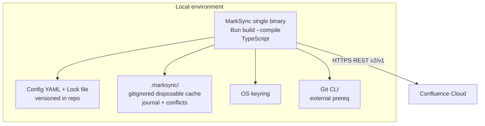
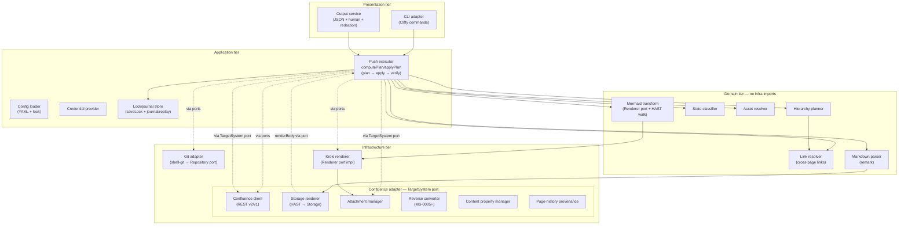
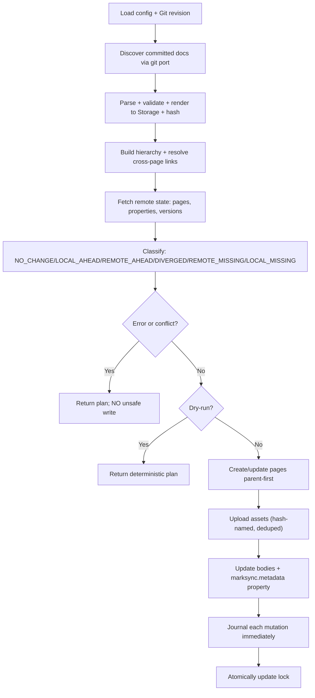

---
# Copyright (c) 2025-2026 Juliusz Ćwiąkalski (https://www.cwiakalski.com | https://www.linkedin.com/in/juliusz-cwiakalski/ | https://x.com/cwiakalski)
# MIT License - see LICENSE file for full terms
source: https://github.com/juliusz-cwiakalski/agentic-delivery-os/blob/main/doc/templates/architecture-overview-template.md
ados_distribution: redistributable
id: ARCHITECTURE-OVERVIEW
status: Draft
created: 2026-07-04
last_updated: 2026-07-14
owners: [Juliusz Ćwiąkalski]
area: engineering
document_classification: current-truth
links:
  related_decisions: [ADR-0001, ADR-0002, PDR-0001, TDR-0001, ADR-0005, ADR-0006, TDR-0003, ADR-0010]
  related_changes: [GH-18, GH-20, GH-21, GH-22, GH-23, GH-24, GH-26, GH-27, GH-63, GH-64, GH-66, GH-69]
  summary: "Architecture overview — ports-and-adapters CLI; Markdown→Storage pipeline; Confluence Cloud adapter; UUID+lock state model; no hosted backend."
ai_assistance: "AI-assisted drafting; human-authored and approved by Juliusz Ćwiąkalski."
---

# Architecture Overview

_A ports-and-adapters (hexagonal) CLI. The application core owns identity,
conversion, planning, and synchronization; thin adapters supply source documents
(Git), remote mutations (Confluence), rendering (Mermaid), and IO (filesystem,
keyring, stdout). This is the spec §11 model (`doc/inception/system-specification-draft-from-ai-brainstorm.md`),
re-pointed from Go to TypeScript per ADR-0001._

## System context (C4 L1)

```mermaid
flowchart LR
  Human[Human operator] --> MS[MarkSync CLI]
  Agent[AI coding/doc agent] --> MS
  CI[CI pipeline] --> MS

  MS -->|reads committed Markdown| Git[(Git repository)]
  MS -->|publishes pages/assets/properties| Conf[(Confluence Cloud)]
  MS -->|reads/writes secrets| Keyring[(OS keyring)]
  MS -->|renders diagrams (opt-in)| Kroki[(Kroki API public endpoint)]
```

- **MarkSync CLI** — a single self-contained binary that synchronizes Git-authored Markdown to Confluence pages (the system under description).
- **Human / AI agent / CI pipeline** — the three operator personas; identical core behaviour, only auth differs (`01-north-star.md`).
- **Git repository** — the authoritative engineering workspace; MarkSync reads committed snapshots (never pushes/pulls).
- **Confluence Cloud** — the publication surface; MarkSync creates/updates pages, attachments, and content properties.
- **OS keyring** — stores API tokens / OAuth refresh tokens; never written to project files.
- **Kroki API** — an optional (opt-in `render` policy) public HTTP service (`https://kroki.io/mermaid/svg`) that renders Mermaid source to SVG; diagram content leaves the environment only when this policy is active (NFR-PRIV-2). On failure the pipeline falls back to the code block (ADR-0002 C-2).

## Container diagram (C4 L2)



- **MarkSync binary** — one container (the CLI); compiled per OS/arch. Holds all application + adapter code. No separate server process.
- **Config + Lock (filesystem)** — version-controlled YAML; the shared-base record (ADR-0006). No secrets.
- **`.marksync/` cache** — disposable runtime state (rendered bodies, journal, conflict workspaces); never needed for correctness.
- **Git CLI** — an explicit external prerequisite (spec §9.4); read-only from MarkSync's perspective.
- **Confluence Cloud** — the remote system of record for pages.

## Components

_Derived from spec §11.2, re-pointed to TypeScript. Tiers in the module-governance
section below govern residence and dependency direction._

> **Extensibility principle.** The architecture separates **core** (generic,
> adapter-agnostic) from **target-system adapter** (Confluence-specific). A
> `TargetSystem` port (defined in domain) abstracts the remote publishing surface.
> The Confluence adapter is the first and currently the only implementor. This
> keeps the architecture extensible for future adapters at low cost — a new
> adapter implements the `TargetSystem` port and its adapter-specific renderer /
> reverse converter — without adding speculative complexity. Confluence may
> remain the only adapter indefinitely; the port exists to keep the boundary
> clean, not to force generality.

### Core components (generic, adapter-agnostic)

| Component | Container | Tier | Responsibility |
|---|---|---|---|
| CLI adapter | MarkSync binary | presentation | Commands, flags, prompts, output selection (human/JSON/NDJSON) |
| Output service | MarkSync binary | presentation | Structured + human output, exit codes, redaction, non-interactive detection (auto-disable color in CI/scripts) |
| Application / use-case orchestration | MarkSync binary | application | Orchestrates plan→apply→verify; run IDs |
| Config loader | MarkSync binary | application | Load/merge/default/validate YAML config + lock (ajv/zod) |
| Credential provider | MarkSync binary | application | env/keyring/profile resolution; never logs secrets |
| Identity module | MarkSync binary | domain | UUID v7 generation (`generateUuidV7`), `DocumentId` branded value object, front-matter binding (`injectUuid`/`readUuid`), duplicate-UUID detection (`detectDuplicateUuids`) — `src/domain/identity/` |
| Page binding | MarkSync binary | domain | `PageBinding` record mapping a `DocumentId` to a target page (type + identity-binding semantics; lock persistence is E3-S2) — `src/domain/binding/` |
| Hierarchy planner | MarkSync binary | domain | Page graph, titles, parents, document-node resolution |
| Link resolver | MarkSync binary | domain | Resolve local Markdown cross-document links to target-system page IDs/URLs so Confluence internal links work after sync. `resolveLink(sourcePath, target, bindings)` at `src/domain/hierarchy/link-resolver.ts` *(delivered — GH-23)* |
| State classifier | MarkSync binary | domain | Pure three-way `classify({ local?, base?, remote }) → Result<SyncState, MarkSyncError>` + `SyncState` enum + `RemoteState` union + `SharedBase` view + `SyncState → Action` mapping (`NoOp`/`Update`/`Block`/`Skip`) — `src/domain/state/{classifier,sync-state,hashes,actions}.ts` *(delivered — GH-22)* |
| Concurrency gates | MarkSync binary | domain | Decentralized optimistic-concurrency backstop for overlapping CI runs (ADR-0006 C-5/C-6): `assertOperationFresh` (operation-ID freshness via UUID-v7 time-prefix comparison), `assertPlanNotExpired` (stale-plan expiry, default 15 min, conservative boundary), `decideOnConflict` + `Decision` (409 re-fetch-once: reapply vs block over the `SyncState` matrix) — `src/domain/state/{operation-freshness,plan-expiry,conflict-policy}.ts`; `uuidV7Timestamp` extractor anchors both expiry and freshness via the `runId`'s embedded UUID-v7 timestamp (`src/domain/identity/uuid.ts`) *(delivered — GH-24)* |
| Markdown parser | MarkSync binary | domain | Markdown → MDAST/HAST (remark + remark-frontmatter + remark-gfm); canonical subset validation. `parseMarkdown` (`src/domain/markdown/parse.ts`) → `mdastToHast` bridge (`src/domain/markdown/mdast-to-hast.ts`) → unsupported-node classifier emitting `UnsupportedConstruct` (`src/domain/markdown/unsupported.ts`) → canonical HAST + `contentHash` sha256 (`src/domain/render/canonicalize.ts`) *(delivered — GH-20; front-matter stripping — GH-63)* |
| Asset resolver | MarkSync binary | domain | Path-safe, content-addressed local-image resolution. `AssetResolver` (`src/domain/assets/resolver.ts`) walks HAST `img` nodes, resolves each local `src` relative to the doc confined to the configured root (`realpath` + prefix check, symlink-aware → `Forbidden(path-traversal)`, NFR-SEC-7), sha256-identifies each asset, and rewrites the node to the dedup filename `marksync-asset-<sha256>.<ext>` (`src/domain/assets/naming.ts`); remote `http(s)` images skipped *(delivered — GH-26)* |
| Mermaid transform + port | MarkSync binary | domain | `Renderer` port (`src/domain/mermaid/port.ts`, `render(source): Promise<Result<Artifact, MarkSyncError>>`) + HAST transform (`src/domain/mermaid/transform.ts`): when `render.mermaid.policy === "render"`, walks HAST for `pre>code.language-mermaid`, renders each fence via the injected `Renderer`, dedups by source within-doc, and replaces the fence with an `img` node (→ `imageMacro` emits `<ac:image><ri:attachment>`); on `RemoteUnreachable` keeps the `pre` and collects a warning *(delivered — GH-69)* |
| Push executor | MarkSync binary | application | Ordered safe writes via `TargetSystem` port; the `computePlan` (pure, no-writes dry-run) + `applyPlan` (parent-first, per-document isolation, journaling, provenance wiring, Conflict-as-drift with re-fetch-once policy) use cases at `src/app/push-flow.ts` *(delivered — GH-23)*. Concurrency gates wired in GH-24 — operation-freshness + stale-plan-expiry before each write, 409 re-fetch-once on `Conflict` (pure gates at `src/domain/state/`) *(delivered — GH-24)*. Asset resolution in `computePlan` + per-entry asset upload/reuse in `applyPlan` (reuse-on-exists → 0 writes; `PageBinding.attachmentHashes` merge) wired via `AssetResolver` (`src/domain/assets/`) *(delivered — GH-26)*. Mermaid transform wired into `computePlan` after asset resolution and before `renderBody` when `policy === "render"` — merges mermaid artifacts into `PlanEntry.assets`, populates `ContentHash.attachmentHashes`, and emits the one-time privacy warning *(delivered — GH-69)*. Provenance: `Plan.visiblePanel` (from `config.provenance.visiblePanel`) threads through `applyPlan`→`processEntry`; `appendProvenancePanel` appends the `{info}` macro to the write body only (never to the HAST hash → no false drift); `bindingToProperty` writes the 14-field `marksync.metadata` property; `formatVersionMessageWithMeta` produces the version message + `trimMarker` *(delivered — GH-27)* |
| Pull/conflict service | MarkSync binary | infrastructure | Reverse-sync patches/conflict workspace; never commits |
| Lock/journal store | MarkSync binary | application | Lock atomic save (`saveLock`, delegating to the infra `writeAtomic` primitive at `src/infra/lock/store.ts`) + append-only journal writer + `replayJournal` for partial-apply recovery (`src/app/journal.ts`) *(delivered — GH-23)* |
| Git adapter | MarkSync binary | infrastructure | `Repository` port (`src/domain/git/port.ts`) → shell-git adapter (`createShellGit`, `src/infra/git/shell-git.ts`) via Git CLI (TDR-0003); read-only committed snapshots *(delivered — GH-23)* |
| Mermaid renderer (Kroki) | MarkSync binary | infrastructure | `KrokiClient` (`src/infra/mermaid/kroki.ts`) implements the `Renderer` port: `POST https://kroki.io/mermaid/svg` with the diagram source as `text/plain`, 30 s `AbortController` timeout, HTTP 4xx/5xx + network/timeout → `RemoteUnreachable`; on 200 reads SVG bytes, computes full sha256, and returns `Artifact { bytes, mime: "image/svg+xml", hash, kind: "mermaid" }` (ADR-0002 rung 6) *(delivered — GH-69)* |

### Confluence adapter components (target-system-specific, behind `TargetSystem` port)

| Component | Container | Tier | Responsibility |
|---|---|---|---|
| Confluence client | MarkSync binary | infrastructure | `ConfluenceClient` → Cloud REST v2/v1; native `fetch`, `v1`/`v2` URL builders rooted at `baseUrl`, `authHeader` injection, redacted logging, 429 backoff → `RateLimited`, 5xx retry → `RemoteUnreachable`; 401/403 never retried *(delivered — GH-21)* |
| Confluence page service | MarkSync binary | infrastructure (adapter) | `PageService` (v2): page create/read/update/move + the brand-defining 409-conflict parse → typed `Conflict`; 403 → `Forbidden`; 404 → `RemoteMissing` *(delivered — GH-21)* |
| Confluence content property manager | MarkSync binary | infrastructure (adapter) | `PropertyService` (v1, key-based): `marksync.metadata` string property read/write (lock cross-check data); `getProperty` → `string | undefined`; `putProperty` create-or-update (POST, and on 409 GET `version.number` → PUT with incremented version) *(delivered — GH-21; switched to v1 — GH-66)* |
| Confluence attachment manager | MarkSync binary | infrastructure | `AttachmentService` (v1-only): multipart upload, hash-named dedup, 400-duplicate idempotency signal → "already exists", existence + list. Changed bytes → new hash-named file → fresh create (no in-place `/data` update by design) *(delivered — GH-21)* |
| Confluence Storage renderer | MarkSync binary | infrastructure (adapter) | HAST → Confluence Storage XHTML string-builder visitor (ADR-0005); `renderStorage(hast, opts) → { body, hash, warnings }` (`src/infra/confluence/render/storage.ts`); CDATA code bodies, omitted `ac:schema-version`/`ac:macro-id`, `<ac:task-list>` as its own block *(delivered — GH-20)* |
| Confluence search + restrictions | MarkSync binary | infrastructure (adapter) | `SearchService` (CQL, v1-only) + `RestrictionsService` (v1-only) — minimal for MS-0002 *(delivered — GH-21)* |
| Confluence page-history provenance | MarkSync binary | infrastructure (adapter) | `version.message` formatting per ADR-0010 (`formatVersionMessage`/`formatVersionMessageWithMeta` — MarkSync/Git prefix, compact included-commit summary, deterministic trim to `MAX_VERSION_MESSAGE_LEN`, returns `message` + `trimMarker`); visible provenance panel builder (`buildProvenancePanel` → Storage XHTML `{info}` macro with the `marksync:provenance-panel` marker); direct-edit classifier (`classifyVersion` → `"marksync"` \| `"direct"` by the `marksync git` prefix, NFR-REL-9) *(delivered — GH-21; panel + classifier + trimMarker — GH-27)* |
| ConfluenceTarget adapter | MarkSync binary | infrastructure (adapter) | `class ConfluenceTarget implements TargetSystem` — composes the client + all services; `renderBody` delegates to `renderStorage`; the sole `TargetSystem` implementor *(delivered — GH-21)* |
| Confluence reverse converter | MarkSync binary | infrastructure (adapter) | Storage/ADF → Markdown (later phase; `MS-0005+`); target-specific body parsing |

### C4 L3 — Component diagram



- **Solid arrows** = direct calls within the binary.
- **Dashed arrows** = calls through ports (interfaces); the domain tier defines the ports, infrastructure implements them.
- The **Confluence adapter** box is the `TargetSystem` port implementor — a future adapter (e.g., Notion) would replace this box while everything outside stays unchanged.

## Module governance

### Module-residence rules

| Capability type | Owning module / path pattern | Notes |
|---|---|---|
| new CLI command | `src/cli/commands/` | presentation; thin orchestration only |
| new use-case orchestration | `src/app/` | application; calls domain + infra via ports |
| new domain rule (drift, identity, planning) | `src/domain/<context>/` | no infra imports |
| asset/path-safety resolution (local images, attachments) | `src/domain/assets/` | no infra imports; `AssetResolver` + `assetFilename` delivered (GH-26) |
| new Markdown transform (generic) | `src/domain/render/` | MDAST/HAST-level; adapter-agnostic |
| new Confluence-specific render/reverse | `src/infra/confluence/render/` | HAST→Storage, Storage→MDAST; behind `TargetSystem` port |
| new Confluence endpoint use | `src/infra/confluence/` | behind `ConfluenceClient` interface |
| new target-system adapter | `src/infra/<target>/` | implements `TargetSystem` port; renderer + reverse converter + client |
| new Git operation | `src/infra/git/` | behind `Repository` interface |
| new renderer mode | `src/infra/mermaid/` | behind `Renderer` interface |
| new output format | `src/cli/output/` | presentation; redaction enforced; JSON + human adapters |
| new config/lock field | `src/domain/config/` + schema | schema-validated; migration path |

Rule: place new code by capability type, not by guess; if a capability type is unlisted, add a row before placing the code.

### Dependency-direction / layering matrix

Tiers: **presentation** → **application** → **domain** → **infrastructure**.
Invariant: no dependency may point upward or sideways across tiers. The matrix
specifies which downward dependencies are permitted. Ports (interfaces) live in
`domain`/`application`; adapter implementations live in `infrastructure`.

| From → To | presentation | application | domain | infrastructure |
|---|---|---|---|---|
| presentation | — | ✓ | ✗ | ✗ |
| application | ✗ | — | ✓ | ✓ (via ports) |
| domain | ✗ | ✗ | — | ✗ (defines ports; imports no infra) |
| infrastructure | ✗ | ✗ | ✓ (implements ports) | — |

Example: the CLI adapter (presentation) may import the application layer; the
domain layer may NOT import the Confluence adapter. The Confluence adapter
(infrastructure) **implements** the `TargetSystem` port defined in the domain
tier (`src/domain/target/port.ts`).

### Internal interface contracts

_Lightweight signatures + return/error shapes. Full versioned contracts live in
the integration-scenarios docs (`doc/inception/integration-scenarios/`)._

| Boundary (A → B) | Operation | Signature | Returns | Errors |
|---|---|---|---|---|
| app → git port | readCommitted | `readCommitted(ref, patterns)` | `Result<Map<path, Uint8Array>, MarkSyncError>` | throws on malformed path/ref (invariant guard, TDR-0003 C-4 — no `BadPath`/`BadRef` `Result` arm per DM-8); `RemoteUnreachable` on git runtime failure. `patterns` are micromatch-style globs (`**` matches any path depth, e.g. `docs/**/*.md`); a file is included if **any** pattern matches (union), and empty `patterns` → empty map. The shell-git adapter lists all committed files and filters in-memory via `src/shared/glob.ts` (GH-64) — git pathspec is not used because it does not support recursive `**`. |
| app → git port | headSha | `headSha()` | `Result<string, MarkSyncError>` | `RemoteUnreachable` on git runtime failure |
| app → git port | currentBranch | `currentBranch()` | `Result<string, MarkSyncError>` | `RemoteUnreachable` on git runtime failure; falls back to `GITHUB_REF_NAME` on detached HEAD |
| app → git port | listCommitSubjects | `listCommitSubjects(range?)` | `Result<readonly string[], MarkSyncError>` | throws on malformed range (invariant); `RemoteUnreachable` on git runtime failure |
| app → markdown port | parse | `parseMarkdown(bytes, opts?)` | `Result<MdastRoot, MarkSyncError>` | total in MS-0002 — a genuine parse failure is an invariant violation that `throw`s (no `ParseError` arm exists in `MarkSyncError`) |
| app → target system port | renderBody | `renderBody(hast, opts)` | `Result<{ body, hash, warnings }, MarkSyncError>` | `UnsupportedConstruct`; input is canonical **HAST** (the app layer runs `parseMarkdown` → `mdastToHast` → `renderBody`) |
| app → target system port | getPage | `getPage(id)` | `Result<Page, MarkSyncError>` | `RemoteMissing` (404), `Forbidden` (403), `RateLimited`, `RemoteUnreachable` |
| app → target system port | createPage | `createPage(req)` | `Result<Page, MarkSyncError>` | `Forbidden`, `Conflict`, `RateLimited`, `RemoteUnreachable` |
| app → target system port | updatePage | `updatePage(req)` (`req` carries `pageId`, `title`, `body`, `baseVersion`; v2 PUT requires `title`) | `Result<Page, MarkSyncError>` | `Conflict` (409 → drift), `Forbidden`, `RateLimited`, `RemoteUnreachable` |
| app → target system port | movePage | `movePage(req)` | `Result<Page, MarkSyncError>` | `Forbidden`, `RateLimited`, `RemoteUnreachable` |
| app → target system port | getProperty | `getProperty(pageId, key)` | `Result<string \| undefined, MarkSyncError>` | `Forbidden`, `RateLimited`, `RemoteUnreachable` (missing key → `ok(undefined)`) |
| app → target system port | putProperty | `putProperty(pageId, key, value)` | `Result<void, MarkSyncError>` | `TooLarge`, `Forbidden`, `RateLimited`, `RemoteUnreachable` (create-or-update over v1; a property-PUT 409 is the rare concurrent race → `RemoteUnreachable`, not `Conflict` — GH-66 DEC-6) |
| app → target system port | uploadAttachment | `uploadAttachment(pageId, artifact)` | `Result<AttachmentRef, MarkSyncError>` | `TooLarge`, `Forbidden`, `RateLimited`, `RemoteUnreachable` (duplicate filename → "already exists" result) |
| app → target system port | attachmentExists | `attachmentExists(pageId, hash)` | `Result<boolean, MarkSyncError>` | `Forbidden`, `RateLimited`, `RemoteUnreachable` |
| app → target system port | listAttachments | `listAttachments(pageId)` | `Result<AttachmentRef[], MarkSyncError>` | `Forbidden`, `RateLimited`, `RemoteUnreachable` |
| app → target system port | searchPages | `searchPages(cql)` | `Result<PageRef[], MarkSyncError>` | `RateLimited`, `RemoteUnreachable` |
| app → target system port | getRestrictions | `getRestrictions(pageId)` | `Result<PageRestrictions, MarkSyncError>` | `Forbidden`, `RateLimited`, `RemoteUnreachable` |
| app → target system port | reverseConvert | `reverseConvert(bodyRepr)` | `MdastRoot` | `UnsupportedConstruct` (`MS-0005+`) |
| app → mermaid port | render | `render(source)` → `Promise<Result<Artifact, MarkSyncError>>` | `Artifact{ bytes, mime: "image/svg+xml", hash, kind: "mermaid" }` | `RemoteUnreachable` (HTTP 4xx/5xx, DNS, timeout) → per-fence fallback to `code` block + warning (ADR-0002 C-2). Port at `src/domain/mermaid/port.ts`; implemented by `KrokiClient` (`src/infra/mermaid/kroki.ts`, public Kroki — rung 6, opt-in `render` policy with a one-time privacy warning). The in-process rung-1 adapter (Part B) is deferred to MS-0003+ *(delivered — GH-69; code-policy default — GH-25)* |
| app → link resolver | resolveLink | `resolveLink(sourcePath, target, bindings)` | `Result<PageRef \| string, MarkSyncError>` | `UnresolvedLink` for an unresolvable `.md` target; external/anchor/non-`.md` targets pass through as the original string *(delivered — GH-23)* |
| app → state classifier | classify | `classify({ local?, base?, remote })` | `Result<SyncState, MarkSyncError>` | `Forbidden` (when `remote.kind === "forbidden"` — not a sync state); `local` optional (absent ⇒ `LOCAL_MISSING`); invoked only for bound documents |
| app → lock store | commit | `commit(newLock)` | `void` | `LockDirty`, `ConcurrentWrite` |
| cli → app (push-flow) | computePlan | `computePlan(config, lock, git, target)` | `Promise<Result<Plan, MarkSyncError>>` | `ForbiddenBranch` (branch gate — 0 discovery reads on deny), `DuplicateUuid` (INV-SAFE-3 fatal gate — 0 writes), transport (`RateLimited`/`RemoteUnreachable`). Pure no-writes dry-run; `Plan = { runId, operationId, entries[], provenance, warnings, visiblePanel }` *(delivered — GH-23; `visiblePanel` — GH-27)* |
| cli → app (push-flow) | applyPlan | `applyPlan(plan, target, lock, opts)` (`opts` carries `stalePlanMinutes`) | `Promise<Result<ApplyReport, MarkSyncError>>` | per-document errors collected in the report as `blocked` outcomes (Conflict-as-drift; `StalePlan` for stale/expired docs); operation-freshness + stale-plan-expiry gates before each write; on `Conflict`, re-fetch + re-classify ONCE then reapply-or-block (max 1 re-fetch + 1 reapply, no loop); only transport failures abort the run. `ApplyReport = { runId, results[], writes, skips, blocks }`; parent-first, per-document isolation, journal-before-lock *(delivered — GH-23; concurrency gates — GH-24)* |

Scope: signature + return/error shape only. Every `TargetSystem` operation
returns `Result<T, MarkSyncError>`; any remote call can additionally surface
`RateLimited` (exhausted-429) or `RemoteUnreachable` (exhausted-5xx / network /
schema-drift). The `TargetSystem` port is the primary extensibility seam: the
Confluence adapter (`ConfluenceTarget`) implements it; a future adapter (e.g.,
Notion, GitBook) would implement the same port with its own renderer and reverse
converter. The `Renderer` interface mirrors spec §9.11.

### Feature → component ownership map

| Feature | Owning component(s) |
|---|---|
| Safe publish (create/update/no-op) | app, hierarchy planner, Confluence Storage renderer, push executor |
| Drift detection + conflict block | state classifier, push executor |
| Document identity (UUID + lock) | identity module, page binding, lock/journal store, Confluence content property manager |
| Mermaid render + attach | mermaid transform + Renderer port (`src/domain/mermaid/`), Kroki renderer (`src/infra/mermaid/`), push executor (wiring), Confluence attachment manager |
| Cross-page link resolution | link resolver, hierarchy planner, Confluence client (page ID lookup) |
| Concurrency control (CI) | push executor (wiring), concurrency gates (`src/domain/state/`), lock store |
| Provenance (page history + visible panel + property) | Confluence page-history provenance, push executor (panel injection + property enrichment) |
| `repair-state` | lock/journal store |
| Reverse sync (later) | Confluence reverse converter, pull/conflict service |
| JSON/machine-readable output | output service, CLI adapter |

### Module-boundary heuristics

- A module with **> 3 responsibilities** / > 1 reason to change → split by responsibility.
- Two modules that always change together → consider merging.
- High cohesion within a module; low coupling across modules.
- A dependency mocked in > 1 unrelated test → consider an interface boundary (port).
- The Confluence adapter is the **only** module permitted to know REST v2/v1 distinctions (A-FEA-6 isolation).

## Data flow

### Push flow (primary — `MS-0002`) *(realized — GH-23)*



- Each step is idempotent; partial-apply rerun uses journal + remote property to avoid duplicates (spec §9.8).
- The dry-run path (Load → Classify → return `Plan` with 0 writes) is `computePlan`; the apply path (create/update parent-first → upload assets → update bodies + property → journal → lock) is `applyPlan` — both at `src/app/push-flow.ts` *(delivered — GH-23)*. The asset-upload step (per-entry upload after Create/Update, reuse-on-exists, `attachmentHashes` merge) is wired via `AssetResolver` (`src/domain/assets/`) *(delivered — GH-26)*. Writes are serialized (bounded concurrency = 1, ADR-0010 C-3); each mutation is journaled (`src/app/journal.ts`) before the lock updates, and a 409 surfaces as drift with no retry.
- Concurrency control (`A-FEA-7`): decentralized — Confluence 409 on stale `version.number` + operation-ID dedup + stale-plan expiry. No shared service; no pessimistic leasing. CI concurrency-group templates reduce overlap at the source. *(delivered — GH-24)*

### Reverse sync flow (later — `MS-0005+`)

- `pull` reads remote Storage/ADF → reverse-converts to Markdown patch → writes to conflict workspace → **never** auto-commits (spec §9.9).

## External dependencies and integrations

| System / API / provider | Purpose | Ownership | Criticality |
|---|---|---|---|
| Confluence Cloud REST API (v2 + v1; version split below) | Page CRUD, content properties, attachments, labels, search, restrictions | Atlassian | **High** — the only remote system |
| Git CLI | Read committed snapshots, worktree status, renames | local install | High — source of truth reader |
| OS keyring | API token / OAuth token storage | OS | Medium — env fallback exists |
| Kroki public API (`https://kroki.io/mermaid/svg`) | Mermaid diagram rendering (opt-in `render` policy, ADR-0002 rung 6) | Yuzutech (open source) | Medium — opt-in only; network failure falls back to `code` block (ADR-0002 C-2); reached via built-in `fetch` (no dependency) *(delivered — GH-69)* |
| official `mermaid` npm package | In-process diagram rendering (design target, Part B — MS-0003+) | open source (Mermaid) | High — load-bearing for ADR-0001; not yet installed (in-process renderer deferred per GH-11 / CEO-DEC-1) |
| Atlassian auth (API token / OAuth 3LO) | Identity | Atlassian | High |

> **Confluence API version split** (informed by the `MS-0001` spike, refined by
> GH-66): pages, hierarchy = **v2**; content properties (key-based
> `marksync.metadata` GET/POST/PUT) = **v1** — the v2 path parameter expects a
> property ID, not a key; attachment upload/update, labels add/delete,
> search/CQL, restrictions = **V1-ONLY**. All distinctions are isolated behind
> the `ConfluenceClient` adapter (A-FEA-6).

## Deployment topology

| Container | Where it runs | How traffic reaches it |
|---|---|---|
| MarkSync binary | Developer workstation / CI runner / container | Invoked as a CLI process; no network ingress |
| Confluence Cloud | Atlassian-hosted SaaS | HTTPS REST from the binary |

- No server process; no ingress; no regions to manage. The binary is the unit of deployment.
- CI runs the same binary with non-interactive credentials (env vars / masked secrets).

## Key architectural decisions

| Decision | Decision record |
|---|---|
| TypeScript + Bun single-binary over Go | [ADR-0001](../decisions/ADR-0001-implementation-language-and-runtime.md) |
| Mermaid rendering strategy (official lib, content-hash, SVG, fallback ladder) | [ADR-0002](../decisions/ADR-0002-mermaid-rendering-strategy.md) |
| Brand = MarkSync; Confluence = first adapter | [PDR-0001](../decisions/PDR-0001-product-naming-confluence-adapter.md) |
| Run a Confluence API validation spike before implementation | [TDR-0001](../decisions/TDR-0001-confluence-api-validation-spike.md) |
| Write Storage Format, not ADF | [ADR-0005](../decisions/ADR-0005-page-body-representation-storage-not-adf.md) |
| Document identity + shared-base state model (UUID v7 + committed lock + disposable cache + decentralized 409 concurrency + squash provenance + branch restriction) | [ADR-0006](../decisions/ADR-0006-document-identity-and-shared-base-state-model.md) |
| CLI framework — Cliffy | [TDR-0002](../decisions/TDR-0002-cli-framework.md) |
| Git adapter — shell-Git behind `Repository` interface | [TDR-0003](../decisions/TDR-0003-git-adapter.md) |
| Testing runner — bun:test + thin E2E runner | [TDR-0004](../decisions/TDR-0004-testing-runner.md) |
| Confluence page history provenance — squash by default, commit-by-commit deferred | [ADR-0010](../decisions/ADR-0010-confluence-page-history-provenance-and-sync-granularity.md) |

## Known constraints and uncertainty flags

**Fixed constraints:**
- No hosted backend for core value (A-VIA-1).
- Cloud-only in `MS-0002`; one auth path (API token); one configured subtree per target.
- No cross-page transaction (Confluence has none) — validate globally, execute parent-first, journal immediately.
- Binary size and cold-start are **desired targets** (~90 MB / ~2 s), not hard constraints — larger size or longer start times are acceptable if the job gets done. The CLI is used intermittently by humans and asynchronously in CI.
- ≤ ~500 managed pages in `MS-0002` (A-FEA-10).
- Decentralized coordination: no shared service — locking via Git lock + Confluence 409 (ADR-0006 C-6).
- Sync restricted to configured branches (`allowBranches`, default `["main"]`) — docs sync as "deployment" (ADR-0006).
- Lock file is committed to the repo (like `package-lock.json` for npm) — it records per-target page bindings and shared-base state; no secrets.
- Single cache root `.marksync/` (overridable via `MARKSYNC_CACHE_DIR`) is **gitignored** to avoid merge conflicts. Only `.marksync/cache/` is CI-cacheable (reconstructable from Git + Confluence); `.marksync/journal/` and `.marksync/conflicts/` are run-specific and never cached (ADR-0006).
- Confluence version history provenance: **squash by default** for `MS-0002` — one Confluence version per sync with a compact provenance summary in `version.message`; commit-by-commit sync deferred to a future milestone (ADR-0010).
- `MS-0002` cross-OS support: **Linux + Windows** (amd64 + arm64 where supported). macOS deferred to `MS-0003` or later.

**Uncertainty flags (low confidence — human confirmation needed):**

- **[UNCERT-1] Mermaid in-process render** — `A-FEA-1` (`testing`). The official library's headless determinism via `jsdom` (+ `deterministicIds`, SVG output, fixed font) is spike-gated (ADR-0002). If it fails, language choice is revisited. _Confidence: low → medium_ (Mermaid's own test suite uses jsdom). **→ Plan a spike early in `MS-0002` backlog.**
- **[UNCERT-2] Bun single-binary signing/trust** — `A-FEA-2` (`unvalidated`). Cross-compile works; macOS codesign guide exists (Bun v1.2.4+); Windows Authenticode via `osslsigncode` is manual (R-FEA-2). _Confidence: low._ **→ Plan a spike early in `MS-0002` backlog.**
- **[UNCERT-3] Confluence `version.message` length limit** — exact history-description/message limit is unverified. ADR-0010 requires a small verification spike and deterministic trimming strategy before implementation. _Confidence: medium._ **→ Plan a spike early in `MS-0002` backlog.**
- **[UNCERT-4] Permission asymmetry handling** — `A-FEA-6`/`R-FEA-10`. If Confluence permissions are incomplete (a user can read some pages but not all synced pages), drift reasoning may misclassify a page as deleted when it is merely inaccessible. `doctor` discovery and a visibility-completeness check are planned. Mitigation: if a page ID is recorded in the lock but returns `Forbidden`, emit a warning and skip rather than treating it as deleted. Distinguishing deleted vs inaccessible requires assuming sync is performed by a space owner / power user with full read access. Recorded as R-FEA-10 in the risk register. _Confidence: medium._
- **[RESOLVED] State model** — ADR-0006 refined: UUID v7, decentralized 409 concurrency (optimistic, not pessimistic leasing), per-target lock, 15-min stale window (assumed). _Confidence: medium-high._
- **[RESOLVED] Git adapter** — shell-Git (TDR-0003). _Confidence: high._
- **[RESOLVED] CLI framework** — Cliffy (TDR-0002). _Confidence: medium-high._
- **[RESOLVED] Testing runner** — bun:test (TDR-0004). _Confidence: medium-high._
- **[RESOLVED] Sync granularity default** — squash by default for `MS-0002`; commit-by-commit deferred to a future milestone (ADR-0010; owner reversal per PR #4 review). _Confidence: medium-high._

## Four-risk check on architecture decisions

- **Value** — the ports-and-adapters design directly serves the trust wedge: deterministic planning, drift classification, and the no-silent-overwrite invariant (`INV-SAFE-1`). Mermaid in-process serves the fidelity differentiator.
- **Usability** — single binary + identical local/CI behaviour minimizes setup friction (A-USA-1); `MS-0003`/MLP will add `doctor` diagnostics for the remaining friction.
- **Feasibility** — **mostly de-risked** by the spike for the Confluence contract; the TS/Bun stack itself remains contingent on ADR-0002 + ADR-0002 signing (UNCERT-1/2).
- **Viability** — hexagonal boundaries keep the support matrix narrow (swap adapters, not core) and enable contributor seams (R-VIA-1 mitigation); no DB/telemetry keeps OSS sustainability realistic (A-VIA-1).
