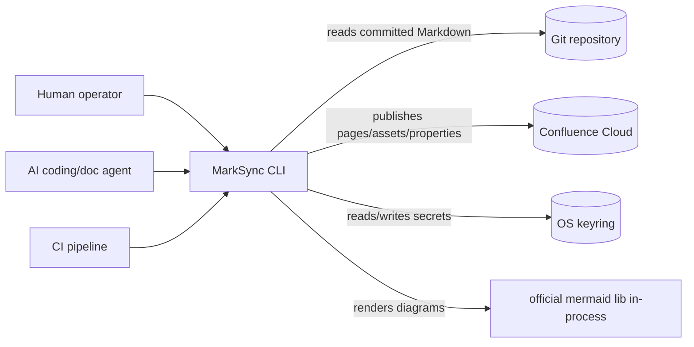
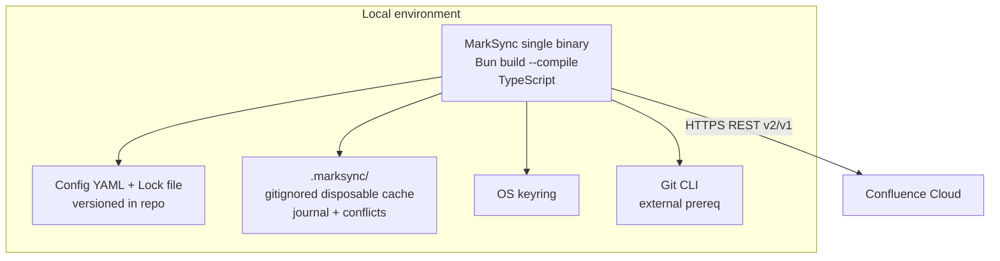
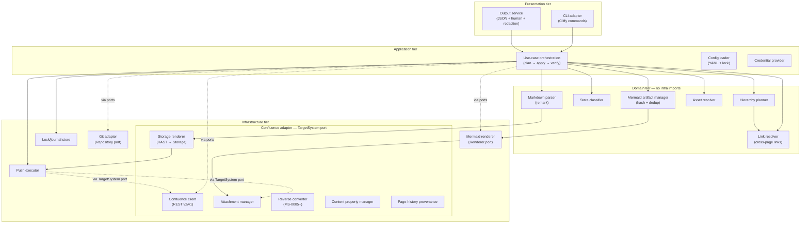
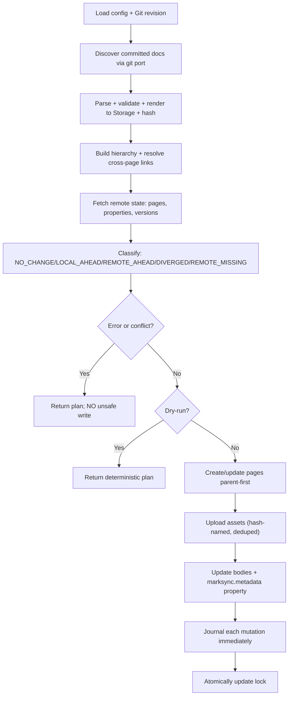

---
# Copyright (c) 2025-2026 Juliusz Ćwiąkalski (https://www.cwiakalski.com | https://www.linkedin.com/in/juliusz-cwiakalski/ | https://x.com/cwiakalski)
# MIT License - see LICENSE file for full terms
source: https://github.com/juliusz-cwiakalski/agentic-delivery-os/blob/main/doc/templates/architecture-overview-template.md
ados_distribution: redistributable
id: ARCHITECTURE-OVERVIEW
status: Draft
created: 2026-07-04
last_updated: 2026-07-04
owners: [Juliusz Ćwiąkalski]
area: engineering
document_classification: current-truth
links:
  related_decisions: [ADR-0001, ADR-0002, PDR-0001, TDR-0001, ADR-0005, ADR-0006]
  related_changes: []
  summary: "Architecture overview — ports-and-adapters CLI; Markdown→Storage pipeline; Confluence Cloud adapter; UUID+lock state model; no hosted backend."
ai_assistance: "AI-assisted drafting; human-authored and approved by Juliusz Ćwiąkalski."
---

# Architecture Overview

_A ports-and-adapters (hexagonal) CLI. The application core owns identity,
conversion, planning, and synchronization; thin adapters supply source documents
(Git), remote mutations (Confluence), rendering (Mermaid), and IO (filesystem,
keyring, stdout). This is the spec §11 model (`doc/inception/system-specification-draft-from-ai-brainstorm.md`),
re-pointed from Go to TypeScript per ADR-0001._

## System context (C4 L1)

- **MarkSync CLI** — a single self-contained binary that synchronizes Git-authored Markdown to Confluence pages (the system under description).
- **Human / AI agent / CI pipeline** — the three operator personas; identical core behaviour, only auth differs (`01-north-star.md`).
- **Git repository** — the authoritative engineering workspace; MarkSync reads committed snapshots (never pushes/pulls).
- **Confluence Cloud** — the publication surface; MarkSync creates/updates pages, attachments, and content properties.
- **OS keyring** — stores API tokens / OAuth refresh tokens; never written to project files.

## Container diagram (C4 L2)

- **MarkSync binary** — one container (the CLI); compiled per OS/arch. Holds all application + adapter code. No separate server process.
- **Config + Lock (filesystem)** — version-controlled YAML; the shared-base record (ADR-0006). No secrets.
- **`.marksync/` cache** — disposable runtime state (rendered bodies, journal, conflict workspaces); never needed for correctness.
- **Git CLI** — an explicit external prerequisite (spec §9.4); read-only from MarkSync's perspective.
- **Confluence Cloud** — the remote system of record for pages.

## Components

_Derived from spec §11.2, re-pointed to TypeScript. Tiers in the module-governance
section below govern residence and dependency direction._

> **Extensibility principle.** The architecture separates **core** (generic,
> adapter-agnostic) from **target-system adapter** (Confluence-specific). A
> `TargetSystem` port (defined in domain) abstracts the remote publishing surface.
> The Confluence adapter is the first and currently the only implementor. This
> keeps the architecture extensible for future adapters at low cost — a new
> adapter implements the `TargetSystem` port and its adapter-specific renderer /
> reverse converter — without adding speculative complexity. Confluence may
> remain the only adapter indefinitely; the port exists to keep the boundary
> clean, not to force generality.

### Core components (generic, adapter-agnostic)

| Component | Container | Tier | Responsibility |
|---|---|---|---|
| CLI adapter | MarkSync binary | presentation | Commands, flags, prompts, output selection (human/JSON/NDJSON) |
| Output service | MarkSync binary | presentation | Structured + human output, exit codes, redaction, non-interactive detection (auto-disable color in CI/scripts) |
| Application / use-case orchestration | MarkSync binary | application | Orchestrates plan→apply→verify; run IDs |
| Config loader | MarkSync binary | application | Load/merge/default/validate YAML config + lock (ajv/zod) |
| Credential provider | MarkSync binary | application | env/keyring/profile resolution; never logs secrets |
| Hierarchy planner | MarkSync binary | domain | Page graph, titles, parents, document-node resolution |
| Link resolver | MarkSync binary | domain | Resolve local Markdown cross-document links to target-system page IDs/URLs so Confluence internal links work after sync |
| State classifier | MarkSync binary | domain | Compare local/remote/base → NO_CHANGE/LOCAL_AHEAD/REMOTE_AHEAD/DIVERGED/REMOTE_MISSING/etc. |
| Markdown parser | MarkSync binary | domain | Markdown → MDAST/HAST (remark); canonical subset validation |
| Asset resolver | MarkSync binary | domain | Safe path/hash/dedup prep for images + attachments |
| Mermaid artifact manager | MarkSync binary | domain | Calculate Mermaid content hash, detect whether a given hash already exists on the target, orchestrate render→upload→reference |
| Push executor | MarkSync binary | infrastructure | Ordered safe writes via `TargetSystem` port; journal; optimistic concurrency |
| Pull/conflict service | MarkSync binary | infrastructure | Reverse-sync patches/conflict workspace; never commits |
| Lock/journal store | MarkSync binary | infrastructure | Lock atomic write, journal replay, `repair-state` |
| Git adapter | MarkSync binary | infrastructure | `Repository` interface → Git CLI (or `isomorphic-git`) |
| Mermaid renderer | MarkSync binary | infrastructure | `Renderer` interface → official `mermaid` + jsdom (ADR-0002); produces image bytes + hash |

### Confluence adapter components (target-system-specific, behind `TargetSystem` port)

| Component | Container | Tier | Responsibility |
|---|---|---|---|
| Confluence client | MarkSync binary | infrastructure | `ConfluenceClient` → Cloud REST v2/v1; pages, content properties, hierarchy |
| Confluence attachment manager | MarkSync binary | infrastructure | Attachment upload/update/download (V1-only); hash-based dedup; existence detection |
| Confluence Storage renderer | MarkSync binary | infrastructure (adapter) | HAST → Confluence Storage XHTML (ADR-0005); target-specific body representation |
| Confluence reverse converter | MarkSync binary | infrastructure (adapter) | Storage/ADF → Markdown (later phase; `MS-0005+`); target-specific body parsing |
| Confluence content property manager | MarkSync binary | infrastructure (adapter) | `marksync.metadata` property read/write (v2); lock cross-check data |
| Confluence page-history provenance | MarkSync binary | infrastructure (adapter) | `version.message` formatting per ADR-0010; MarkSync/Git prefix; squash summary |

### C4 L3 — Component diagram

- **Solid arrows** = direct calls within the binary.
- **Dashed arrows** = calls through ports (interfaces); the domain tier defines the ports, infrastructure implements them.
- The **Confluence adapter** box is the `TargetSystem` port implementor — a future adapter (e.g., Notion) would replace this box while everything outside stays unchanged.

## Module governance

### Module-residence rules

| Capability type | Owning module / path pattern | Notes |
|---|---|---|
| new CLI command | `src/cli/commands/` | presentation; thin orchestration only |
| new use-case orchestration | `src/app/` | application; calls domain + infra via ports |
| new domain rule (drift, identity, planning) | `src/domain/<context>/` | no infra imports |
| new Markdown transform (generic) | `src/domain/render/` | MDAST/HAST-level; adapter-agnostic |
| new Confluence-specific render/reverse | `src/infra/confluence/render/` | HAST→Storage, Storage→MDAST; behind `TargetSystem` port |
| new Confluence endpoint use | `src/infra/confluence/` | behind `ConfluenceClient` interface |
| new target-system adapter | `src/infra/<target>/` | implements `TargetSystem` port; renderer + reverse converter + client |
| new Git operation | `src/infra/git/` | behind `Repository` interface |
| new renderer mode | `src/infra/mermaid/` | behind `Renderer` interface |
| new output format | `src/cli/output/` | presentation; redaction enforced; JSON + human adapters |
| new config/lock field | `src/domain/config/` + schema | schema-validated; migration path |

Rule: place new code by capability type, not by guess; if a capability type is unlisted, add a row before placing the code.

### Dependency-direction / layering matrix

Tiers: **presentation** → **application** → **domain** → **infrastructure**.
Invariant: no dependency may point upward or sideways across tiers. The matrix
specifies which downward dependencies are permitted. Ports (interfaces) live in
`domain`/`application`; adapter implementations live in `infrastructure`.

| From → To | presentation | application | domain | infrastructure |
|---|---|---|---|---|
| presentation | — | ✓ | ✗ | ✗ |
| application | ✗ | — | ✓ | ✓ (via ports) |
| domain | ✗ | ✗ | — | ✗ (defines ports; imports no infra) |
| infrastructure | ✗ | ✗ | ✓ (implements ports) | — |

Example: the CLI adapter (presentation) may import the application layer; the
domain layer may NOT import the Confluence adapter. The Confluence adapter
(infrastructure) **implements** the `ConfluenceClient` port defined in domain.

### Internal interface contracts

_Lightweight signatures + return/error shapes. Full versioned contracts live in
the integration-scenarios docs (`doc/inception/integration-scenarios/`)._

| Boundary (A → B) | Operation | Signature | Returns | Errors |
|---|---|---|---|---|
| app → git port | readCommitted | `readCommitted(ref, patterns)` | `Map<path, bytes>` | `RefNotFound`, `BadPath` |
| app → git port | worktreeStatus | `worktreeStatus(paths)` | `WorktreeStatus` | — |
| app → markdown port | parse | `parse(bytes)` | `MdastRoot` | `ParseError` |
| app → target system port | getPage | `getPage(id, repr)` | `Page` | `NotFound`, `Forbidden`, `Conflict` |
| app → target system port | updatePage | `updatePage(req)` | `Page` | `Conflict` (409 → drift) |
| app → target system port | putProperty | `putProperty(pageId, key, value)` | `void` | `Conflict`, `TooLarge` |
| app → target system port | renderBody | `renderBody(mdast, opts)` | `{ bodyRepr, hash }` | `UnsupportedConstruct` |
| app → target system port | attachmentExists | `attachmentExists(pageId, hash)` | `boolean` | `Forbidden` |
| app → target system port | uploadAttachment | `uploadAttachment(pageId, artifact)` | `AttachmentRef` | `TooLarge`, `Forbidden` |
| app → target system port | reverseConvert | `reverseConvert(bodyRepr)` | `MdastRoot` | `UnsupportedConstruct` (`MS-0005+`) |
| app → mermaid port | render | `render(source, opts)` | `Artifact{ bytes, mime, hash }` | `RenderUnavailable` (→ fallback ladder) |
| app → link resolver | resolveLink | `resolveLink(sourcePath, targetPath)` | `PageRef` | `Unresolved` |
| app → state classifier | classify | `classify(local, base, remote)` | `SyncState` | — |
| app → lock store | commit | `commit(newLock)` | `void` | `LockDirty`, `ConcurrentWrite` |

Scope: signature + return/error shape only. The `TargetSystem` port is the
primary extensibility seam: the Confluence adapter implements it; a future
adapter (e.g., Notion, GitBook) would implement the same port with its own
renderer and reverse converter. The `Renderer` interface mirrors spec §9.11.

### Feature → component ownership map

| Feature | Owning component(s) |
|---|---|
| Safe publish (create/update/no-op) | app, hierarchy planner, Confluence Storage renderer, push executor |
| Drift detection + conflict block | state classifier, push executor |
| Document identity (UUID + lock) | config loader, lock/journal store, Confluence content property manager |
| Mermaid render + attach | Mermaid renderer, Mermaid artifact manager, Confluence attachment manager |
| Cross-page link resolution | link resolver, hierarchy planner, Confluence client (page ID lookup) |
| Concurrency control (CI) | push executor, lock store |
| Provenance (page history) | Confluence page-history provenance |
| `repair-state` | lock/journal store |
| Reverse sync (later) | Confluence reverse converter, pull/conflict service |
| JSON/machine-readable output | output service, CLI adapter |

### Module-boundary heuristics

- A module with **> 3 responsibilities** / > 1 reason to change → split by responsibility.
- Two modules that always change together → consider merging.
- High cohesion within a module; low coupling across modules.
- A dependency mocked in > 1 unrelated test → consider an interface boundary (port).
- The Confluence adapter is the **only** module permitted to know REST v2/v1 distinctions (A-FEA-6 isolation).

## Data flow

### Push flow (primary — `MS-0002`)

- Each step is idempotent; partial-apply rerun uses journal + remote property to avoid duplicates (spec §9.8).
- Concurrency control (`A-FEA-7`): decentralized — Confluence 409 on stale `version.number` + operation-ID dedup + stale-plan expiry. No shared service; no pessimistic leasing. CI concurrency-group templates reduce overlap at the source.

### Reverse sync flow (later — `MS-0005+`)

- `pull` reads remote Storage/ADF → reverse-converts to Markdown patch → writes to conflict workspace → **never** auto-commits (spec §9.9).

## External dependencies and integrations

| System / API / provider | Purpose | Ownership | Criticality |
|---|---|---|---|
| Confluence Cloud REST API (v2 + v1-only endpoints) | Page CRUD, content properties, attachments, labels, search, restrictions | Atlassian | **High** — the only remote system |
| Git CLI | Read committed snapshots, worktree status, renames | local install | High — source of truth reader |
| OS keyring | API token / OAuth token storage | OS | Medium — env fallback exists |
| official `mermaid` npm package | Diagram rendering | open source (Mermaid) | High — load-bearing for ADR-0001 |
| Atlassian auth (API token / OAuth 3LO) | Identity | Atlassian | High |

> **Confluence API version split** (proven by `MS-0001` spike): pages, content
> properties, hierarchy = **v2**; attachment upload/update, labels add/delete,
> search/CQL, restrictions = **V1-ONLY**. All distinctions are isolated behind
> the `ConfluenceClient` adapter (A-FEA-6).

## Deployment topology

| Container | Where it runs | How traffic reaches it |
|---|---|---|
| MarkSync binary | Developer workstation / CI runner / container | Invoked as a CLI process; no network ingress |
| Confluence Cloud | Atlassian-hosted SaaS | HTTPS REST from the binary |

- No server process; no ingress; no regions to manage. The binary is the unit of deployment.
- CI runs the same binary with non-interactive credentials (env vars / masked secrets).

## Key architectural decisions

| Decision | Decision record |
|---|---|
| TypeScript + Bun single-binary over Go | [ADR-0001](../decisions/ADR-0001-implementation-language-and-runtime.md) |
| Mermaid rendering strategy (official lib, content-hash, SVG, fallback ladder) | [ADR-0002](../decisions/ADR-0002-mermaid-rendering-strategy.md) |
| Brand = MarkSync; Confluence = first adapter | [PDR-0001](../decisions/PDR-0001-product-naming-confluence-adapter.md) |
| Run a Confluence API validation spike before implementation | [TDR-0001](../decisions/TDR-0001-confluence-api-validation-spike.md) |
| Write Storage Format, not ADF | [ADR-0005](../decisions/ADR-0005-page-body-representation-storage-not-adf.md) |
| Document identity + shared-base state model (UUID v7 + committed lock + disposable cache + decentralized 409 concurrency + squash provenance + branch restriction) | [ADR-0006](../decisions/ADR-0006-document-identity-and-shared-base-state-model.md) |
| CLI framework — Cliffy | [TDR-0002](../decisions/TDR-0002-cli-framework.md) |
| Git adapter — shell-Git behind `Repository` interface | [TDR-0003](../decisions/TDR-0003-git-adapter.md) |
| Testing runner — bun:test + thin E2E runner | [TDR-0004](../decisions/TDR-0004-testing-runner.md) |
| Confluence page history provenance — squash by default, commit-by-commit deferred | [ADR-0010](../decisions/ADR-0010-confluence-page-history-provenance-and-sync-granularity.md) |

## Known constraints and uncertainty flags

**Fixed constraints:**
- No hosted backend for core value (A-VIA-1).
- Cloud-only in `MS-0002`; one auth path (API token); one configured subtree per target.
- No cross-page transaction (Confluence has none) — validate globally, execute parent-first, journal immediately.
- Binary size and cold-start are **desired targets** (~90 MB / ~2 s), not hard constraints — larger size or longer start times are acceptable if the job gets done. The CLI is used intermittently by humans and asynchronously in CI.
- ≤ ~500 managed pages in `MS-0002` (A-FEA-10).
- Decentralized coordination: no shared service — locking via Git lock + Confluence 409 (ADR-0006 C-6).
- Sync restricted to configured branches (`allowBranches`, default `["main"]`) — docs sync as "deployment" (ADR-0006).
- Lock file is committed to the repo (like `package-lock.json` for npm) — it records per-target page bindings and shared-base state; no secrets.
- Single cache root `.marksync/` (overridable via `MARKSYNC_CACHE_DIR`) is **gitignored** to avoid merge conflicts. Only `.marksync/cache/` is CI-cacheable (reconstructable from Git + Confluence); `.marksync/journal/` and `.marksync/conflicts/` are run-specific and never cached (ADR-0006).
- Confluence version history provenance: **squash by default** for `MS-0002` — one Confluence version per sync with a compact provenance summary in `version.message`; commit-by-commit sync deferred to a future milestone (ADR-0010).
- `MS-0002` cross-OS support: **Linux + Windows** (amd64 + arm64 where supported). macOS deferred to `MS-0003` or later.

**Uncertainty flags (low confidence — human confirmation needed):**

- **[UNCERT-1] Mermaid in-process render** — `A-FEA-1` (`testing`). The official library's headless determinism via `jsdom` (+ `deterministicIds`, SVG output, fixed font) is spike-gated (ADR-0002). If it fails, language choice is revisited. _Confidence: low → medium_ (Mermaid's own test suite uses jsdom). **→ Plan a spike early in `MS-0002` backlog.**
- **[UNCERT-2] Bun single-binary signing/trust** — `A-FEA-2` (`unvalidated`). Cross-compile works; macOS codesign guide exists (Bun v1.2.4+); Windows Authenticode via `osslsigncode` is manual (R-FEA-2). _Confidence: low._ **→ Plan a spike early in `MS-0002` backlog.**
- **[UNCERT-3] Confluence `version.message` length limit** — exact history-description/message limit is unverified. ADR-0010 requires a small verification spike and deterministic trimming strategy before implementation. _Confidence: medium._ **→ Plan a spike early in `MS-0002` backlog.**
- **[UNCERT-4] Permission asymmetry handling** — `A-FEA-6`/`R-FEA-10`. If Confluence permissions are incomplete (a user can read some pages but not all synced pages), drift reasoning may misclassify a page as deleted when it is merely inaccessible. `doctor` discovery and a visibility-completeness check are planned. Mitigation: if a page ID is recorded in the lock but returns `Forbidden`, emit a warning and skip rather than treating it as deleted. Distinguishing deleted vs inaccessible requires assuming sync is performed by a space owner / power user with full read access. Recorded as R-FEA-10 in the risk register. _Confidence: medium._
- **[RESOLVED] State model** — ADR-0006 refined: UUID v7, decentralized 409 concurrency (optimistic, not pessimistic leasing), per-target lock, 15-min stale window (assumed). _Confidence: medium-high._
- **[RESOLVED] Git adapter** — shell-Git (TDR-0003). _Confidence: high._
- **[RESOLVED] CLI framework** — Cliffy (TDR-0002). _Confidence: medium-high._
- **[RESOLVED] Testing runner** — bun:test (TDR-0004). _Confidence: medium-high._
- **[RESOLVED] Sync granularity default** — squash by default for `MS-0002`; commit-by-commit deferred to a future milestone (ADR-0010; owner reversal per PR #4 review). _Confidence: medium-high._

## Four-risk check on architecture decisions

- **Value** — the ports-and-adapters design directly serves the trust wedge: deterministic planning, drift classification, and the no-silent-overwrite invariant (`INV-SAFE-1`). Mermaid in-process serves the fidelity differentiator.
- **Usability** — single binary + identical local/CI behaviour minimizes setup friction (A-USA-1); `MS-0003`/MLP will add `doctor` diagnostics for the remaining friction.
- **Feasibility** — **mostly de-risked** by the spike for the Confluence contract; the TS/Bun stack itself remains contingent on ADR-0002 + ADR-0002 signing (UNCERT-1/2).
- **Viability** — hexagonal boundaries keep the support matrix narrow (swap adapters, not core) and enable contributor seams (R-VIA-1 mitigation); no DB/telemetry keeps OSS sustainability realistic (A-VIA-1).
