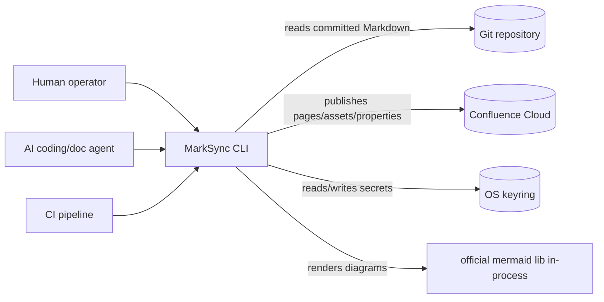
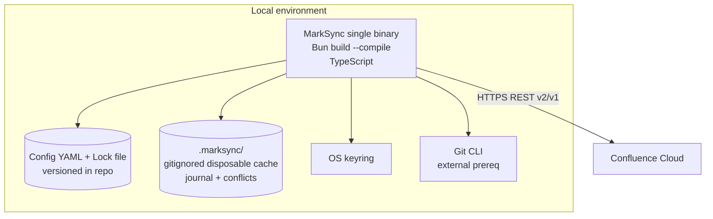

---
# Copyright (c) 2025-2026 Juliusz Ćwiąkalski (https://www.cwiakalski.com | https://www.linkedin.com/in/juliusz-cwiakalski/ | https://x.com/cwiakalski)
# MIT License - see LICENSE file for full terms
source: https://github.com/juliusz-cwiakalski/agentic-delivery-os/blob/main/doc/templates/architecture-overview-template.md
ados_distribution: redistributable
id: ARCHITECTURE-OVERVIEW
status: Draft
created: 2026-07-04
last_updated: 2026-07-04
owners: [Juliusz Ćwiąkalski]
area: engineering
document_classification: current-truth
links:
  related_decisions: [ADR-0001, ADR-0002, ADR-0003, ADR-0004, ADR-0005, ADR-0006]
  related_changes: []
  summary: "Architecture overview — ports-and-adapters CLI; Markdown→Storage pipeline; Confluence Cloud adapter; UUID+lock state model; no hosted backend."
ai_assistance: "AI-assisted drafting; human-authored and approved by Juliusz Ćwiąkalski."
---

# Architecture Overview

_A ports-and-adapters (hexagonal) CLI. The application core owns identity,
conversion, planning, and synchronization; thin adapters supply source documents
(Git), remote mutations (Confluence), rendering (Mermaid), and IO (filesystem,
keyring, stdout). This is the spec §11 model (`doc/inception/system-specification-draft-from-ai-brainstorm.md`),
re-pointed from Go to TypeScript per ADR-0001._

## System context (C4 L1)



- **MarkSync CLI** — a single self-contained binary that synchronizes Git-authored Markdown to Confluence pages (the system under description).
- **Human / AI agent / CI pipeline** — the three operator personas; identical core behaviour, only auth differs (`01-north-star.md`).
- **Git repository** — the authoritative engineering workspace; MarkSync reads committed snapshots (never pushes/pulls).
- **Confluence Cloud** — the publication surface; MarkSync creates/updates pages, attachments, and content properties.
- **OS keyring** — stores API tokens / OAuth refresh tokens; never written to project files.

## Container diagram (C4 L2)



- **MarkSync binary** — one container (the CLI); compiled per OS/arch. Holds all application + adapter code. No separate server process.
- **Config + Lock (filesystem)** — version-controlled YAML; the shared-base record (ADR-0006). No secrets.
- **`.marksync/` cache** — disposable runtime state (rendered bodies, journal, conflict workspaces); never needed for correctness.
- **Git CLI** — an explicit external prerequisite (spec §9.4); read-only from MarkSync's perspective.
- **Confluence Cloud** — the remote system of record for pages.

## Components

_Derived from spec §11.2, re-pointed to TypeScript. Tiers in the module-governance
section below govern residence and dependency direction._

| Component | Container | Tier | Responsibility |
|---|---|---|---|
| CLI adapter | MarkSync binary | presentation | Commands, flags, prompts, output selection (human/JSON/NDJSON) |
| Output service | MarkSync binary | presentation | Structured + human output, exit codes, redaction |
| Application / use-case orchestration | MarkSync binary | application | Orchestrates plan→apply→verify; run IDs |
| Config loader | MarkSync binary | application | Load/merge/default/validate YAML config + lock (ajv/zod) |
| Credential provider | MarkSync binary | application | env/keyring/profile resolution; never logs secrets |
| Hierarchy planner | MarkSync binary | domain | Page graph, titles, parents, links, document-node resolution |
| State classifier | MarkSync binary | domain | Compare local/remote/base → NO_CHANGE/LOCAL_AHEAD/REMOTE_AHEAD/DIVERGED/REMOTE_DELETED/etc. |
| Markdown parser | MarkSync binary | domain | Markdown → MDAST/HAST (remark); canonical subset validation |
| Storage renderer | MarkSync binary | domain | HAST → Confluence Storage XHTML (ADR-0005); provenance decoration |
| Reverse converter | MarkSync binary | domain | Storage/ADF → Markdown (later phase; `MS-0005+`) |
| Asset resolver | MarkSync binary | domain | Safe path/hash/upload prep for images + attachments |
| Push executor | MarkSync binary | infrastructure | Ordered safe writes; journal; optimistic concurrency |
| Pull/conflict service | MarkSync binary | infrastructure | Reverse-sync patches/conflict workspace; never commits |
| Lock/journal store | MarkSync binary | infrastructure | Lock atomic write, journal replay, `repair-state` |
| Git adapter | MarkSync binary | infrastructure | `Repository` interface → Git CLI (or `isomorphic-git`) |
| Confluence adapter | MarkSync binary | infrastructure | `ConfluenceClient` interface → Cloud REST v2/v1 |
| Mermaid adapter | MarkSync binary | infrastructure | `Renderer` interface → official `mermaid` + jsdom (ADR-0002) |

## Module governance

### Module-residence rules

| Capability type | Owning module / path pattern | Notes |
|---|---|---|
| new CLI command | `src/cli/commands/` | presentation; thin orchestration only |
| new use-case orchestration | `src/app/` | application; calls domain + infra via ports |
| new domain rule (drift, identity, planning) | `src/domain/<context>/` | no infra imports |
| new Markdown/storage transform | `src/domain/render/` | HAST→Storage visitors |
| new Confluence endpoint use | `src/infra/confluence/` | behind `ConfluenceClient` interface |
| new Git operation | `src/infra/git/` | behind `Repository` interface |
| new renderer mode | `src/infra/mermaid/` | behind `Renderer` interface |
| new output format | `src/cli/output/` | presentation; redaction enforced |
| new config/lock field | `src/domain/config/` + schema | schema-validated; migration path |

Rule: place new code by capability type, not by guess; if a capability type is unlisted, add a row before placing the code.

### Dependency-direction / layering matrix

Tiers: **presentation** → **application** → **domain** → **infrastructure**.
Invariant: no dependency may point upward or sideways across tiers. The matrix
specifies which downward dependencies are permitted. Ports (interfaces) live in
`domain`/`application`; adapter implementations live in `infrastructure`.

| From → To | presentation | application | domain | infrastructure |
|---|---|---|---|---|
| presentation | — | ✓ | ✗ | ✗ |
| application | ✗ | — | ✓ | ✓ (via ports) |
| domain | ✗ | ✗ | — | ✗ (defines ports; imports no infra) |
| infrastructure | ✗ | ✗ | ✓ (implements ports) | — |

Example: the CLI adapter (presentation) may import the application layer; the
domain layer may NOT import the Confluence adapter. The Confluence adapter
(infrastructure) **implements** the `ConfluenceClient` port defined in domain.

### Internal interface contracts

_Lightweight signatures + return/error shapes. Full versioned contracts live in
the integration-scenarios docs (`doc/inception/integration-scenarios/`)._

| Boundary (A → B) | Operation | Signature | Returns | Errors |
|---|---|---|---|---|
| app → git port | readCommitted | `readCommitted(ref, patterns)` | `Map<path, bytes>` | `RefNotFound`, `BadPath` |
| app → git port | worktreeStatus | `worktreeStatus(paths)` | `WorktreeStatus` | — |
| app → markdown port | parse | `parse(bytes)` | `MdastRoot` | `ParseError` |
| app → render port | toStorage | `toStorage(mdast, opts)` | `{ title, bodyXml, hash }` | `UnsupportedConstruct` |
| app → confluence port | getPage | `getPage(id, repr)` | `Page` | `NotFound`, `Forbidden`, `Conflict` |
| app → confluence port | updatePage | `updatePage(req)` | `Page` | `Conflict` (409 → drift) |
| app → confluence port | putProperty | `putProperty(pageId, key, value)` | `void` | `Conflict`, `TooLarge` |
| app → mermaid port | render | `render(source, opts)` | `Artifact{ bytes, mime, hash }` | `RenderUnavailable` (→ fallback ladder) |
| app → state classifier | classify | `classify(local, base, remote)` | `SyncState` | — |
| app → lock store | commit | `commit(newLock)` | `void` | `LockDirty`, `ConcurrentWrite` |

Scope: signature + return/error shape only. The `ConfluenceClient` interface
mirrors spec §9.7 (translated to TS); the `Renderer` interface mirrors spec §9.11.

### Feature → component ownership map

| Feature | Owning component(s) |
|---|---|
| Safe publish (create/update/no-op) | app, hierarchy planner, storage renderer, confluence adapter, push executor |
| Drift detection + conflict block | state classifier, confluence adapter, push executor |
| Document identity (UUID + lock) | config loader, lock/journal store, confluence adapter (content property) |
| Mermaid render + attach | mermaid adapter, asset resolver, confluence adapter |
| Concurrency control (CI) | push executor, lock store |
| `repair-state` | lock/journal store |
| Reverse sync (later) | reverse converter, pull/conflict service |

### Module-boundary heuristics

- A module with **> 3 responsibilities** / > 1 reason to change → split by responsibility.
- Two modules that always change together → consider merging.
- High cohesion within a module; low coupling across modules.
- A dependency mocked in > 1 unrelated test → consider an interface boundary (port).
- The Confluence adapter is the **only** module permitted to know REST v2/v1 distinctions (A-FEA-6 isolation).

## Data flow

### Push flow (primary — `MS-0002`)

```mermaid
flowchart TD
  A[Load config + Git revision] --> B[Discover committed docs via git port]
  B --> C[Parse + validate + render to Storage + hash]
  C --> D[Build hierarchy/link graph]
  D --> E[Fetch remote state: pages, properties, versions]
  E --> F[Classify: NO_CHANGE/LOCAL_AHEAD/REMOTE_AHEAD/DIVERGED/REMOTE_DELETED]
  F --> G{Error or conflict?}
  G -- Yes --> H[Return plan; NO unsafe write]
  G -- No --> I{Dry-run?}
  I -- Yes --> J[Return deterministic plan]
  I -- No --> K[Acquire lease → create/update pages parent-first]
  K --> L[Upload assets (hash-named, deduped)]
  L --> M[Update bodies + marksync.metadata property]
  M --> N[Journal each mutation immediately]
  N --> O[Atomically update lock; release lease]
```

- Each step is idempotent; partial-apply rerun uses journal + remote property to avoid duplicates (spec §9.8).
- Concurrency control (`A-FEA-7`): per-target serialization + repo/target lease + operation-ID dedup + stale-plan expiry before step K.

### Reverse sync flow (later — `MS-0005+`)

- `pull` reads remote Storage/ADF → reverse-converts to Markdown patch → writes to conflict workspace → **never** auto-commits (spec §9.9).

## External dependencies and integrations

| System / API / provider | Purpose | Ownership | Criticality |
|---|---|---|---|
| Confluence Cloud REST API (v2 + v1-only endpoints) | Page CRUD, content properties, attachments, labels, search, restrictions | Atlassian | **High** — the only remote system |
| Git CLI | Read committed snapshots, worktree status, renames | local install | High — source of truth reader |
| OS keyring | API token / OAuth token storage | OS | Medium — env fallback exists |
| official `mermaid` npm package | Diagram rendering | open source (Mermaid) | High — load-bearing for ADR-0001 |
| Atlassian auth (API token / OAuth 3LO) | Identity | Atlassian | High |

> **Confluence API version split** (proven by `MS-0001` spike): pages, content
> properties, hierarchy = **v2**; attachment upload/update, labels add/delete,
> search/CQL, restrictions = **V1-ONLY**. All distinctions are isolated behind
> the `ConfluenceClient` adapter (A-FEA-6).

## Deployment topology

| Container | Where it runs | How traffic reaches it |
|---|---|---|
| MarkSync binary | Developer workstation / CI runner / container | Invoked as a CLI process; no network ingress |
| Confluence Cloud | Atlassian-hosted SaaS | HTTPS REST from the binary |

- No server process; no ingress; no regions to manage. The binary is the unit of deployment.
- CI runs the same binary with non-interactive credentials (env vars / masked secrets).

## Key architectural decisions

| Decision | Decision record |
|---|---|
| TypeScript + Bun single-binary over Go | `doc/inception/decisions/ADR-0001-...md` |
| Mermaid rendering strategy (official lib, content-hash, fallback ladder) | `doc/inception/decisions/ADR-0002-...md` |
| Brand = MarkSync; Confluence = first adapter | `doc/inception/decisions/ADR-0003-...md` |
| Run a Confluence API validation spike before implementation | `doc/inception/decisions/ADR-0004-...md` |
| Write Storage Format, not ADF | `doc/inception/decisions/ADR-0005-...md` |
| Document identity + shared-base state model (UUID + committed lock) | `doc/decisions/ADR-0006-...md` |

## Known constraints and uncertainty flags

**Fixed constraints:**
- No hosted backend for core value (A-VIA-1).
- Cloud-only in `MS-0002`; one auth path (API token); one configured subtree per target.
- No cross-page transaction (Confluence has none) — validate globally, execute parent-first, journal immediately.
- Binary ≤ 90 MB; cold-start ≤ 2 s; ≤ ~500 managed pages in `MS-0002` (A-FEA-10).

**Uncertainty flags (low confidence — human confirmation needed):**

- **[UNCERT-1] Mermaid in-process render** — `A-FEA-1` (`testing`). The official library's headless determinism via `jsdom` is spike-gated (ADR-0002). If it fails, language choice is revisited. _Confidence: low._
- **[UNCERT-2] Bun single-binary signing/trust** — `A-FEA-2` (`unvalidated`). Cross-compile works, but macOS notarization + Windows Authenticode under Bun `build --compile` is unproven (R-FEA-2). _Confidence: low._
- **[UNCERT-3] State model lock-file format** — ADR-0006 (Proposed). Single lock vs per-target lock, UUID v4 vs v7, lease semantics for CI concurrency need confirmation. _Confidence: medium._
- **[UNCERT-4] Git adapter choice** — shell-Git (spec default) vs `isomorphic-git` (pure-TS, better single-binary purity). _Confidence: medium._ (See OPEN-Q3.)
- **[UNCERT-5] Permission asymmetry handling** — `A-FEA-6`/`R-FEA-10`. `doctor` discovery is planned but the visibility-completeness check is not yet designed. _Confidence: medium._

## Four-risk check on architecture decisions

- **Value** — the ports-and-adapters design directly serves the trust wedge: deterministic planning, drift classification, and the no-silent-overwrite invariant (`INV-SAFE-1`). Mermaid in-process serves the fidelity differentiator.
- **Usability** — single binary + identical local/CI behaviour minimizes setup friction (A-USA-1); `MS-0003`/MLP will add `doctor` diagnostics for the remaining friction.
- **Feasibility** — **mostly de-risked** by the spike for the Confluence contract; the TS/Bun stack itself remains contingent on ADR-0002 + ADR-0002 signing (UNCERT-1/2).
- **Viability** — hexagonal boundaries keep the support matrix narrow (swap adapters, not core) and enable contributor seams (R-VIA-1 mitigation); no DB/telemetry keeps OSS sustainability realistic (A-VIA-1).
