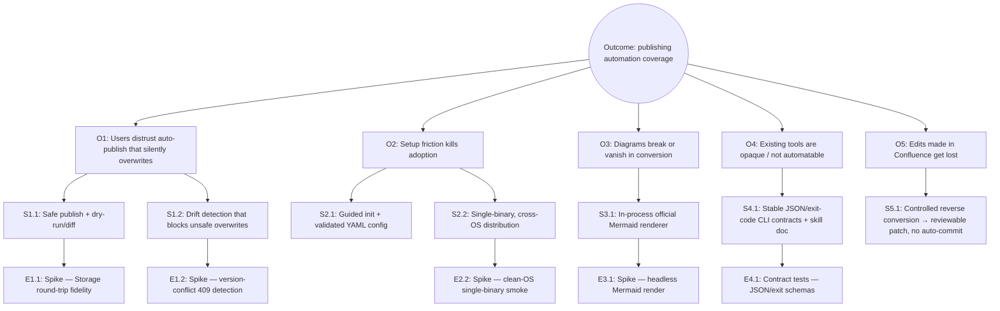

---
# Copyright (c) 2025-2026 Juliusz Ćwiąkalski (https://www.cwiakalski.com | https://www.linkedin.com/in/juliusz-cwiakalski/ | https://x.com/cwiakalski)
# MIT License - see LICENSE file for full terms
source: https://github.com/juliusz-cwiakalski/agentic-delivery-os/blob/main/doc/templates/opportunity-solution-tree-template.md
ados_distribution: redistributable
id: OST
status: Draft
created: 2026-07-03
last_updated: 2026-07-03
owners: [Juliusz Ćwiąkalski]
area: discovery
document_classification: current-truth
links:
  related_decisions: [ADR-0001, ADR-0002, ADR-0005]
  related_changes: []
summary: "Opportunity Solution Tree — ties MarkSync's outcome to the user problems (opportunities), solutions, and validation experiments."
---

# Opportunity Solution Tree

_Conditional — produced because product discovery has been done (competitive
landscape + category-leadership + failure-premortem reports). Keeps engineering
scope tied to user problems, not feature breadth._

## Desired outcome

- **Outcome:** Increase **automation coverage of documentation publishing** — the share of configured Git→Confluence changes published faithfully without manual copy-paste. *(MVP target: eliminate copy-paste for the canonical Markdown subset; MLP target: first-publish under ~10 min.)*
- **Links to NSM:** [North Star Metric](./01-north-star.md#north-star-metric).

## Tree

## Opportunities

_Opportunities are user problems (not features), each backed by evidence._

| Opportunity | Evidence / source |
|---|---|
| O1 — Users distrust auto-publish that silently overwrites their (or a colleague's) work | Motivation brain dump (drift/overwrite scenario); failure premortem §"silent overwrite"; competitive gap across inventoried tools |
| O2 — Setup friction and platform fragility kill adoption before value is felt | Category-leadership report (MLP / activation); motivation ("exceptional DX… super easy to set up"); premortem §"renderer missing on platform X" |
| O3 — Diagrams (Mermaid/PlantUML) break or disappear, and orgs often lack the Confluence plugin | Motivation (Mermaid-to-image requirement); competitive report §8 (diagrams as decision-driving features); ADR-0001/0002 |
| O4 — Existing tools are opaque, one-way, and not automatable (no JSON, no stable exits, no provenance) | System spec §1, §7.9; competitive report; motivation (CI + AI-agent operability) |
| O5 — Valuable edits made directly in Confluence get lost on the next Git publish | Motivation brain dump (the core two-worlds problem); spec §7.7 reverse-sync FRs |

## Solutions per opportunity

| Opportunity | Solution | Rationale |
|---|---|---|
| O1 | S1.1 Safe publish with mandatory plan/dry-run/diff before any write | "Safe sync beats magical sync" principle; FR-SYNC-001/004/006 |
| O1 | S1.2 Drift detection: compare remote version/body hash vs last base; classify REMOTE_AHEAD/DIVERGED; block by default | Directly prevents silent overwrite; FR-SYNC-003/008/009; spike-proven (409 on `version=current+1`) |
| O2 | S2.1 Guided `init` + schema-validated YAML config + `doctor` health check | Reduces time-to-first-publish; FR-CFG-009/010, FR-AUTH-010 |
| O2 | S2.2 Single self-contained binary per OS/arch (TS compiled via Bun) | Removes runtime-install friction; ADR-0001; motivation (single binary, cross-OS) |
| O3 | S3.1 Render Mermaid via the **official** library in-process; content-hash + reuse | Guarantees fidelity without a Confluence plugin or external Node/Chromium; ADR-0001/0002 |
| O4 | S4.1 Stable JSON/NDJSON + exit-code contracts + a SKILL doc + read-only defaults | Makes MarkSync agent- and CI-operable; FR-CLI-002/004/009/010 |
| O5 | S5.1 Controlled reverse conversion → uncommitted patch / conflict bundle; **never** auto-commits | Recovers Confluence edits safely; honors Git-authoritative principle; FR-REV-001…008 (Phase 2) |

## Experiments per solution

_Validation status reflects the Confluence API validation spike where applicable._

| Solution | Assumption tested | Metric | Stop criteria / status |
|---|---|---|---|
| S1.1 (safe publish) | Markdown→Storage round-trips losslessly for the canonical subset | 100% of GFM kitchensink fixtures survive round-trip | **Validated** (spike K1: 27/27 constructs). Stop if any construct is lossy. |
| S1.2 (drift detection) | Confluence rejects stale-version writes with a usable 409 | 409 returned when `version != current+1`; error is machine-parseable | **Validated** (spike G1). |
| S2.1 (guided init) | A user can reach first publish under ~10 min (excluding credential creation) | Time-to-first-publish in a usability test | **Unvalidated** — test in MLP. |
| S2.2 (single binary) | A clean OS image with no language runtime runs the binary end-to-end | `config validate` + dry-run succeed on clean Linux/macOS/Windows | **Unvalidated** — spike pending (Bun compile + signing/trust). Stop if binary cannot run without a runtime or signing is blocked. |
| S3.1 (in-process Mermaid) | The official `mermaid` library renders deterministically headless without Chromium | One diagram renders in-process; output is byte-stable for unchanged input | **Testing** (ADR-0002 spike) — load-bearing unknown. Stop and reconsider language if it requires Chromium. |
| S4.1 (agent contracts) | JSON output + exit codes are stable enough for an agent to drive safely | Contract tests pass; agent completes plan→validate→publish via JSON only | **Unvalidated** — test once CLI exists. |
| S5.1 (reverse sync) | The canonical subset reverse-converts to semantically-equivalent Markdown | Round-trip fixtures match; unsupported constructs never vanish silently | **Partially validated** (spike reverse-read works on a trivial page; enriched-page test pending). Phase 2. |
