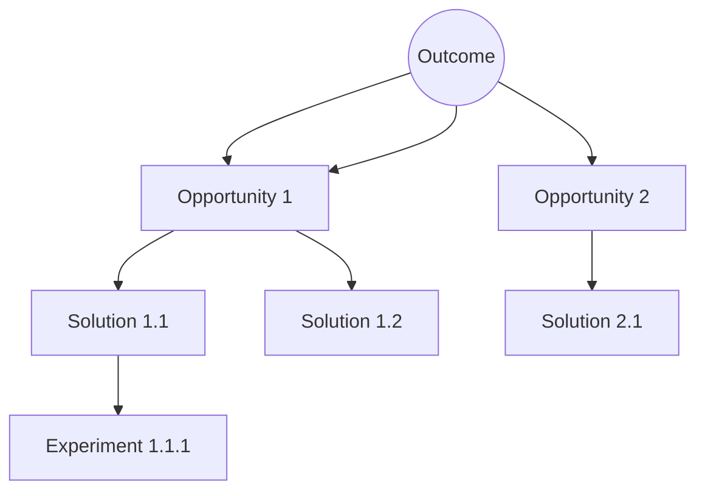

---
# Copyright (c) 2025-2026 Juliusz Ćwiąkalski (https://www.cwiakalski.com | https://www.linkedin.com/in/juliusz-cwiakalski/ | https://x.com/cwiakalski)
# MIT License - see LICENSE file for full terms
source: https://github.com/juliusz-cwiakalski/agentic-delivery-os/blob/main/doc/templates/opportunity-solution-tree-template.md
ados_distribution: redistributable
id: OST
status: Draft
created: 2026-06-26
last_updated: 2026-06-26
owners: [<owner-or-team>]
area: discovery
document_classification: current-truth
links:
  related_decisions: []
  related_changes: []
summary: "Opportunity Solution Tree — outcome to opportunities to solutions to experiments."
---

# Opportunity Solution Tree

_Conditional — produced when product discovery has been done. Maps a desired outcome to opportunities, solutions, and experiments so engineering scope stays tied to user problems._

## Desired outcome
_The single outcome this tree serves (link to the NSM in `doc/overview/01-north-star.md`). State it as a measurable outcome, not a feature._

- Outcome: <measurable outcome>
- Links to NSM: <north-star metric reference>

## Tree

## Opportunities
_With evidence/source for each._
| Opportunity | Evidence / source |
|---|---|

## Solutions per opportunity
| Opportunity | Solution | Rationale |
|---|---|---|

## Experiments per solution
_State the assumption tested, the metric, and the stop criteria._
| Solution | Assumption tested | Metric | Stop criteria |
|---|---|---|---|
