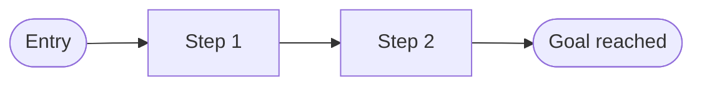

---
# Copyright (c) 2025-2026 Juliusz Ćwiąkalski (https://www.cwiakalski.com | https://www.linkedin.com/in/juliusz-cwiakalski/ | https://x.com/cwiakalski)
# MIT License - see LICENSE file for full terms
source: https://github.com/juliusz-cwiakalski/agentic-delivery-os/blob/main/doc/templates/user-journey-template.md
ados_distribution: redistributable
id: USER-JOURNEY
status: Draft
created: 2026-06-26
last_updated: 2026-06-26
owners: [<owner-or-team>]
area: ux
document_classification: current-truth
links:
  related_decisions: []
  related_changes: []
summary: "User journey — cross-feature flow map with steps, emotions, pains, and opportunities."
---

# User Journey

_Conditional — for UI-bearing projects. Captures cross-feature user flows (distinct from per-feature flows in a feature spec)._

## Persona & context
_Link to the persona/JTBD (`persona-jtbd-template.md`) and state the goal of this journey._

- Persona: <persona>
- Goal of this journey: <goal>

## Journey stages
_The high-level stages the user moves through._

1. <stage>
2. <stage>

## Steps
| Action | Thought / feeling | Pain | Opportunity | Touchpoint / screen |
|---|---|---|---|---|

## Flow

## Opportunities surfaced
_Insights from pains that should feed the OST or roadmap._

- <insight> — feeds <OST / roadmap>
- <insight> — feeds <OST / roadmap>
